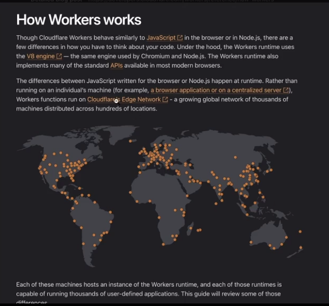
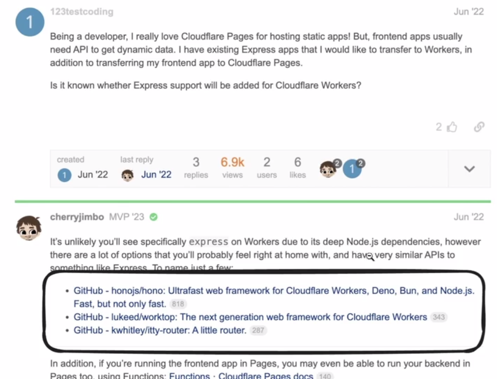
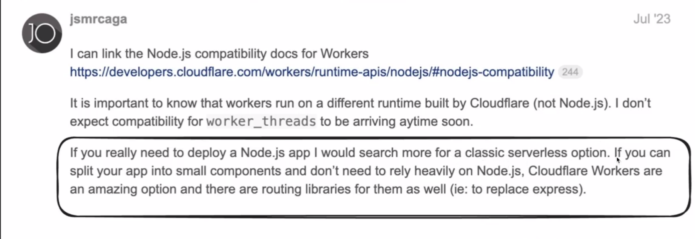
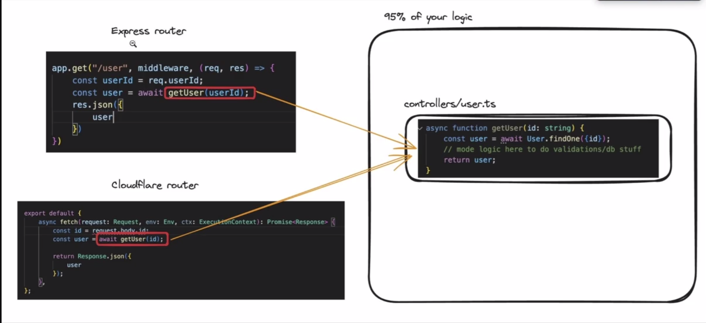
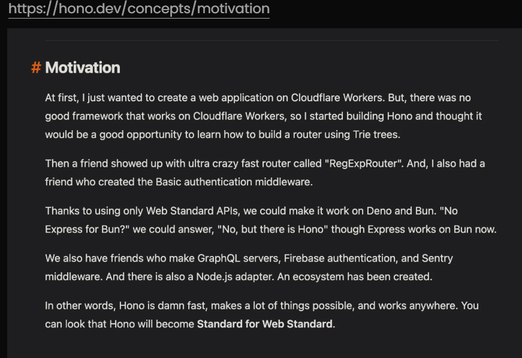
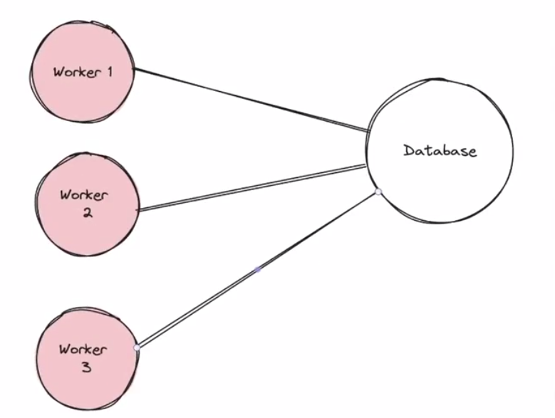

# Serverless Architecture


>One more thing, to be able to delpoy an application you need to know the little bit of devops, you need to bring up a server, you have to clone your repo, start the process, understand ports and security groups in aws, need to know about certbot, nginx, you need to know how to scale it, you need to know how to monitor it, you need to know how to make sure its up and running 24/7. So you need to know a little bit of devops. But with serverless architecture you dont need to worry about any of that. You just write your code and deploy it and the cloud provider takes care of all the devops stuff for you.

When you need to deploy a backend server on the internet, there are a few approaches:

#### Deployment Options
- Use cloud providers like **AWS**, **GCP**, **Azure**, or **Cloudflare**.
- Rent a **Virtual Machine (VM)** and deploy your app.
- Use an **Auto Scaling Group**.
- Deploy it in a **Kubernetes Cluster**.

#### Downsides of Traditional Deployment
- Managing **how/when to scale**.
- **Base cost** even when no one is visiting your website.
- Monitoring multiple servers to ensure uptime.

---

### What is Serverless?

**Serverless** is a backend deployment approach where the cloud provider dynamically manages the allocation and provisioning of servers. The term "serverless" is a bit misleading because servers are still involved, but the key point is that developers do not have to manage them, developers dont have to worry about the servers. When millions of starts to use your application then you do pay a lot of money. And its more than what you would pay for self hosted server. So its more expensive at scale.  
- Developers and operators **do not need to worry about servers**.  
- You just write routes and run a command to deploy your app.  
- Serverless apps **automatically deploy**, **autoscale**, and **charge on a per-request basis**.  

#### Downsides of Serverless
- **More expensive at scale**.
- **Cold start problem** (slower startup times for inactive functions).

> how do you solve the cold start problem, you can use something called provisioned concurrency in aws lambda, which keeps a certain number of instances warm and ready to handle requests, but this comes at an additional cost. You always have a pool of container, that a minimum of lets say 5 container that are always running, and when more users come then you can add more and more container. One more way to solve the cold start problem is you always have a ping function running somewhere that pings your cloudflare function every 5 minutes, so that it never goes idle.

> serverless exists for frontend and database as well. For frontend you have services like vercel, netlify, cloudflare pages, for database you have services like neondb. When you start a database on neondb, you are starting a serverless database, means based on the number of request to db the compute and storage of database is going up. You dont have a managed database. You told neondb the serverless database provider to take care.

#### Famous Serverless Providers
- AWS Lambda
- Google Cloud Functions
- Cloudflare Workers

- **Easier Definition**: What if you could just write your express routes and run a command, the app would automatically deploy, autoscale, and you would be charged on a per-request basis. That is serverless.

### When should you use a serverless architecture:
- When you get off the ground fast and dont want to worry about devops.
- When you get off the ground as quickly as possible and you dont want to pay a stagnant fees of lets say 20 dollars a month for a machine that lets say noone is hitting. So you want to pay for a per request basis for that serverless is the ideal architecture. 
- Also when you cant anticipate the traffic and dont want to worry about autoscaling.

---

## Cloudflare Workers

- Cloudflare Workers **do not use the Node.js runtime**.  
  They have created their own runtime using **V8 Isolates**.  
- **No Node.js APIs** (e.g., `fs`, `http`, etc.).
- **Lightweight** and optimized for **edge execution**, with better startup times than traditional containerized runtimes.  

### How Cloudflare Workers Work
- The Workers runtime uses the **V8 engine** (also used by Chromium and Node.js).  
- Worker functions run on **Cloudflare's Edge Network**, a global network of thousands of machines distributed across hundreds of locations.




---

### Comparison: AWS Lambda and Google Cloud Functions

- **Closer to full-fledged Node.js environments**.
- Support Node.js and other popular programming languages.
- Provide richer support for libraries and packages.
- **Higher cold start times** compared to Cloudflare Workers.

---

### Choosing a Backend Approach

### 1. Express with AWS Lambda/Google Cloud Functions
- If you already know **Express**, this is a straightforward choice:
  - **Express Works Out-of-the-Box**: Both AWS Lambda and Google Cloud Functions support Node.js natively.
  - **Ease of Deployment**: Serverless frameworks like **Serverless Framework**, **AWS SAM**, or **Google Firebase Functions** simplify deployment.
- **Trade-off**:  
  Higher cold start times compared to Cloudflare Workers, especially for larger applications. However, this is acceptable for general-purpose backend services.

---

### 2. Hono with Cloudflare Workers
- If your use case requires **low latency** and **fast startup**, choose Cloudflare Workers with **Hono**:
  - **Ultra-Fast Cold Start Times**: Workers use lightweight V8 isolates instead of containers, making them faster.
  - **Optimized for Edge Deployment**: Best for applications that need to run closer to the user (e.g., global APIs or low-latency services).
  - **Hono is Express-Like**: Offers a familiar API for Express developers.
- **Trade-off**:  
  Cloudflare Workers don’t support all Node.js APIs (e.g., `fs`, `http`), so you might need to adjust your application design.

---

### Cloudflare Workers Runtime

Although Cloudflare Workers behave similarly to JavaScript in the browser or Node.js, there are differences in how they work at runtime:  

- **V8 Engine**: The Workers runtime uses the same engine as Chromium and Node.js.  
- **Global Edge Network**: Worker functions run on Cloudflare's **Edge Network**, a global network of thousands of machines distributed across hundreds of locations.  

#### Key Differences
- Instead of running on an individual's machine (like a browser or centralized server), Workers run on **Cloudflare's distributed Edge Network**.
- Each machine in the network hosts an instance of the Workers runtime, which is capable of running thousands of user-defined applications.


## Cloudflare Workers Deployment and Development

- Sign up for a **Cloudflare account**.
- Go to workers and pages section.
- Create a new worker.
- Select empty worker, hello world option.
- and deploy it.
- very easy to add a custom domain, you have to buy your domain at cloudflare, which is not recommended as when your app starts making money cloudflare will send you a fat bill and will block your domain so you would not be able to move out of cloudflare.

**Initializing a Worker:** 
To create a new Cloudflare worker:

```bash
npm create cloudflare -- my-app
```

#### Example Express App

```jsx
import express from "express";
const app = express();

app.get("/route", (req, res) => {
    // Handles a GET request to /route
});
```

#### Same Functionality in Cloudflare Workers

```jsx
export default {
    async fetch(request: Request, env: Env, ctx: ExecutionContext): Promise<Response> {
        console.log(request.body);
        console.log(request.headers);

        if (request.method === "GET") {
            return Response.json({
                message: "You sent a GET request"
            });
        } else {
            return Response.json({
                message: "You did not send a GET request"
            });
        }
    },
};
```

### Deploying the Worker

To deploy a worker on the internet, you use **Wrangler**: (wrangler is a command line tool to manage cloudflare workers)

- [Wrangler Docs](https://developers.cloudflare.com/workers/wrangler/)

### Wrangler Command Line Interface

Wrangler is the Cloudflare developer platform command line interface (CLI) that allows you to manage worker projects. It lets you deploy the application to cloudflare, it lets you run your application locally. Wrangler brings up their runtime locally and starts the code you do npm run dev.

- **Install/Update Wrangler**: Get started by installing Wrangler and updating it to newer versions.
- **API**: An experimental API to programmatically manage your Cloudflare workers.
- **Bundling**: Review Wrangler's default bundling.
- **Commands**: Create, develop, and deploy your Cloudflare workers using wrangler commands.
- **Configurations**: Use the `wrangler.toml` configuration file to customize your development and deployment setup.
- **Custom Builds**: Customize how your code is compiled before being processed by Wrangler.
- **Deprecations**: Differences between Wrangler versions, including deprecated and breaking changes.
- **Environments**: Deploy the same worker application with different configurations for each environment.
- **Migrations**: Review migration guides for specific versions of Wrangler.
- **Run in CI/CD**: Deploy your workers in a CI/CD environment.
- **System Environment Variables**: Local environment variables that can change Wrangler's behavior.

### Common Wrangler Commands

1. **Login to Wrangler**:
    ```bash
    npx wrangler login
    ```

2. **Deploy your worker**:
    ```bash
    npm run deploy
    ```

### Assigning a Custom Domain

- You need to purchase a plan to assign a custom domain.
- You must buy the domain on Cloudflare or transfer it to Cloudflare.

---

**Alternatives to Express**:
- **honojs/hono**
- **lukeed/worktop**
- **kwhitley/itty-router**

These alternatives are lightweight and designed for edge environments like Cloudflare Workers.

---

### Alternatives to Express on Cloudflare Workers

It’s unlikely that you'll use **Express** on Cloudflare Workers due to its deep **Node.js** dependencies. However, there are several alternatives that provide similar APIs and are optimized for edge runtimes.



**You can split all your handlers in a file:**

### Splitting Your App into Small Components


Create a generic handler that you can forward requests to from either express or hono or native cloudflare handler


So thats how you can move the existing express codebase to the serverless architecture.
If your application can be broken down into smaller components and doesn't rely heavily on Node.js, it makes your app more modular and easier to deploy across distributed environments like Cloudflare Workers.

For example, a modular architecture can be seen here:



---
## What is Hono



### Runtimes Supported by Hono
Hono, a framework for Cloudflare Workers, supports the following runtimes:

Cloudflare Workers, Cloudflare Pages, Deno, Bun, Fastly Compute, Vercel, Netlify, AWS Lambda, Lambda@Edge, Supabase Functions, Node.js

---


### Using Hono with Cloudflare Workers

To use Hono with Cloudflare Workers:

1. **Install Hono**:
```bash
npm create hono@latest --my-app
```

2. **Example of Hono code**:

>You can go to developers.cloudflare.com/workers/tutorials to see the examples of few common workers

```jsx
import { Hono } from 'hono';

const app = new Hono();

app.get('/', async (c) => {
    const body = await c.req.json();
    console.log(body);
    console.log(c.req.header("Authorization"));
    console.log(c.req.query("param"));

    return c.text('Hello Hono!');
});

export default app;
```

3. **Deploy the worker**:

- First, login with Wrangler:
```bash
npx wrangler login
```

- Then, deploy:
```bash
npm run deploy
```

---

### Using Middleware with Hono

To use middleware in Hono:

```jsx
import { Hono, Next } from 'hono';
import { Context } from 'hono/jsx';

const app = new Hono();

app.use(async (c, next) => {
    if (c.req.header("Authorization")) {
        // Do validation
        await next();
    } else {
        return c.text("You don't have access");
    }
});

app.get('/', async (c) => {
    const body = await c.req.parseBody();
    console.log(body);
    console.log(c.req.header("Authorization"));
    console.log(c.req.query("param"));

    return c.json({ msg: "as" });
});

export default app;
```

---

### Connecting to a Database

You can connect your Cloudflare Worker to a database using **Prisma** for edge deployment:

- [Prisma Cloudflare Edge Deployment Guide](https://www.prisma.io/docs/orm/prisma-client/deployment/edge/deploy-to-cloudflare) 

# Connection Pooling

- Prisma makes money by charging for connection pooling.
- When using serverless functions, each function invocation can create a new database connection, leading to a high number of connections that can overwhelm the database. Also database doesnt allow many connections.
- Prisma says keep your database separate and it will create a connection pooler and all the serverless functions will connect to the connection pooler and the connection pooler will connect to the database.



- Also one more problem is, Prisma the library has dependencies that the cloudflare runtime doesn’t understand.
- **Connection pooling in prisma for serverless env**
    - https://www.prisma.io/docs/accelerate
    - https://www.prisma.io/docs/orm/prisma-client/deployment/edge/deploy-to-cloudflare-workers
- Prisma Accelerate is a fully managed global connection pool and caching layer for your existing databases, enabling query-level cache policies directly from the prisma orm.

## Setup prisma project
1. Install prisma in your project
```bash
npm install --save-dev prisma
```
 
2. Init Prisma
```bash
npx prisma init
```
 
3. Create a basic schema
```ts
generator client {
  provider = "prisma-client-js"
}

datasource db {
  provider = "postgresql"
  url      = env("DATABASE_URL")
}

model User {
  id       Int    @id @default(autoincrement())
  name     String
  email    String
}
```

> the database url will be the direct url for migrations, and once you migrated then you can replace it with the prisma accelerate url for normal working of the application.
 
4. Create migrations
```bash
npx prisma migrate dev --name init
```
 
5. Signup to Prisma accelerate

https://console.prisma.io/login

**Then Enable accelerate and Generate an API key and Replace it in .env**

5. Add accelerate as a dependency
```bash
npm install @prisma/extension-accelerate
```

6. Generate the prisma client with no engine flag (remember this)
```bash
npx prisma generate --no-engine
```

7. Setup your code
```ts
import { Hono, Next } from 'hono'
import { PrismaClient } from '@prisma/client/edge'
import { withAccelerate } from '@prisma/extension-accelerate'
import { env } from 'hono/adapter'

const app = new Hono()

app.post('/', async (c) => {
  // Todo add zod validation here
  const body: {
    name: string;
    email: string;
    password: string
  } = await c.req.json()
  const { DATABASE_URL } = env<{ DATABASE_URL: string }>(c)

  const prisma = new PrismaClient({
      datasourceUrl: DATABASE_URL,
  }).$extends(withAccelerate())

  console.log(body)

  await prisma.user.create({
    data: {
      name: body.name,
      email: body.email,
      password: body.password
    }
  })
  
  return c.json({msg: "as"})
})

export default app
```

> the database url will be the direct url for migrations, and once you migrated then you can replace it with the prisma accelerate url for normal working of the application.