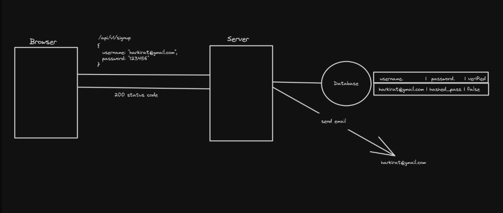
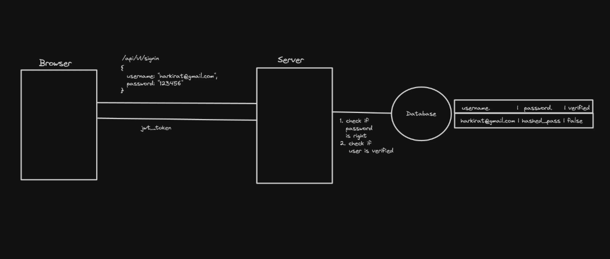
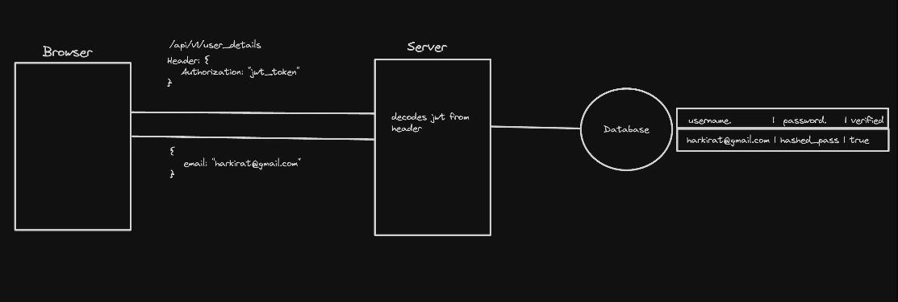
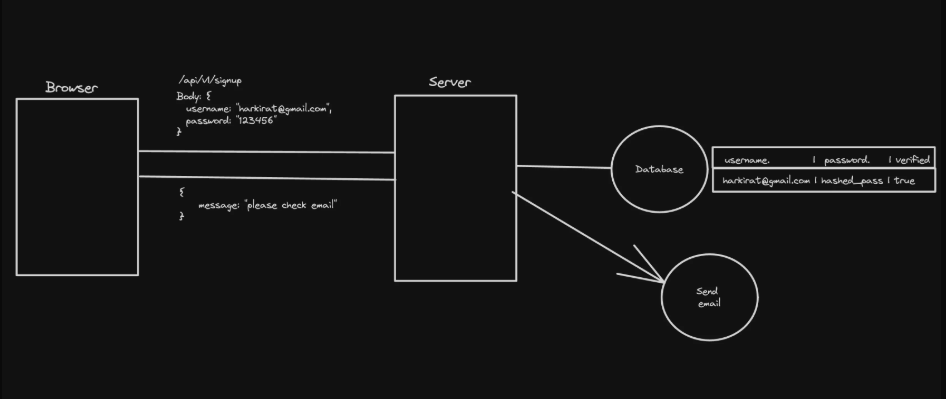
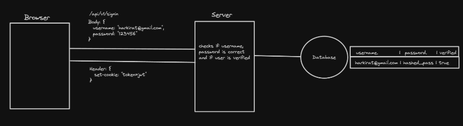
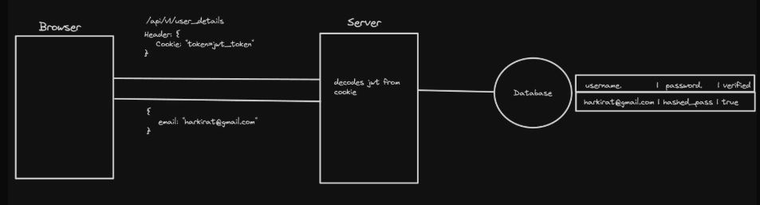

# Authentication
Authentication is the process of letting users signup/signin into websites via username / password or using SSO (single sign on).

### JWT + local storage auth
You take userid and password from body and sends to the database. The server checks in the database if the password is right, is the user verified, if, then it sends a jwt token which client(browser) stores in the local storage.
Now client need to send the token in every subsequent request that requires authentication. They send the authorization header along, backend decodes it and verifies it as the user.

### SignUp


One more thing can happen is an email verification. When you signup, you can send a verification email to the user, and when they click on the link in the email, you can verify the user. And mark the user as verified in the database. So that the user cant hijack the email of someone else.

### SignIn


User gives the email and password, the server checks if password is correct, then sends a jwt token back to the client. The client stores the token in local storage and sends it in the authorization header in every subsequent request that requires authentication.

### Auth Request


Now for every request that requires authentication, the client sends the token in the authorization header. The server decodes the token and verifies it. If the token is valid, the server processes the request and sends back the response.


## Authentication using cookies
Cookies in web development are small pieces of data sent from a website and stored on the user's computer by the user's web browser while the user is browsing. They are designed to be a reliable mechanism for websites to remember things (very similar to local storage)

**Session Management**: Cookies allow websites to identify users and track their individual session states across multiple pages or visits.

**Personalization**: Websites use cookies to personalize content and ads. For instance, cookies might store information about a user's preferences, allowing the site to tailor content or advertisements to those interests.

**Tracking**: Cookies can track users across websites, providing insights into browsing behavior. This information can be used for analytics purposes, to improve website functionality, or for advertising targeting.

**Security**: Secure cookies can be used to enhance the security of a website by ensuring that the transmission of information is only done over an encrypted connection, helping to prevent unauthorized access to user data.


We will be focussing on point 4...

Why not local storage?
- Cookies and LocalStorage both provide ways to store data on the client-side, but they serve different purposes and have different characteristics.
- Cookies are send with every request to the website (by the browser) (you don’t have to explicitly add a header to the fetch call). This point becomes super important in Next.js.
    - Cookies can have an expiry attached to them
    - Cookies can be be restricted to only https and to certain domains

Also in nextjs, you cannot use local storage + authorization header to send the token in the first request. As the first request that goes out to the server is the one that renders the page, and you cannot send the authorization header in that request. As the first request is made by the browser to the server to get the page, and the browser does not have access to local storage at that point.
So, you cannot use local storage to store the token and send it in the authorization header in the first request.
In a React application, the first request is made to the CDN to get the bundle files, which are the same for everyone, and then the browser sends a request to the backend to get the token, which can be stored in local storage. But in Next.js, the first request is made to the server to render the page, and you need to have the user-specific data in that request.
So, you need to use cookies to store the token and send it in the request to the server. The server can then decode the token and get the user-specific data, which can be used to render the page.

In Next.js, as it uses server-side rendering (SSR), when user signup or signin, the server sends a Set-Cookie header with the response, which the browser stores in its cookies. 
When the browser makes a request to the server, it automatically sends the cookies along with the request. The server can then read the cookies and get the user-specific data.
So, the very first req comes to the server has the user data, lets say the users purchases are already rendered in the server and returned back. So, you want the user specific data in very first request you need to use cookies. You logout, it clears the cookie.
Cookies can have an expiry date, so you can set the cookie to expire after a certain time. You can also set the cookie to be secure, which means it will only be sent over HTTPS connections. You can also set the cookie to be HttpOnly, which means it cannot be accessed by JavaScript on the client-side, making it more secure against XSS attacks. XSS attacks are the ones where the attacker injects malicious code into the website, which can then be executed by the browser. Meaning the attacker can steal the token from local storage and use it to make requests to the server.

### Signup


### SignIn


### Auth Request



### Properties of cookies
- Types of cookies: 
    - Persistent - Stay even if u close the window
    - Session - Go away after the window closes
    - Secure - Sent only over secure, encrypted connections (HTTPS).
- Properties of cookies:    
    - **HttpOnly**: When set, this attribute prevents client-side JavaScript from accessing the cookie via `document.cookie`. This helps protect sensitive information (like authentication tokens) from XSS (Cross-Site Scripting) attacks, as malicious scripts cannot read or manipulate these cookies.
    - **SameSite**: Controls whether cookies are sent with cross-site requests, helping to mitigate CSRF (Cross-Site Request Forgery) attacks.  

        **CSRF (Cross-Site Request Forgery) Attacks**

        A CSRF attack tricks a user’s browser into making unwanted requests to a different site where the user is authenticated. Since browsers automatically include cookies with every request to a domain, a malicious site can cause a user’s browser to perform actions (like changing account details or making purchases) on another site where the user is logged in, without their consent.

        For example, if you are logged into your bank in one tab, and you visit a malicious website in another tab, that site could submit a form or send a request to your bank’s site using your credentials (cookies), potentially transferring money or changing your account settings.

        **Same-site** = Requests originate from the same registered domain (not necessarily the exact same subdomain).

        **Cross-site** = Requests come from a different registered domain.

        **How SameSite Helps Prevent CSRF**

        The `SameSite` cookie attribute was introduced to help mitigate CSRF attacks. By setting `SameSite=Strict` or `SameSite=Lax`, browsers restrict when cookies are sent with cross-site requests (requests coming from a different domain, like another website), making it much harder for malicious sites to perform actions on behalf of an authenticated user. `SameSite=None` allows cookies to be sent with all requests, but should only be used with the `Secure` flag and with caution.

        In summary, always use the `SameSite` attribute (preferably `Strict` or `Lax`) and restrict cookie domains to reduce the risk of CSRF attacks.
        - **Strict**: Cookies are only sent for requests originating from the same site. Any cross-site usage (like clicking a link from another domain) will not include the cookie.
        - **Lax**: Cookies are sent on top-level navigation (e.g., clicking a link from another site), but only for safe HTTP methods like GET. But not for POST, PUT, DELETE, etc. from another site. This provides a balance between security and usability.
        - **None**: Cookies are sent with all requests, including cross-site requests. To use this, the cookie must also be marked as `Secure` (sent only over HTTPS). This setting is less secure and should be used with caution.

        | SameSite Value | Description  | Cookies Sent With                | Use Case                                                    |
        | -------------- | ------------ | -------------------------------- | ----------------------------------------------------------- |
        | `Strict`       | Most secure  | Only same-site                   | Banking, high-security apps                                 |
        | `Lax`          | Balanced     | Same-site + GET navigation       | Most apps                                                   |
        | `None`         | Least strict | All requests, but needs `Secure` | Cross-origin apps (e.g., separate frontend/backend domains) |


        ### SameSite=None
        > You're saying: “I want this cookie to go to any site, anytime.”. “So the browser says: 'Okay, but **only over HTTPS**, to prevent interception.'”

        This is talking about **why cookies with `SameSite=None` require the `Secure` flag**, which means they will **only be sent over HTTPS**, not HTTP.

        ### 📦 What Does “Interception” Mean?

        **Interception** means that **someone could see or modify your data** as it travels over the internet.

        #### Think of it like this:

        * Your browser sends a cookie to your server.
        * If you're using **HTTP**, that data is sent **unencrypted** — like sending a postcard.
        * Anyone sitting in the network path (like someone on public Wi-Fi or a malicious router) can:

        * **Read** the cookie (e.g. steal your session token).
        * **Modify** the request (e.g. change data or inject malicious content).

        This is called a **man-in-the-middle attack (MITM)**.

        ### ✅ Why HTTPS Prevents Interception

        When you use **HTTPS**, your data is encrypted:        
        * It's like sending your request in a **sealed envelope** that only the server can open.
        * Attackers **can’t read or change** the request — even if they intercept it.

        ### 🍪 So What’s the Risk with Cookies?

        If a cookie is:
        * Marked as `SameSite=None` (so it **can be sent cross-site**), and
        * Not marked `Secure`, and
        * Sent over **HTTP**,

        Then an attacker could:
        * Steal the cookie (session hijacking),
        * Replay it to impersonate you,
        * Use it for CSRF or other attacks.

        ### 💡 That’s Why the Browser Says:

        > “If you're going to allow this cookie to be sent **cross-site** (`SameSite=None`), then it **must** be sent **securely** (`Secure` over HTTPS). Otherwise, I won’t even store it.”

        It's a **security rule enforced by modern browsers** to protect users.

---

- **Domain**: Specifies the domain(s) for which the cookie is valid. By setting the domain attribute, you can control which subdomains can access the cookie. For example, setting `Domain=.example.com` allows all subdomains of `example.com` to receive the cookie.

    ```http
    Set-Cookie: token=abc123; Domain=example.com; Path=/; HttpOnly
    ```
    This tells the browser that the cookie named `token` is valid for the domain `example.com` and all its subdomains, and it should be sent with requests to any path on that domain.
    ### 1. **You can only set cookies for your own domain or parent domain**

    * If your server is on `api.example.com`, you **can set a cookie for**:

    * `api.example.com` (default)
    * `example.com` (parent)

    But you **cannot set a cookie for another domain** like `otherdomain.com` — the browser will reject it.


    ### 2. **Cookies are not shared across unrelated domains**

    * You **cannot** share cookies between:

    * `frontend.com` and `backend.com`
    * `example.com` and `example.org`

    Even if you try to do:

    ```http
    Set-Cookie: Domain=backend.com
    ```

    …from `frontend.com`, the browser will **refuse** to store the cookie because it’s from a different origin.


    ### 3. **Security Note: Be careful when setting cookies for `.example.com`**

    * If you do:

    ```http
    Set-Cookie: token=abc123; Domain=.example.com
    ```

    That cookie will be sent to **every subdomain** — even ones you may not control (e.g. `chat.example.com`, `test.example.com`), which can lead to security risks.


    ```js
    res.cookie('token', token, {
    domain: 'example.com',     // allows sharing across subdomains
    httpOnly: true,
    secure: true,
    sameSite: 'None',
    });
    ```

- **Path**: Defines the URL path that must exist in the requested resource before the browser sends the cookie. For example, setting `Path=/account` restricts the cookie to URLs under `/account`.

- **Expires/Max-Age**: Determines the lifetime of the cookie. `Expires` sets a specific date/time when the cookie will be deleted, while `Max-Age` sets the duration (in seconds) until the cookie expires. If neither is set, the cookie becomes a session cookie and is deleted when the browser is closed.

- **Secure**: When set, the cookie is only sent over secure (HTTPS) connections, preventing it from being transmitted over unencrypted HTTP requests.

- **HttpOnly**: (repeated for emphasis) Prevents JavaScript access to the cookie, providing protection against XSS attacks.

These properties allow you to fine-tune cookie behavior for security, privacy, and application requirements.


### Using cookies in the backend
So there is a project in Auth folder of my study practice folder. In that there is used the cookies auth. Open that and see notes:
- You need to use a cookie parser to parse the very long cookie string and get the token.
- In cors you need to pass credentials as true(in express if youre using cors and you want cookies to be set you need to pass credentials as true) and origin as the frontend from where the cookies can be set.
You have seen websites in which when you click signin or signup it takes to the .auth domain af that website.
eg: www.varun.comn and it takes to www.auth.varun.com

Now in signin route you check the credentials from the database and then generate a token sign it and return it(in the local storage approach). But in here you simply call 
res.cookie and pass the name of the token and the token. res.cookie("token", token); this function will put the cookie in the Set-Cookie header.


Example in express:
```ts
import express from "express";
import cookieParser from "cookie-parser";
import cors from "cors";
import jwt, { JwtPayload } from "jsonwebtoken";
import path from "path";

const app = express();
app.use(cookieParser());
app.use(express.json());
app.use(cors({
    credentials: true,      //Here if your fe and be are different then you have to set the credentials to true
    origin: "http://localhost:5173"
}));

app.post("/signin", (req, res) => {
    const email = req.body.email;
    const password = req.body.password;
    // do db validations, fetch id of user from db
    const token = jwt.sign({
        id: 1
    }, JWT_SECRET);
    res.cookie("token", token);
    res.send("Logged in!");
});

app.get("/user", (req, res) => {
    const token = req.cookies.token;
    const decoded = jwt.verify(token, JWT_SECRET) as JwtPayload;
    // Get email of the user from the database
    res.send({
        userId: decoded.id
    })
});


app.post("/logout", (req, res) => {
    res.cookie("token", "");    //Similar thing that we do to remove the token from the browser local storage, this time server does it
    // res.clearCookie();  //It can also be used instead of that
    res.json({
        message: "Logged out!"
    })
});

app.listen(3000);
```

Frontend in React
signin page
```tsx
import { useState } from "react"
import { BACKEND_URL } from "../config"
import axios from "axios"

export const Signin = () => {
    const [username, setUsername] = useState("")
    const [password, setPassword] = useState("")

    return <div>
        <input onChange={(e) => {
            setUsername(e.target.value);
        }} type="text" placeholder="username" />
        <input onChange={(e) => {
            setPassword(e.target.value);
        }} type="password" placeholder="password" />
        <button onClick={async () => {
            await axios.post(`${BACKEND_URL}/signin`, {
                username,
                password
            }, {
                withCredentials: true,      //Here you need to do this because this is cross site which means the fe and be run on different domain
            });
            alert("you are logged in")
        }}>Submit</button>
    </div>
}
```
user page
```tsx
import axios from "axios";
import { useEffect, useState } from "react"
import { BACKEND_URL } from "../config";

export const User = () => {
    const [userData, setUserData] = useState();

    useEffect(() => {
        axios.get(`${BACKEND_URL}/user`, {
            withCredentials: true,
          })
            .then(res => {
                setUserData(res.data);
            })
    }, []);

    return <div>
        You're id is {userData?.userId}
        <br /><br />
        <button onClick={() => {
            axios.post(`${BACKEND_URL}/logout`, {}, {
                withCredentials: true,
            })
        }}>Logout</button>
    </div>
}
```
routing:
```tsx
import './App.css'

import { BrowserRouter, Route, Routes } from "react-router-dom";
import { Signup } from './components/Signup';
import { Signin } from './components/Signin';
import { User } from './components/User';

function App() {
  return (
    <BrowserRouter>
      <Routes>
        <Route path={"/signup"} element={<Signup />} />
        <Route path={"/signin"} element={<Signin />} />
        <Route path={"/user"} element={<User />} />
      </Routes>
    </BrowserRouter>
  )
}

export default App
```


Frontend from express:
```html
<!DOCTYPE html>
<html lang="en">
<head>
    <meta charset="UTF-8">
    <meta name="viewport" content="width=device-width, initial-scale=1.0">
    <title>Login Page</title>
    <script src="https://cdn.jsdelivr.net/npm/axios/dist/axios.min.js"></script>
</head>
<body>

<input id="username" type="text" placeholder="username" />
<input id="password" type="password" placeholder="password" />
<button id="loginButton">Submit</button>
<button id="logoutButton">Logout</button>
<div id="userData"></div>


<script>

    document.getElementById('loginButton').addEventListener('click', async () => {
        const username = document.getElementById('username').value;
        const password = document.getElementById('password').value;
        
        try {
            await axios.post(`/signin`, {
                username,
                password
            });
            alert("You are logged in");
        } catch (error) {
            console.error('Login failed:', error);
            alert("Login failed");
        }
    });

    document.getElementById('logoutButton').addEventListener('click', () => {
        axios.post(`/logout`, {}, {
            withCredentials: true,
        }).then(() => {
            console.log('Logged out successfully.');
        }).catch(error => {
            console.error('Logout failed:', error);
        });
    });

    function fetchUserData() {
        axios.get(`/user`, {
            withCredentials: true,
        }).then(response => {
            const userData = response.data;
            displayUserData(userData);
        }).catch(error => {
            console.error('Failed to fetch user data:', error);
        });
    }

    function displayUserData(userData) {
        const userDataDiv = document.getElementById('userData');
        // Example: Assumes userData contains a 'name' and 'email'. Adapt based on your actual user data structure.
        userDataDiv.innerHTML = `<p>Your id is: ${userData.userId}</p>`;
    }
    fetchUserData();
</script>

</body>
</html>
```
Add a route that sends this html file
```ts
app.get("/", (req, res) => {
    res.sendFile(path.join(__dirname, "../src/index.html"))
})      // This is for when we reach frontend getting served from the express server
```
Remove credentials from cors
```ts
app.use(cors());
```


# NextAuth
NextAuth relies on cookies rather than local storage. As with the first ever request browser sends the cookies by itself and the user specific data is send by the server.
If you have a react application then the first request goes out, the response get has js bundle, its hosted via cdn it doesnt have any user specific things, and when the second
request goes out then you can use the token stored in local storage and send it along with it. In nextjs the first req goes out to your nextjs server and this one need to have 
some authentication information as the nextjs is a server side renderer. Cookies by default will send the information in the first request.
NextAuth is a library that lets you do authentication in Next.js
Popoular choices while doing auth include -
- External provider - 
    - https://auth0.com/
    - https://clerk.com/
    - Firebase auth
- In house using cookies
- NextAuth

NextAuth supports various providers
- Login with email
- Login with google
- Login with facebook

**before implementing NextAuth, you need to know what is catch all routes.**

**Catch routes in NextJS:**
You want to catch all the requests that are going out to some routes, in here its, "/app/api/auth/[any route]" 
In nextjs project:
- Create app/api/auth/[...nextauth]/route.ts
```tsx
    import { NextRequest, NextResponse } from "next/server"

    export function GET(req: NextRequest) {
        return NextResponse.json({
            message: "Handler"
        })
    }
```
- Try going to the random endpoints like "localhost:3000/api/auth/random/random2"
- Try logging the sub-routes youre at:
```tsx
    import { NextRequest, NextResponse } from "next/server"

    export function GET(req: NextRequest, { params }: { params: { nextauth: string[] } }) {
        console.log(params.nextauth[0])
        return NextResponse.json({
            message: "Handler"
        })
    }
```
or you can get it in args and do args.params.authRoutes...


### Give NextAuth access to a catch-all

NextAuth is a library that helps you implement authentication in Next.js applications. It provides a simple way to manage user sessions, handle sign-in and sign-out, and integrate with various authentication providers.
To give NextAuth access to a catch-all route, you need to create a file named `[...nextauth].ts` in the `app/api/auth/` directory of your Next.js project. This file will handle all authentication-related requests and allow NextAuth to manage user sessions.


### NextAuth Providers
Adding providers - There are three broad types of providers
- OAuth (Login with google, etc...)
- Email (Passwordless Email login via email OTP)
- Credentials (your own strategy)

In the route.ts file, the code looks like this:
```ts
import NextAuth from "next-auth"

const handler = NextAuth(authOptions);
```

Now we have to see what do we have to pass to this NextAuth function. It takes an object called `authOptions` which contains the configuration for NextAuth. This includes the providers you want to use, callbacks, session management, and more.

We are first going to see the credentials provider, which is the most basic one. It allows you to authenticate users using a username and password. This is useful for applications that have their own user management system and want to handle authentication themselves.
NextAuth is a session management library. Given you have a user in your database, it will create cookies, manage session, it doesnt takes care of how and where it stores the user.

## Credentials Provider
You write nextauth in the api/auth/[...nextauth]/route.ts file. This library says that.
This page is autogenerated by nextauth based on what credentials you tell it to support.
```ts
import NextAuth from "next-auth"
import CredentialsProvider from 'next-auth/providers/credentials';

const handler = NextAuth({
  providers: [
    CredentialsProvider({
        name: 'Credentials',    // this is the name that will be displayed on the sign-in button
        credentials: {
          username: { label: 'email', type: 'text', placeholder: 'varunprajapati123@gmail.com' },
          password: { label: 'password', type: 'password'},
        },
        async authorize(credentials: any) {
            // Add your own logic here to find the user in your database
            // if the user is found, return the user object or what you want, if the user is not found, return null
            return {
                id: "user1"
            };
        },
      })
  ],
  secret: process.env.NEXTAUTH_SECRET // this secret is used to sign the JWT token, this is compulsory, you make a random string and put it in the .env file
})

export const GET = handler;
export const POST = handler;
```
authorize is the function which will be called when you click on the signin button.

Then you hit localhost:3000/api/auth/signin you get a ui given by the nextauth itself.
Where is signup, nextauth is not a user management library, if you need a signup page, create your own signup page, you create it yourself, you write the logic to put the user in your database.

NextAuth is a session management library, it says given you have a user in your database, it will create cookies for you.
When you click on sign in with email option, then control will reach on the authorize function. In which we can write the logic of the authorization by getting the credentials data. Then you can return the the things you want to store in the token.

Also when you click on the signin button then you can see the response you get has a setcookie header, server has returned the cookie. And the user is now logged in.

Now in frontend how can you know if the user is logged in or not? For that the nextauth provides a useSession hook which you can use in your components to get the session data.
```tsx
import { useSession } from "next-auth/react";
export default function MyComponent() {
    const { data: session, status } = useSession();

    if (status === "loading") {
        return <div>Loading...</div>;
    }

    if (status === "unauthenticated") {
        return <div>You are not logged in</div>;
    }

    if (!session) {
        return <div>You are not logged in</div>;
    }

    // when status === "authenticated"
    return <div>Welcome, {session.user.id}</div>;
}
```
The `useSession` hook provides the session data and the status of the session. The session data contains the user information that you returned in the `authorize` function. The status can be "loading", "authenticated", or "unauthenticated".
For using this useSession hook we need to wrap our application inside a SessionProvider which comes from next-auth/react. And this SessionProvider is a client component, so we need to make sure that we wrap our application with it in a client component.

```jsx
"use client"
import { SessionProvider, signIn, signOut } from "next-auth/react";

export default function Home() {
    return <SessionProvider><RealHome/></SessionProvider>;
}

funtion RealHome() {
    const session = useSession();

    return (
        <div>
            if (session.status === "loading") {
                return <div>Loading...</div>;
            }
            if (session.status === "unauthenticated") {
                return <button onClick={() => signIn()}>Sign In</button>;
            }
            if( session.status === "authenticated") {
                return (
                    <div>
                        <p>Welcome</p>
                        <button onClick={() => signOut()}>Sign Out</button>
                    </div>
                );
            }
        </div>
    )
}

```
These were the basics of Client Side Authentication using NextAuth. So as its a client component, when user signed in and you want to lets say want to fetch the user details, then to make an axios call you need to use the useEffect hook. So you cant make the component async neither you can make db calls directly in the component.

So for making this component server component and to be able to use the async component or make db calls directly from the component so that we can do server side rendering, we can use getServerSession.

Like this we can wrap children inside the layout.tsx with SessionProvider, but it will be a client component, you need to make a new component that wraps the children with SessionProvider and make it client component. 
With this you can remember that whatever providers like SessionProvider, contextAPI, etc you want in your app, you can make a separate file and wrap the children with that.

**Now how can we see the user details, which are present in the token:**
We can use the useSession hook for client side components.
If you want the user details in the server component then you can use getServerSession hook from next-auth. This function is async function so you have to make the 
parent function async and then await on getServerSession() and then you can use the session in the server component. 
If you want to get the user details in the api endpoint then too you can use getServerSession.

Also one thing when you are getting the user details on the server, client, api you wont be seeing the id that you have returned. So the nextauth by default doesnt send everything you pass there. If you want to send the id you have to use callback.

Now to persist more data like the userId:
You need to use the nextauth built-in callbacks. So nextauth gives you a bunch of functions inside which you can write some of your own logic.
Like the jwt callback that is called when the jwt token is created. So if you want to make changes to the token or run some logic which you want it to run at the time of 
token creation then you put it in the jwt callback. 

```ts
const handler = NextAuth({
  providers: [
    CredentialsProvider({
      name: "Credentials",
      credentials: {
        username: { label: "Username", type: "text", placeholder: "jsmith" },
        password: { label: "Password", type: "password" },
      },
      async authorize(credentials, req) {
        return {
          id: "123",
          name: "varun",
          email: "varunprajapati123@gmail.com",
        };
      },
    }),
  ],
  secret: process.env.NEXTAUTH_SECRET,

  // Add this callbacks block
  callbacks: {
    async session({ session, token, user }) {
      // You can attach the id to the session
      session.user.id = token.sub; // 'sub' is the default user ID field in the JWT
      return session;
    },
  },
});
```

**If you're using JWT, you can also explicitly define what's in the token:**
```ts
callbacks: {
  async jwt({ token, user }) {
    if (user) {
      token.id = user.id;
    }
    return token;
  },
  async session({ session, token }) {
    session.user.id = token.id;  // make sure it's available here
    return session;
  },
},

```


**Session callback**: See we have seen that the session has the email and username, and the other information, session doesnt contain. So lets say you want the id to be in the 
session too, then you can make changes to the session in session callback.
This is how the fe gets access to the id but backend doesnt. The server side component doesnt have the id, the client side component has.
So getServerSession is not returning the database user/userId. 
So what you have to do is to make the handler logic shift in another file and then pass it to the handler function, and also in every getServerSession function youre 
using in the server side. So when calling getServerSession in a server component or in any server environment, make sure to pass your authOptions as its argument.
Extract the config into a separate file and pass it.


## Other providers
You can add other providers like Google, Facebook, etc. by importing them from `next-auth/providers` and adding them to the `providers` array in the `authOptions` object.


**Adding Google Provider**
Basically you can check the next-auth page for providers. There you can find the in detail steps to add Login with Google/Github/etc...
- First create credentials in google gcp account. Create Credentials > OAuth client ID
- Then along with the credentials provider you need to add google provider too.
You can do it for the github too. Just go and check out the docs, all easy...


**Custon SignUp page**
What if you want to change how your signup page looks 
Add pages to next auth
Ref - https://github.com/code100x/cms/blob/main/src/lib/auth.ts#L207
Add app/signin/page.tsx
Ref - https://github.com/code100x/cms/blob/main/src/app/signin/page.tsx
Ref - https://github.com/code100x/cms/blob/main/src/components/Signin.tsx#L39

```tsx
"use client"
import { signIn } from 'next-auth/react';
import { useRouter } from 'next/navigation';

export default function() {
    const router = useRouter();
    
    return <div>
        <button onClick={async () => {
            await signIn("google");
        }}>Login with google</button>

        <br />
        <button onClick={async () => {
            await signIn("github");
        }}>Login with Github</button>
        <br />
        <button onClick={async () => {
            const res = await signIn("credentials", {
                username: "",
                password: "",
                redirect: false,
            });
            console.log(res);
            router.push("/")
        }}>Login with email</button>
        
    </div>
}
```

So just call the signIn function with the provider name, and it will call the provider on button click.
And to tell next auth that this is the new signup page, you have to, after CredentialsProvider, session, callbacks, add pages in the auth object which youve made.
pages: {
    signIn: "/signin
}