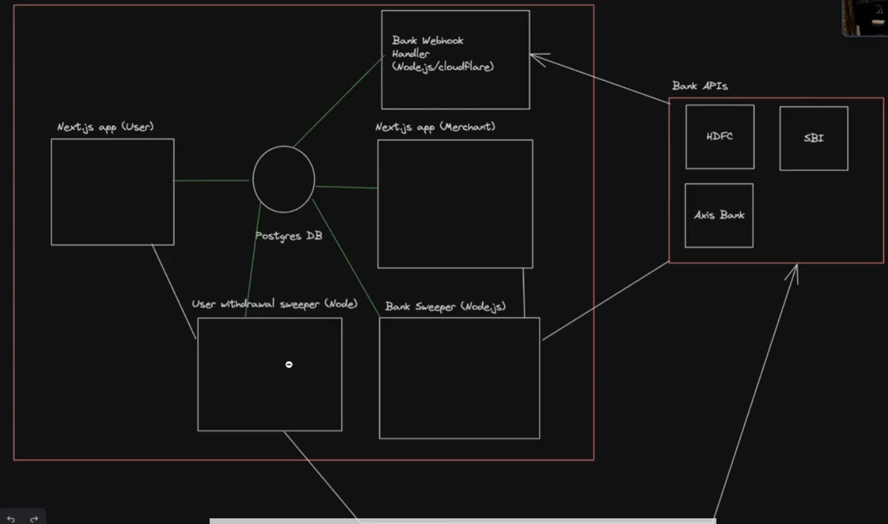

You add money to your wallet, lets say 1000 rupees. You send some to the merchants, like Zomato or Swiggy and you left with 500. Now you want to send that money back to bank. So there is a external service youre heavily reliant on, which is the bank. So you send a request to propayn to send 500 back to your bank account. propayn then sends a request to HDFC bank to transfer 500 rupees from propayn's account to your bank account. HDFC then sends a request to your bank, lets say Kotak, to transfer 500 rupees from propayn's account to your account. Kotak then sends a response back to HDFC that the transfer was successful, and HDFC sends a response back to propayn that the transfer was successful. Finally, propayn updates your wallet balance and sends you a notification that the transfer was successful. This entire process is called off-ramping, where you are transferring money from your wallet back to your bank account. So youre reliant on multiple external services to complete this process. And these external services are not always reliable. You cant assume, sending money to your bank will be like this easy like http://hdfc.com/transfer?amount=500&to=yourbankaccount. Banks go up and down, they have very high latency. You have to track this transfer very heavily. You have to make sure that the transfer is successful, and you have to handle errors and retries. This is why financial applications are complex and require a lot of engineering effort to build.

So, we'll have a propayn nextjs frontend and backend and a database. We need is a separate backend bank server that tells us that the user's bank sent the money to propayn's bank account, this separate backend which might be hosted on webhook.propayn.com, we are making it separate because it needs to be highly available and reliable, if this goes down you might not be able to capture request that bank has sent you. You want your primary application that scales up and down that have high traffic to be separate from this backend that is highly available and reliable. This backend will have multiple endpoints that will be hit by the banks, like webhook.propayn.com/hdfc, webhook.propayn.com/sbi, etc. So when user selects sbi netbanking to add money they will be sent to sbi page and make the payment (sbi will transfer that amount to propayn's hdfc bank account), then the sbi server will tell the webhook server that the user has been charged, and the webhook server will update the transaction to fulfilled from processing. Why dont the frontend directly talk to the bank? Because the frontend is not trusted, it can be modified by the user. The frontend can be hacked, and the user can send a request to the bank to add money to their wallet without actually paying. So the frontend should never directly talk to the bank, it should always go through the backend. So the bank should tell our webhook backend that payment has been made. This is very common architecture when talking to bank apis. 

Now whenever user wants to send money to their bank account. When user selects the withdraw option then we need to hit the user's bank api. Now lets say that bank server is down for 2 mins. One thing you can do it to tell user bank server is busy and please retry later. But if you dont want to give user such a bad experience, if the bank server is down then you want to keep retrying it, then you need another service called the withdrawal service, whose job is like, when someone withdraws money then that request will sit in a queue, and the withdrawal service try to hit the bank server, if its rejected then it again goes into the queue and will keep retrying to hit the bank api until it is successful or until a certain time limit is reached. This is called a retry mechanism, and it is very common in financial applications. 

The withdraw code and service should be very secure, like it should not be possible that user sends the request to withdraw more money than they have in their wallet. It should have good validations and checks. So ideally you should send the reques to bank server sequentially (it should not be like the requests are sent parallely as there can be 2 requests thats telling user 1 withdraws 200 and user balance is 200, but parallel request made 400 rupess withdrawl) and check if the user has enough balance in their wallet to withdraw that amount. 

### Hot Paths
The database paths you need to be very cautious with:
- Send money to someone, make sure the user cant spent twice quickly. Means user cant send money to to people at same moment.
- Add money to wallet, make sure the webhook adds the money to the wallet only once, you need to do few checks, like is the transfer happened before? As bank might happened that the bank retried and sent you the request twice.

So financial apps like Paytm, Zerodha, Slice etc.. are the apps that are holding your money for you. Which is quite dangerous as we see, They have a balance of you taken from your bank. The balance they have is a number stored in the database. There must be good security around that number.
So when you let's say want 2000 in your paytm wallet, to add money you select HDFC net banking. Then paytm says I have a user with this user id, please charge 2000 from its account and send it to the paytm's bank(lets say it's linked to Kotak bank). So HDFC understands and gives a token to paytm to give it to user. So that when user visits HDFC netbankig site with token, it understands that it is the customer that paytm was talking about.
Then HDFC takes 2000 from the user's account and tells the paytm backend that I have took 2000 you do +2000 in wallet. HDFC may be sending paytm's bank 2000 maybe that time or maybe all the payments like that at once a day maybe end of the day. Paytm's backend gets to know that HDFC took user's 2000 and it adds 2000 in the user's wallet.
This HDFC telling paytm backend is called a webhook. paytm has a webhook or an API endpoint like internal.paytm.something/hdfc that HDFC can send a req to tell paytm that user you told with id this has paid 2000. It's called a webhook and that's how financial services talk to banks.

Eg: lets say you go to makemytrip website and select a hotel for 10000 and select sbi bank net banking to pay and click pay now. Then number 1 request go to mmt server that i want to charge 10000 rupees to the user with id 1. It tells sbi servers i have a user with mmt id 1 and he want to pay 10000 to me please give me a url with a token, so that the money deduces from user's bank and goes to mmt's bank account. Sbi gives a link like netbanking.sbi.com/something?token=.... whoever you want to charge 10000 rupees send them here. MMT backend sends this url to user browser and it redirects the user to this link.
User enter credentials and pays. Then the sbi server will tell the mmt server that the id 1 user had paid please give them the service they have asked for (the bank gives back userid, amount it deduced, and a password along with it, so that the webhook knows that the bank has sent the request actually not someone else, so this generally happens with webhook, whoever is calling that webhook you need to share a password with them so you be able to validate if the req is coming is actually coming from them), i will transfer the amount to mmt's bank account which is in lets say icici bank. (what does not happens is the, when user put userid password and otp to netbanking page and pays, then user gets redirected back to mmt page and from client the request goes to the mmt server about payment has been done). So sbi server directly talks to the mmt server. Makemytrip server redirect the user to the bill recipt page. (Mmt frontend doesnt talk to the mmt server, as user can give a modified request or something which is not safe.)

So hdfc send Paytm a req or api that i have send 2000 to Paytm's bank, so credit it to the user's wallet, so why cant someone mock the req and keep crediting. Because hdfc also sends a password that is shared between Paytm backend and hdfc so that it understands that the req came from the hdfc only.

In finantial application, one should store the money in the database in integers, we dont store in decimals. Like rs. 20 is stored like 2000, not like 20.00, its because of precision issues. It might happen when you get an entry you might get number like 20.19999999 and its not possible as a value of paise, also some user may be missing some money, so you never should store decimals in databases. 

"npx prisma db seed", it means when you start database your db is completely empty, there is no data in the table. So its a good idea to seed some dummy data in there.
prisma.user.upsert means insert the data and if the data is already there then insert that data. Because you might run create again and again and it will give conflict.

## On Ramping
We will have to create 2 things, first is creating a dummy bank server, and second is creating a nodejs bank webhook handler server that the dummy bank will hit.

Whats webhooks?
You have FE and BE of your application, that talks to the BE of your application. Lets say you have another nodejs backend with none of your services are talking, but lets say there is external company lets say HDFC api, that needs to share information with you time to time, so when that HDFC hitting your BE service, this BE request is called webhook request, because you have a way for other people to hook into your database by sending a request to that BE. So these are webhooks that are separate BE servers from your primary backend.

Can someone hack webhook server and send add money req directly or if some get access to webhook url can impersonate hdfc and send req to propayn, directly?
So when hdfc sends the response to zerodha that i have debited user with id 1, it also sends a password that is shared between both. So propayn checks if the password send by hdfc is that or not. Or you can also do ip based protection.

ACID Properties in DBMS:
Atomicity: The entire transaction takes place at once or doesnt happens at all.
Consistenct: The database must be consistent before and after the transaction.
Isolation: Multiple transactions occure independently without interference.
Durability: The changes of a successful transaction occures ever if the system failure occures.

How do bank server know webhook server address and api endpoint?
We aint hitting the bank server from frontend, whenever you go to the bank and say we need your apis, it asks for your webhook, thats how the bank will know that when the payment is done, it will hit the webhook server.

Lets take razorpay, you have a website and you Want to accept payments What you can do is you sign up on razor pay and you tell razor pay that I will send To you their userid, the amount you have to deduce, please debit that money, whenever you do please let me know that This user id has paid this much money for this specific transaction. Show benefits your debuting money On Internet for your service and you dont have your bank you use the services like Razer pay or stripe or directly the bank api You have to Sign up to razorpay or stripe, or signing up with the hdfc folks Telling them that we have to accept payments so this is my webhook url, whenever i send user your way and they make the payment let me know on this webhook. Then when user comes to your website and clicks on pay then you tell the hdfc that this is the user id please charge them 1500, then you redirect the person to hdfc netbanking page with token and when the user succeds with the payment they hit the webhook with the success.

## Step by step Flow: Add Money to propayn wallet via netbanking

1. User Action (frontend - propayn Fe)
- User enter amount and select hdfc bank as payment method. 
- On clicking pay securely paytm Frontend sends a request to paytm backend (Paytm BE)

2. Payment request initiation (backend - propayn BE)
- Paytm backend validates the request (user session, KYC, limits, etc.)
- Paytm backend generates
    - a transaction/order id
    - a secure token (transaction token) to prevent tampering/fraud
- It stores this transaction with status as pending 
- Then paytm backend calls this internal propayn or payment gateway backend to initiate payment

3. Payment Gateway Coordination
- The backend or PG middleware handles the integration with external banks. 
- It prepares a payment payload including a transaction amount, order id, merchant id (which is paytm's id), HDFC callback url (which is Webhook Return url for success or failure), and a signature (to ensure authenticity and data integrity)
- Then PG backend redirects the user to HDFC Bank's net banking payment url via POST/redirect with all this data.

4. Bank Page (HDFC Net Banking)
- User lands on HDFC Bank's payment page
- User logs in with HDFC credentials and authorizes the payment
- The amount is already prefetched based on payload from Paytm

5. Payment Completion (Redirect + Webhook) 
**(SUCCESS CASE)** 
- Hdfc processes the payment and deducts the amount from user's bank account.
- Then two things happens:
    - Frontend Redirect: HDFC redirects the user back to Paytm's return url with the transaction status (success) and transaction id.
    - Server-to-server Webhook: HDFC also notifies the Paytm backend via a webhook (to a separate webhook handler service- likely paytm's auxiliary backend) with the transaction details (transaction status, reference id from HDFC), amount, signature for verification, etc.

6. Verification and Finalization (Paytm Backend)
- Paytm verifies the Webhooks Authenticity using signature and transaction id. 
- If everything checks out:
    - It makes the transaction as success. 
    - Credits the amount to the user's paytm wallet. 
    - Sends a confirmation notice to the user (via app sms or email). 
- Funds are settled into paytm's acquiring bank account example ICICI

**(FAILURE CASE)** 
- If user cancels payment or it fails due to insufficient balance:
    - HDFC redirects to payment paytm return url with Failure status.
    - No webhook is sent or it is marked as failed.
    - Paytm backend marks transaction as failed and no money is added to the wallet.

**Why use a token/signature?**
- To prevent tampering/spoofing, Paytm uses:
    - Transaction token (tied to a user/session/amount).
    - Digital signature, hash based asymmetric encryption (HMAC) to verify the authenticity of the webhook payload.
    - This ensures the return data or webhook cannot be faked.

## Now what is PG (Payment Gateway) middleware/integrator and auxiliary backend?

- PG middleware or integrator component handles integrating and managing the payment request to external entities like banks, UPI, cards, etc. Think of it as the bridge between Paytm and external payment systems.

**Responsibilities:**
- Receives payment instructions from paytm backend (example: amount, user id, selected payment method).
- Generates the required payload (bank specific) with correct format, merchant id, encryption/signature.
- Redirects the user to the bank or payment page (HDFC, etc.).
- Tracks the user's payment session (transaction id, order id).
- Waits for the callback or redirect from bank to paytm after the user finishes the transaction.

