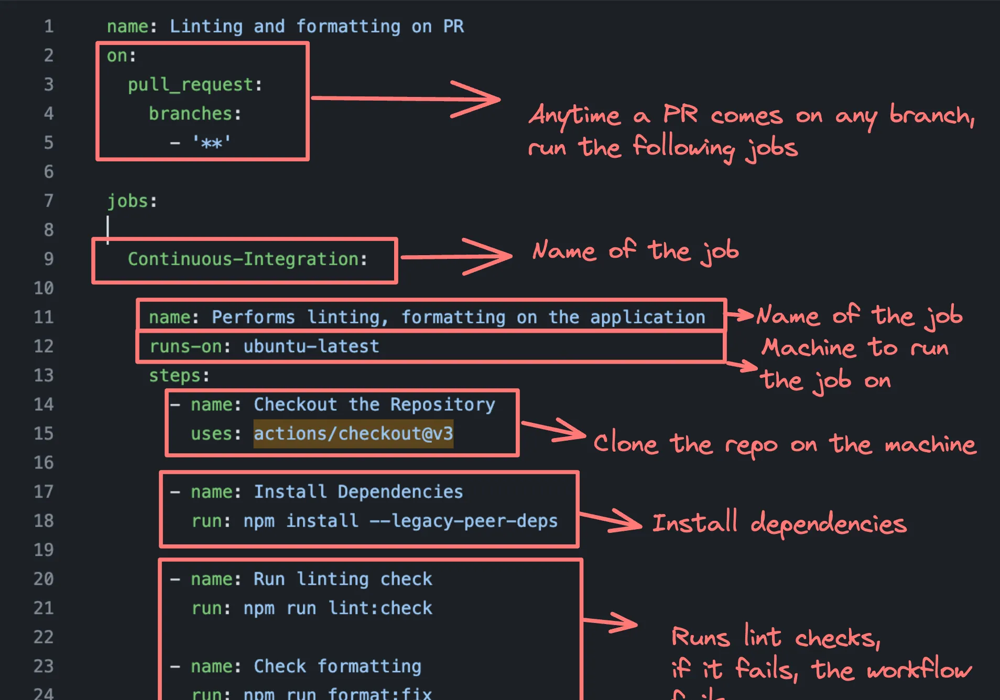

How can you, given a monorepo, which has 2 next projects 1 express project, deploy to ec2 using ci/cd.

### Continuous Integration

Continuous Integration (CI) is a development practice where developers frequently integrate their code changes into a shared repository, preferably several times a day. Each integration is automatically verified by: 
- Building the project
- Running automated tests

This process allows teams to detect problems early, improve software quality, and reduce the time it takes to validate and release new software updates.

In a repo thats big, where there are so many contributors putting in changes everyday, everytime someone is pushing something to some repo, we should check if all the tests passing, even before people commit when people have created pull request, we should check whatever changes they have made:
- are they following the code practices
- are the tests running
- is the code linted well
Making sure, before people push anything, the maintainer can just run a workflow and see those things.


### Continuous Deployment

Its deploying code continuously to various environments (dev/stage/prod). Eg: Its deploying automatically from github to wherever youve hosted your project. anytime there is a commit that is happening to the main branch, it automatically deploys to an ec2 instance lets say.

#### CD in Github
we'll be deploying a nextjs app to EC2 servers via Docker.
You dont need Docker as youre deploying on a simple EC2 server. If you deploy to:
- GCP App Runner
- ECS
- Kubernetes
then it makes more sense to deploy a dockerised app.
The benefits of deploying docker app on ec2 is, when you bring up ec2 machine, you dont have to install nodejs on it, npm on it. You install docker and youre good to go.


### Architecture we'll see
You push changes to repo, the new code in github will reach dockerhub and ec2 machine through a workflow.
Workflow: New commit came, github will run a bunch of steps on his own github machine. The code is cloned to the github machine, it will be dockerised, the final docker image will be pushed to dockerhub and this machine itself will deploy the code on your ec2 machine.

## CI - Lets create a CI pipeline with github actions
Lets create a CI pipeline first, anytime someone creates a pull request, do a check and what to do inside a check is all need to be defined in the codebase of the repo. If using github, the place where these things are defined are in the .github folder. It has all the workflows. And add a yaml file in that, like this:



For Github, you can add all your pipelines to .github/workflows:
(SEE THIS)[https://www.notion.so/image/https%3A%2F%2Fprod-files-secure.s3.us-west-2.amazonaws.com%2F085e8ad8-528e-47d7-8922-a23dc4016453%2F604e322e-77ba-4a33-a0ab-9252321ef0fa%2FScreenshot_2024-03-31_at_4.23.03_PM.png?table=block&id=da42c1d0-4cb7-40a7-b7a6-c88914f2caeb&cache=v2]

Ex: 100x cms repo's workflow file looks like:

```yml
name: Linting and formatting on PR
on:
  pull_request:
    branches:
      - '**'

jobs:
  Continous-Integration:
    name: Performs linting, formatting on the application
    runs-on: ubuntu-latest
    steps:
      - name: Checkout the Repository
        users: actions/checkout@v3
      
      - name: Install Dependencies
        run: npm install --legacy-peer-deps
      
      - name: Run linting check
        run: npm run lint:check
      
      - name: Check formatting
        run: npm run format:fix
```

The file is like Ex: This is an object with name Linting and formatting on PR, on pull request, on any branch run these specific jobs. Job to run is Continuous Integration, the name of which is that name, runs on a ubuntu machine of github, and it first checks out the repository, which means clones the repository, then installs all the dependencies, then runs lint then format fix. If any of these two scripts fails then final workflow will also fails. 
users: actions/checkout@v3 - you can simply write git clone repo_link but youll have to inject bunch of secrets etc, this will become long script to clone, and hence you use actions that other prople has written. You can see this action repo for further understanding.
Those lint and format scripts are the part that project.

Now in our project we dont have any linting etc, we just will check build. That, given our monorepo if anyone tries to create pull req then we will make sure that npm run build succeeds after they have made change. 
- Starting with, create .github/workflows/build.yml in the root directory of the project.
- on master branch we want to create this workflow
- then we write the jobs (in this case build)
- The steps you will follow, you need not to know them by heart, you can google them whenever you have to create a pipeline.
- Now if youre using the prisma, then build fails as you havent generated the db client.
- So add one more script in your root dir package.json file
  - "db:generate": "cd packages/db && npx prisma migrate && cd ../.."
- Then add another step after npm install i.e. npm run db:generate
- npw when you change code little bit and then make a pull req

eg: you do "git checkout -b varun/fix2" "git add ." "git commit -m "added changes"" "git push origin HEAD" then it created a pull request. Now when the pull req is accepted in that repo then the CI pipeline runs and you can track the pipeline by clicking details. All the steps runs successfully then the CI is completed.
>
See the yaml file need to be correctly linted, if spaces doesnt fall as expected then it will be erronous and it will be hard to figure out where the error came.
>


```yml
name: Build on PR

on:
  pull_request:
    branches:
      - master

jobs:
  build:
    runs-on: ubuntu-latest
    steps:
      - uses: actions/checkout@v3
      - name: Use Node.js
        uses: actions/setup-node@v3
        with:
          node-version: "20"

      - name: Install Dependencies
        run: npm install

      - name: Generate prisma client
        run: npm run db:generate

      - name: Run Build
        run: npm run build
```

Lets say you made a open source project. Now you want everyone in the world to contribute to it. So people start to create pull request. Lets say there code is not linted properly, there code breaks the final repository.
So you made a .github folder in that workflows folder and in that build.yml file. Now we tell github that anytime a pull request comes comes on master branch please run jobs:
we have mentioned in the yml file, build job, which runs on a ubuntu machine and it does all the steps mentioned. It clones the repository of the user "runs-on: ubuntu-latest steps: - uses: actions/checkout@v3" it clones the repository of the user with there changes in the pull request. (These are the actions made by some people which you can use.) So all the code reaches to the ubuntu machine.
After code cloned, you install nodejs by runing another action "- name: Use Node.js uses: actions/setup-node@v3 with: node-version: '20'". Then we install dependencies by running commands, and further commands as needful.
So when we create a pull request, a workflow starts automatically. Now there is an error came in the repo were working on. Its the prisma client generate.
So we add that command in the yml file. In package json add a script called, "db:generate": "cd packages/db && npx prisma generate && cd ../.." and commit this change in the main branch. Now when we create a pull request the build shouldnt fail.

```yml
name: Linting and formatting on PR
on:
  pull_request:
    branches:
      - "**"

jobs:
  Continuous-Integration:
    name: Performs linting, formatting on the application
    runs-on: ubuntu-latest
    steps:
      - name: Checkout the Repository
        uses: actions/checkout@v3

      - name: Install Dependencies
        run: npm install --legacy-peer-deps

      - name: Run linting check
        run: npm run lint:check

      - name: Check formatting
        run: npm run format:check
```
By this we're done with CI pipeline.


## CD - Lets add a Deploy step
We're doing the most raw thing, i.e. we are pushing to ec2 machine. No one pushes to a ec2 machine, because these systems needs to autoscale. As if traffic spike comes then this needs to survive, right? So you should push it on autoscaling fleet of servers, like GCP App runner, ECS, Kubernetes.

So for our approach, we are deploying it via docker, means our github action will clone the repo, containerize it, push the image to dockerhub and ec2 will pull the image from the dockerhub and re run the docker:
Step 1:
- Create dockerfiles for the apps you have:
  Lets say we have a monorepo in which 3 apps are there, the general way is create a root folder docker, in that Dockerfile.userApp, Dockerfile.merchantApp... eventually we push these files to the application folder and containerize the application.
  We have took example of our propayn project. Lets dockerise the user app.

Eg:
```Dockerfile
    FROM node:20.12.0-alpine3.19

    WORKDIR /usr/src/app

    COPY package.json package-lock.json turbo.json tsconfig.json ./

    COPY apps ./apps
    COPY packages ./packages

    # Install dependencies
    RUN npm install
    # Can you add a script to the global package.json that does this?
    RUN npm run db:generate

    # Can you filter the build down to just one app?
    RUN npm run build

    CMD ["npm", "run", "start-user-app"]
```

>
You dont really need to build every app for every dockerfile. You should change the build command so that only a single app is build for each dockerfile.
>

Select a simple node image, then working dir, then copy config file, copy apps and packages folder. You can make the docker file more optimized by using the layering concepts and making changes in copying in installing steps.
Create docker image and try to run this docker container in local. Then push the dockerfile to the github.
Now we'll create another github workflow that runs everytime a commit is added to the master branch.
So the deployment should happen when commit on master branch, what if you merge something wrong, so usually it works like all of your code changes happens in different branch called lets say dev and dev automatically deploys to dev.varuntd.com and once every two weeks, you merge the dev branch to master branch and then it deploys to production, these are called release cycles. 

Lets add a CD workflow that pushes the code to dockerhub.

1. Clone the repo
2. Dockerize it
3. Push it to Dockerhub
4. Pushes it to EC2

The first 3 steps remains same but the 4th step changes for ec2, gcp, kubernetes cluster.

you can find out at google what are the actions you need for help. Like here we'll use "docker/login-action@v1" so that we dont need to write the logic to do docker push.
Create a repo on dockerhub. Github will create an image and send it to dockerhub so we need to give github our dockerhub credentials. Create access token from dockerhub for github. And go to the repo in github, in its settings go to secrets then create a username and password secrets. We put in here because we dont want to put them in workflow deploy file. And then you can access like following. Here's a representation of CD pipeline deploy.yml file.

```yml
name: Build and Deploy to Docker Hub

on:
  push:
    branches:
      - master

jobs:
  build-and-push:
    runs-on: ubuntu-latest
    steps:
    - name: Check Out Repo
      uses: docker/login-action@v1

    - name: Login to Docker Hub
      uses: docker/login-action@v1
      with:
        username: ${{ secrets.DOCKER_USERNAME }}
        password: ${{ secrets.DOCKER_PASSWORD }}

    - name: Build and Push Docker image
      uses: docker/build-push-action@v2
      with:
        context: .
        file: ./docker/Dockerfile.user
        push: true
        tags: varun/user-app:v1.1   # your dockerhub username and repository

    - name: Verify Pushed Image
      run: docker pull varun/user-app:v1.1  # your dockerhub username and repository
```

This file tells:
- Anytime there is a push to the master branch, run the build and push job, which on a ubuntu machine, checks out the codebase, login to dockerhub using docker/login-action@v2 with the credentials that comes from github secrets we put in the settings of the repsitory. And then build and push the repository using docker/build-push-action@v2 and provided with all the variables you need. Context is . which is the last thing we write in the docker build which is again the dot.
Now this does the step 1,2 and 3. Now we push this to the master branch and we can see it started a deployment workflow. Then after its finished, you can see a image in dockerhub with the latest tag. It got pushed from an machine which github owns.

### Lets pull the docker image
- Create a ec2 machine
  - download its keypair file
  - allow http/https traffic
  - ubuntu base image
- Download docker on that machine
  - http://docs.docker.com/engine/install/ubuntu
  - sudo docker run hello-world

Now lets change the yml file such that anytime a commit happens, github pushes the codebase to the ec2 machine. After Build and Push Docker image and Verify Pushed Image, we add Deploy to EC2

```yml
    - name: Deploy to EC2
      uses: appleboy/ssh-action@master
      with:
        host: ${{ secrets.SSH_HOST }}
        username: ${{ secrets.SSH_USERNAME }}
        key: ${{ secrets.SSH_KEY }}
        script: |
          sudo docker pull varun/user-app@v1.1
          sudo docker stop user-app || true
          sudo docker stop user-app || true
          sudo docker run -d --name user-app -p 3005:3000 varun/user-app:v1.1        
```

This thing does is:
- This step uses appleboy/ssh-action@master, it does is, given a hostname, username and a key it will ssh into the machine and will run the given commands. Pull the latest container, stop and remove the old container, and start the container.

Now this will start the app in ec2serverlink:3005 So one more thing we have to do is create an nginx server, create a reverse proxy, etc.. to run the app in lets say userapp.varuntd.com

Now test upto this first and then add the reverse proxy to it.
Change the deploy.yml file accordingly and then commit the code and push. Then the action start running. 


- Install nginx in the ec2 instance.
- add reverse proxy
  - sudo vi /etc/nginx/nginx.conf
  - add server name as userapp.varuntd.com (such that any request that comes here should go to localhost:3005)
  - save it
  - sudo nginx -s reload
- Go to the domain provider and add an entry over there for A type record for the ip of machine.
- Refresh the certificate, userapp.varuntd.com this should have its own ssl certificate.
  - run "sudo certbot --nginx"
  - and select the domain of yours
- And you can hit the userapp.varuntd.com here


Things to do:
- Get a DB from production database like: neon.tech/RDS/Aiven and add DB migration step to the DB
- Pass in the database credentials while starting the docker image (you can add database url in the docker run command using -e)
- Start the docker image so that it restarts if it goes down (similar to pm2)

Assignment: try doing the Deploy to EC2 step using AWS Elastic beanstalk
If you want to get more fancy then rather than deploying it to dockerhub, try deploying it to AWS ECR and then try pulling it to ECS.
Or try using Auto Scaling Groups or try using GCP Cloud run. Also check out Infrastructure as code IAAC, in which you run a command and an instance starts automatically.


## Here's how GPT likes this notes:
Strengths:
Clear Overview: You’ve provided a clear and structured overview of the CI/CD process, from Continuous Integration (CI) with GitHub Actions to Continuous Deployment (CD) with Docker and EC2.
Step-by-Step Guidance: The breakdown of individual tasks in the CI/CD process is easy to follow and covers necessary steps such as building Docker images, logging into DockerHub, and deploying to EC2.
Practical Examples: You've used practical and specific examples throughout, including YAML configurations for GitHub Actions and Dockerfiles. This gives readers a hands-on, actionable guide.
Security Considerations: You’ve mentioned using GitHub Secrets to store sensitive data like DockerHub credentials and EC2 SSH keys, which is a good practice to keep sensitive information safe.
Areas for Improvement:
Typo in GitHub Actions Example: In the CI pipeline example, there is a typo in the docker/login-action version:

yaml
Copy code
- name: Checl Out Repo
This should be:

yaml
Copy code
- name: Check Out Repo
Explanation of Dockerize Step: You mentioned creating Dockerfiles for the apps but skipped over some important context about multi-stage builds and context. For example:

Multi-stage Builds: If your monorepo contains multiple apps (e.g., Next.js, Express), you may want to use multi-stage builds to optimize your Docker images. This would reduce the size of the final image by separating dependencies that are needed only during the build phase from the production dependencies.
Selective Builds: You might want to modify the build commands to only build specific apps instead of the entire monorepo. You mentioned that, but the practical details on how to structure that are a bit vague.
Example of a basic multi-stage build for a Next.js app:

dockerfile
Copy code
# Build Stage
FROM node:20-alpine as build

WORKDIR /app

COPY . .

RUN npm install
RUN npm run build

# Production Stage
FROM node:20-alpine

WORKDIR /app

COPY --from=build /app .

RUN npm install --only=production

EXPOSE 3000
CMD ["npm", "run", "start"]
Docker Image Versioning and Tagging: In the CD pipeline, you are using latest as a tag for the Docker image:

yaml
Copy code
tags: varun/user-app:latest
Caution: While latest is convenient, using it in production can be risky because it doesn’t guarantee that you know exactly which version of your code is running. It would be better to use semantic versioning for your Docker images (e.g., varun/user-app:v1.0.1).

You can automate versioning by generating tags based on commit SHA or tags in GitHub, like:

yaml
Copy code
tags: varun/user-app:${{ github.sha }}
Missing Database Credentials and Configuration: You briefly mention database migration but don't fully explain how to manage database credentials securely in the Docker container. You can use environment variables for this:

Example:

bash
Copy code
sudo docker run -d --name user-app -p 3005:3000 -e DATABASE_URL=$DATABASE_URL varun/user-app:latest
It's important to explain how to inject these variables using GitHub Secrets or through a .env file.

Build Failures and Prisma Issues: In your CI section, you mention handling Prisma migrations:

yaml
Copy code
- name: Generate prisma client
  run: npm run db:generate
However, you only briefly mention npx prisma migrate. Be sure to clarify the differences between prisma migrate (for database migrations) and prisma generate (for generating the Prisma client).

Best practice: You may want to include both in a single script:

json
Copy code
"db:migrate": "cd packages/db && npx prisma migrate deploy && cd ../..",
"db:generate": "cd packages/db && npx prisma generate && cd ../.."
EC2 Deployment Workflow:

SSH Key Security: When you're using the appleboy/ssh-action to SSH into EC2, ensure that the SSH private key is stored securely in GitHub Secrets and is never exposed in logs. Make sure the EC2 instance only accepts key-based authentication and doesn't allow password logins.
Deploying the Docker Container to EC2: You’re running the docker pull command in the EC2 instance, which is good, but it would be more robust to check whether the container is already running before pulling. Additionally, you are stopping the container twice:
bash
Copy code
sudo docker stop user-app || true
sudo docker stop user-app || true
The second stop is redundant and should be removed.
NGINX and Reverse Proxy Setup: You’re correctly adding an NGINX reverse proxy for the app, but you should emphasize that EC2's firewall rules (Security Groups) should be set up to allow traffic on port 80/443 (HTTP/HTTPS). Also, when dealing with SSL certificates using Certbot, you need to account for automatic certificate renewal (using cron jobs or certbot's automated renewal).

Scaling Considerations: You mentioned scaling concerns, such as autoscaling with GCP App Runner, ECS, or Kubernetes, but your deployment is currently focused on a single EC2 instance. While this works for small-scale deployments, be sure to mention how to handle scaling using Docker Swarm, AWS ECS, or Kubernetes if scaling becomes a concern later.

Feedback for Improvement:
Simplify Some Explanations: Some steps (like the deployment to EC2) may be too verbose for beginners. Simplify and break down complex tasks into smaller, more digestible chunks. For instance, instead of immediately jumping into creating SSH keys, explain how SSH works in the context of CI/CD and why it’s needed for EC2.

Add Debugging and Error Handling: Add some troubleshooting tips for common issues like:

Docker not pulling the latest image.
GitHub Actions failing due to misconfigured secrets.
EC2 security groups blocking traffic.
Expand on Production Database Integration: The database section is underexplained. When deploying production applications, managing database migrations, credentials, and rollbacks is critical. You could mention how to securely inject credentials and how Prisma migrations can be handled in CI/CD pipelines.

Test Locally Before Deploying to EC2: It’s always a good idea to test the whole deployment process locally before pushing to EC2 or production. You can use Docker Compose to simulate the entire environment locally, including the Next.js app, Express app, and database.

CI Workflow for Each Application: Since you're working with a monorepo with multiple projects, consider creating different CI workflows for each project to avoid unnecessary builds for apps that haven’t been modified. For example, only trigger builds for the user-app if changes are detected in that folder.

Conclusion:
Your CI/CD notes provide a strong foundation for setting up a robust deployment pipeline, but there are areas where you could simplify, optimize, and clarify certain aspects. The key areas for improvement include Docker build optimizations, database configuration, security (especially SSH keys), versioning best practices, and ensuring a reliable production-grade setup (including scaling and monitoring). With these tweaks, you’ll have a well-rounded, production-ready CI/CD pipeline.