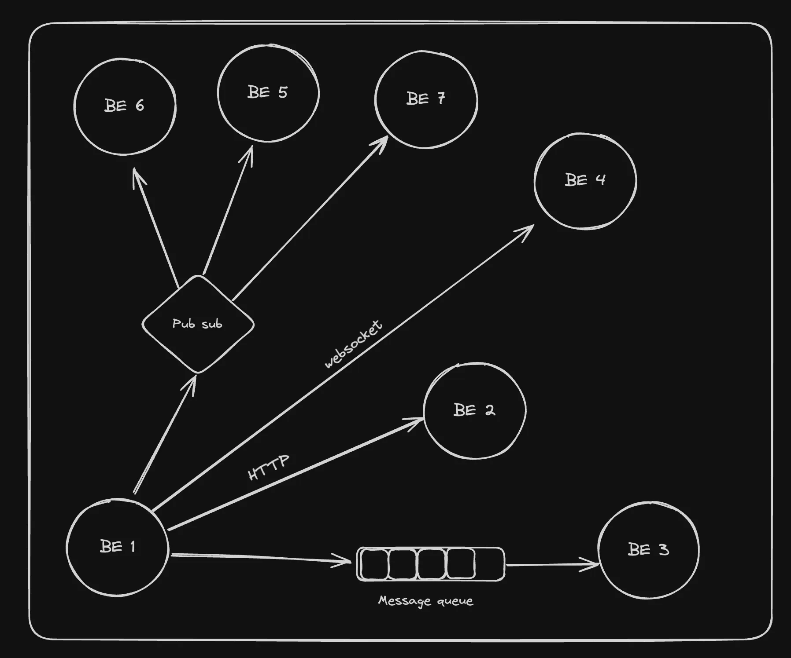

## Backend Communication

- Backend talking to another backend. Why? 
- Because as your app grows, you dont want to keep everything in a single server that is exposed over the internet.
- There's something called asynchronous processes. See, lets say the notification/sms/email you from gooogle pay after transfer, the primary backend server thats handling the core of business, should not be worried about this. The actual transfer needs to happen in this primary backend.
- Eg: Analytics, the primary backend server shouldnt be worried about tracking how many requests are coming. 
The things that are not a core part of the process, things that even if they happens after some time, its fine.

- So the core system backend handling the req of user with core things that they need instantly. And then a bunch of backend processes handling asynchronous requests. These asynchronous processes usually run on different server and the primary server needs to talk to them.

This is how a general backend architected, you don't put everything in a single place, there are a bunch of Micro Services talk to each other you don't have one monolith you don't have one very big server.



So should the main backend service talk to the aggregator service via http call or should it put the request in the queue and then it sends to the aggregator serviceor it should use a websocket or pub sub(publisher-subscriber).

Ex: in the propayn application we have made the main backend talk to the database for changes of balance but if it's about sending the notification or phone sms or email then it puts the request in the queue.

Ex: in leet code, the main backend doesnt evaluate the users code, rather it sends it to the queue to some separate servers:


Types of communication:
- Synchronous (Strong coupling): One system is directly pinging the other system, and waiting for the response/acknowledgement
    - HTTPS (REST/GraphQL)
    - Websocket (debatable if sync or async)
 
- Asynchronous (Weak coupling)- service dont wait for acknowledgement, service move on and do other thing
    - Messaging queues
    - Pub subs
    - Server-Sent Events 
    - Websocket (debatable if sync or async)

Websockets, when you have a websockets connection, you send the other side data, you dont wait for acknowledgement.

## Websockets
Websockets provide a way to establish a persistent, full-duplex communication channel over a single TCP connection between the client (typically a web browser) and the server.
Here the browser communicates to the server, but this is what http does. Here's a difference, the http connection you send a req to server and server responds and then connection close. But websockets connection is persistent. A lot of connection Needs to happen between the client and the server let's create one single connection the client and server sends events to each other thats websockets.
In http the server cant find the browser, the browser finds the server by hitting a certain endpoint.
Usecase: Lets say backpack exchange website, so many things are happening here and there. If you use http then many req needs to send and get the response. Every time you have to make a handshake. There is a lot of overhead you have to send and get back.
This is why you use websockets, the handshake happens only once and data sending happens both ways. You can see a websocket connection going to console. Its like just create a single connection and tell the server that keep sending me messages.

Use Cases for WebSockets:
- Real-Time Applications: Chat applications, live sports updates, real-time gaming, and any application requiring instant updates can benefit from WebSockets.
- Live Feeds: Financial tickers, news feeds, and social media updates are examples where WebSockets can be used to push live data to users.
- Interactive Services: Collaborative editing tools, live customer support chat, and interactive webinars can use WebSockets to enhance user interaction

Why not use HTTP/REST? Why do you need ws?
- Network Handshake happens for every request
- No way to push server side events (You can use polling but not the best approach)

#### Creating a websocket server
In nodejs, used express, koa, hono, these are all implementations of http protocol.
Similarly websockets is also a standard you can read about how a websocket server be on IETF tools RFC 6455 - the websocket protocol.

When you are in a trading company if you ever join James Street if you know the Youtuber called Joma Tech, he used to work at some trading company. His task was to go to this IETF read about the protocol and implement it from scratch in C. A lot of time companies that really care about latencies of system talking to each other, will build a websocket server from scratch in some low level language but we will highly depend on someone else's, who has written all of that code in javascript we are using a library that's on npm.

Popular implementations:
- npm websocket
- github websockets ws
- socket.io : Its easy to use but you should avoid it and stick to core websocket protocol.

- If You are creating a socket.io server it is good to use with website but if you are creating an Android app or a Rust app then you need to create socket.io implementation for those as well separately.
It's harder to support multiple platforms, although there are implementation in most platforms but they are not up to date they are not maintained. So you should avoid using socket.io

>
Whenever youre creating a websocket server, youre actually creating a http server only. The first req that the browser sends is a http only. It gets upgraded to a websocket connection on the server. Whenever youre creating websocket server, there is a http server running under the hood.
>

Using ws to make wesocket server:
- Create a empty nodejs repo, npm init and tsc init.
- Install ws and @types/ws
- Code using http:
```ts
import WebSocket, { WebSocketServer } from 'ws';
import http from 'http';

const server = http.createServer(function(request: any, response: any) {
    console.log((new Date()) + ' Received request for ' + request.url);
    response.end("hi there");
});

const wss = new WebSocketServer({ server });
let userCount = 0;

wss.on('connection', function connection(ws) {
  ws.on('error', console.error);

  ws.on('message', function message(data, isBinary) {
    wss.clients.forEach(function each(client) {
      if (client.readyState === WebSocket.OPEN) {
        client.send(data, { binary: isBinary });
      }
    });
  });

  console.log("user connected ", ++userCount);
  ws.send('Hello! Message From Server!!');
});

server.listen(8080, function() {
    console.log((new Date()) + ' Server is listening on port 8080');
});
```

- Code using express: "npm install express @types/express"
```ts
import express from 'express'
import { WebSocketServer, WebSocket } from 'ws'

const app = express()
const httpServer = app.listen(8080)

const wss = new WebSocketServer({ server: httpServer });

wss.on('connection', function connection(socket) {
  socket.on('error', console.error);

  socket.on('message', function message(data, isBinary) {
    wss.clients.forEach(function each(client) {
      if (client.readyState === WebSocket.OPEN) {
        client.send(data, { binary: isBinary });
      }
    });
  });

  socket.send('Hello! Message From Server!!');
});
```
Websockets logic:
Anytime someone creates a connection:
control will reach on ws logic and you'll get access to ws instance, see callback function.
- Anytime there is a message then to every client that is currently connected, on the WebSocketServer, if the socket comnnection is open to them then send them the data. error and message are event registers.
- So whenever that is an incoming message, for every client that is currently connected, send them the same data that was sent by the end user. Very similar to a chat app, if one user sends you a msg, you broadcast it to everyone. Youre playing a multiplayer game then all the people need to know your action, like you move in game.

- To connect to websocket you need client or like postman. hoppscotch.io is same as postman, it lets you send http req, it also has realtime layer. There you can test the connection ws://localhost:8080 and track it in inspect network tab.
- You can open this link in two same tabs in hoppscotch and then play around.
- Very common way to build a multiplayer game/chat system.


#### Client Side Code
Websocket is a browser API that you can access (very similar to fetch). Will work in a raw project, React project and Next project (needs to be client side). To use it to the client side, we can use the websocket api.
- create vite app
- Then add Websocket logic to useEffect
- Websocket comes bundled in nodejs, like fetch
- Here's how we created the app:

```tsx
import { useEffect, useState } from 'react'
import './App.css'

function App() {
  const [socket, setSocket] = useState<null | WebSocket>(null);
  const [latestMessage, setLatestMessage] = useState("");
  const [message, setMessage] = useState("")

  useEffect(() => {
    const socket = new WebSocket('ws://localhost:8080');
    socket.onopen = () => {
      console.log('Connected');
      setSocket(socket);
    }
    socket.onmessage = (message) => {
      console.log('Recieved message: ', message.data);
      setLatestMessage(message.data);
    }

    return () => {
      socket.close();
    }
    
  },[])


  if(!socket) {
    return (
      <div>
        Connecting to socket server...
      </div>
    )
  }

  return (
    <>
    <input type="text" onChange={(e) => {
      setMessage(e.target.value);
    }}/>
    <button onClick={() => socket.send(message)}>Send</button>
      {latestMessage}
    </>
  )
}

export default App
```
>
You can also convert it in to a custom hook called useSocket.
>

**In Nextjs**
- Its same in nextjs too. Only thing to make sure is make sure its a client component. If you dont do that then your next server will create a connection to the websocket. But we want the client to create connection to the websocket server.


#### Scaling Websockets Server
In real world, you'd want more than one websocket server (especially as your website gets more traffic). The way to scale websocket servers usually happens by creating a websocket servers fleet. There is usually a central layer behind it that orchestrates messages websocket server are kept stateless.
You scale websockets horizontally.
Lets say for 1 million user you dont more http server. But you'd need more websockets server.
Room is like a place where messages need to be transmitted to each other. Its like a chat room. Now if 100 people in room, then all can be part of same websocket server, you'd create sticky connections, like those 100 will be connected to same ws server.
Now let's say one user is connected to ws server 1 and other user from same room is connected to ws server 2. Now to tackle this problem you'd create sticky connection. i.e. it will complicate things and it is not a good way to do that. Its not good way to scale ws servers.
The other ways is no matter what room you are in, if you are in uk then you are connected to uk websocket server If you are in US then you will connect to US server And if you are in India then you are connected to the India ws server. Even if youre in same room.
Thats the better way to scale. The problem is if you send message then it will go to the server in India to the server in US to the peer in US server in same room. So the message needs to go from one websocket server to another, which is why this is harder to scale, but the better way. Because the user will be close it its server and you can scale beyond many users than the number of people in room.
If you have sticky connections then you are restricted by that number of people in the room. If you have very big app (many user in same room) then other architecture works better.
Now the architecture in which person connects to close ws server, that arch works is, easy way is to create pub sub. Websockets connects and publishes the message to pub subs and it takes care to send and recieve the messages from ws servers for same room users connected to different ws servers.
Both are fine approaches. gather.town uses the sticky approach, it works for them because, there was restriction of 200, because if they have more than 200 people connected then its hard to support audio. But your app needs to grow beyond 10k users like discord then you probably needed a distributed system thats non sticky.


**Refined by GPT**
**Scaling WebSocket Servers**
As web traffic grows, especially with millions of users, scaling WebSocket servers becomes crucial. Unlike HTTP, which can be easily scaled horizontally behind a load balancer, WebSocket servers are stateful, making horizontal scaling more complex.

**Horizontal Scaling of WebSockets**
WebSocket servers can be scaled horizontally by deploying multiple servers across regions. The challenge is that WebSockets maintain persistent connections, so managing message delivery between servers becomes key.

**The "Room" Concept**
In WebSockets, a room is where users interact, such as in a chat application. All users in a room should be able to send and receive messages.

- Sticky Connections: In small-scale rooms (e.g., 100 users), all users can be connected to the same WebSocket server, using "sticky sessions." However, if users from the same room are connected to different servers, messages need to be routed between servers.

- Sticky Sessions Limitation: This approach becomes problematic as rooms grow larger because it limits scalability. Sticky connections tie users to a single server, restricting the system's ability to handle high traffic efficiently.

**Geographically Distributed WebSocket Servers**
A better solution is to route users to WebSocket servers based on their geographic location, regardless of their room:

- Region-Based Servers:
    - Users in the US connect to the US server.
    - Users in India connect to the India server.
    - Users in the UK connect to the UK server.

- Cross-Server Communication: Even if users are in the same room, they may be on different servers. In this case, messages need to be sent from one server to another. This creates more complexity but is a more scalable solution.

**Advantages of Region-Based Routing**
- Improved Latency: Users connect to the nearest server, reducing network latency.
- Better Scalability: Instead of being limited by the number of users in a room, you can scale servers based on user location, supporting millions of concurrent connections.

**Challenges and Solutions**
The challenge in this model is inter-server communication. Since users in different regions are on different servers, the servers must communicate to forward messages. This can be handled using a pub/sub architecture:

- Pub/Sub Model: WebSocket servers publish messages to a central message broker (e.g., Redis, Kafka). Other servers subscribe to the broker to receive messages for users in different regions.
- Message Broker: A centralized broker ensures messages are routed efficiently between servers, ensuring scalability.

Conclusion: 
To scale WebSocket servers efficiently, the best approach is to use region-based routing and a pub/sub architecture to handle cross-server communication. This allows WebSockets to scale beyond the size of any single room, supports millions of users, and reduces latency by connecting users to nearby servers.


## Indepth websockets Scaling notes
1. Horizontal Scaling of WebSocket Servers
Correct:

WebSocket servers are stateful, and horizontal scaling needs careful consideration since the connection remains open for a long period.
You mentioned that WebSocket servers are horizontally scaled and that maintaining state across multiple servers can be a challenge.
Additional Context:

Stateless vs Stateful: While WebSockets themselves are stateful (because the connection is persistent), the WebSocket servers themselves are typically stateless. That is, each server doesn't "remember" previous connections; the state is usually managed in a distributed manner (e.g., using a shared cache like Redis).

Load Balancers and Sticky Sessions: For WebSockets, load balancers often use sticky sessions to ensure that a client always connects to the same server. This is useful when there’s session-specific data tied to a connection, but can become problematic as load increases, especially if the room is large, as you correctly noted.

2. Scaling Challenges with Sticky Sessions
Correct:

Sticky sessions can become problematic in large-scale applications (e.g., for users in the same room being spread across multiple WebSocket servers).
Additional Context:

Sticky Sessions Limitations: Sticky sessions (or session affinity) are often used for WebSockets to ensure that all messages for a specific user are routed to the same server. However, as traffic grows, this becomes a limitation because it restricts load balancing and doesn’t scale well across multiple servers or geographic locations.
3. Region-Based WebSocket Servers
Correct:

You mentioned using region-based WebSocket servers (e.g., US, India, UK) to distribute the load and reduce latency by routing users to the nearest server.
Additional Context:

Geo-Location Routing: This is indeed a common strategy for large applications to improve latency. You can use DNS-based routing (e.g., Cloudflare, AWS Route 53) or API Gateway solutions to direct users to the closest server based on their region. This approach is widely used by companies like Slack, Discord, and other chat apps to ensure minimal latency.

Challenges of Cross-Region Communication: The complexity arises when users from different regions (but in the same room) need to exchange messages. In this case, your servers need to communicate with each other in real-time.

4. Cross-Server Communication (Pub/Sub Architecture)
Correct:

To handle message delivery across geographically distributed servers, the pub/sub (publish-subscribe) pattern is the right approach. In this model, all WebSocket servers subscribe to a message broker that handles message delivery.
Additional Context:

Message Brokers: Pub/sub systems like Redis Pub/Sub, NATS, Kafka, or RabbitMQ are often used for this kind of inter-server communication. Redis, for example, allows WebSocket servers to publish messages to a channel, and other servers can subscribe to that channel to receive messages.

Real-time Message Delivery: Many real-time applications also use systems like WebSocket Event Bus or frameworks like Socket.IO, which provide features like automatic reconnection, message broadcasting, and cross-server communication out-of-the-box.

Data Consistency: A challenge in this architecture is ensuring consistency across distributed servers, especially when users in different regions need to be synchronized in real-time. This is often handled with event-driven architectures or CQRS (Command Query Responsibility Segregation) patterns.

5. Scalability Beyond Room Size
Correct:

The idea that using a geographically distributed architecture is more scalable than relying on sticky sessions for each room is correct.
By routing users based on their region, you are not constrained by the number of users in a single room and can scale independently based on geographic load.
Additional Context:

Global Scale: With the region-based approach, you’re effectively leveraging sharding based on user location, which helps the application scale globally without overloading a single server or region.

Room-based Scalability: If you tried to use sticky sessions for very large rooms (e.g., 1000s of users), you'd quickly run into problems of limited resources, because each WebSocket server can only handle a finite number of concurrent connections. Distributed approaches like the one you mentioned (with region-based routing and pub/sub) allow each server to scale independently of room size, supporting millions of concurrent users globally.

6. Pub/Sub Architecture in Detail
Correct:

You mentioned the pub/sub architecture as a solution for scaling WebSocket servers. This is absolutely correct.
Additional Context:

Pub/sub messaging is typically used in systems that require event-driven communication, where messages or events are "published" by producers (one server) and "subscribed" by consumers (other servers or clients).

Common tools for pub/sub architectures include Redis Pub/Sub, Apache Kafka, NATS, and Google Pub/Sub. These tools allow you to decouple the components of your system and distribute messages to multiple WebSocket servers efficiently.

Example Use Case: A user in the UK sends a message to a room, and that message needs to be broadcast to users in the US, India, and the UK. The UK server would publish the message to a central broker (e.g., Redis), and all other WebSocket servers in different regions would subscribe to this channel and receive the message in real-time.

7. Final Thoughts on Scalability
Your notes correctly emphasize scalability, geographic routing, and cross-server communication as important factors when scaling WebSocket servers for high-traffic applications.

Interview Prep
For interview preparation in WebSocket-related roles, here are some additional things you should be familiar with:

WebSocket Basics: Be clear on the differences between WebSocket and HTTP, how WebSockets work under the hood (handshake, connection upgrade, etc.), and how they handle stateful communication.

Load Balancing: Understand how WebSocket load balancing works, especially with sticky sessions and how to handle failover and retries when a WebSocket server goes down.

Real-Time Messaging Protocols: Know about other protocols like MQTT and Socket.IO that are also used in real-time communication.

Scaling Challenges: Be ready to discuss challenges like message delivery guarantees, eventual consistency, and data synchronization across servers.

Performance and Latency Optimization: Be prepared to talk about strategies for reducing latency in real-time systems (e.g., using CDNs, Edge Computing, Geo DNS, and WebSocket multiplexing).

Resiliency and Fault Tolerance: Understand how to make WebSocket-based systems resilient to failure, e.g., using reconnection strategies and message buffering in case of network issues.

Conclusion:
Overall, your notes are conceptually correct, and you've covered key points related to scaling WebSocket servers. Just remember to include the finer details around pub/sub systems, message brokers, and region-based routing in your interview preparation. You'll also need to discuss real-time challenges, fault tolerance, and latency optimizations to provide a full picture of scaling WebSockets in production.


Two more protocols you kirat mentioned `quic` and `WebRTC` 

Where do you implement queue? in the backend itself or another server.
Its just a server thats running RabitMQ or Redis

What is the difference between websocket server and websocket client?
- What is the difference between express and fetch, Express is a library you import on a server which is a request you send from a client. So Websocket client gets initialised in a browser websocket server is initialised on a server.
