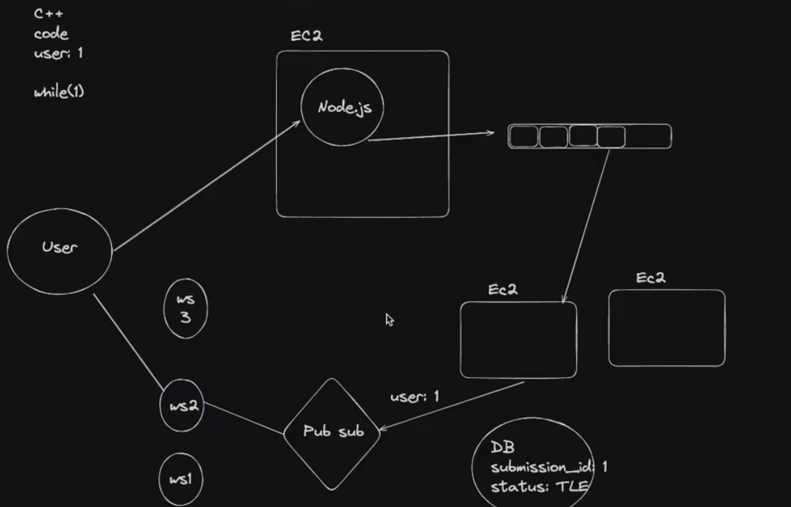

Lets see:
1. Queues
2. Pub subs
3. Redis

# Queues
Lets say leetcode, you submit the problem and the problem reaches the primary backend. Then it pushes on to a queue. It dont execute the code on the primary backend because lets say the code submitted contain infinite loop then?. So the code is sent to queue. And from there workers picks problem.

Here you can autoscale workers depending on queue size. 

Queue implementation Eg: RabbitMQ, SQS (simple queuing service).

Once the code is picked up from queue by workers, they needs to tell the browser, accepted or rejected. Leetcode uses polling for this, you can see in inspect network, after submitting the code. You can use websockets, this way the browser wont overwhelm the backend which wont overwhelm the database in every poll.

What if the server could tells the browser, rather browser polling.

After the worker is done processing the code submitted, for pushing events eg:{user:1, problem:2, status:"time limit exceeded"} from server to client we can use websockets which will directly send to the browser. This websocket connection along with the http, happens when the user clicks submit problem.

So the worker is connected to pub sub and thats connected to websocket which is connected to browser.

Why worker doesnt directly connected to browser, or the websocket? Because workers are very transitory, they come up/go down quickly, they shouldnt be exposed to the internet, worker job is - give code i will process it and put the entry in db and publish to pub sub.

And worker doesnt directly tell the websocket layer. Because in real world we have fleet of websocket servers, and user can be connected to anyone. So the fleet is connected to pub sub and workers are connected to pub sub. 

Now after that here comes Pub subs (publishers subscribers). So the user with id 1 connects to one of a websocket and when it does, it can tell a pub sub system that I have userid 1 and if you have any info related to user id 1 tell it to me, I will forward it to user. Then it can subscribe to an event called lets say userid1 and the worker knows this submission is of userid1 it can publish it to the pub sub that userid1 has this to send.

Also if there are 2 connections with the different ws with 2 devices 2 places then they are subscribed to same event and the worker publishes for that event, the pub sub sends it to both the ws and eventually to both the devices.


So this the architecture we've discussed:

There is a browser that sends a request which reaches the primary backend, goes to a messaging queue. Whenever the worker has time, it pick the event process and they tell a pub sub, here's response for userid1. Whichever ws layer userid1 is connected to, the ws sends it back to browser.

Lets say a leetcode architecture, user connects to a ec2 nodejs server, this machine is your primary backend, and you dont want to run any external code here, you have to run on a different ec2 machine. Now if you can afford lets say 2 machines to run the submitted code then you maintain a queue, and people submit the code, you put it to queue, and one by one the workers pick the code, now this ec2 server has to tell the browser that your code is accepted or rejected, 
- so the ec2 server puts the entry in the database, and the browser is polling to that primary backend, and that backend is checking the database if the code is accepted or rejected, and tells the browser.
- or you can do is have fleet of websocket servers connected to pub sub, and the browser connects to one of them, and that websocket server tells that pub sub that I have user id 1 connected to me, so if you have any info related to user id 1 tell it to me, I will forward it to user. And that ec2 server after processing the code, adds the entry in the database adn tells the pub sub also. 



---
</br>
</br>

# Redis
Redis is an open source, in-memory data structure store, used as a database, cache, and message broker. One of the key feature of Redis is its ability to keep all data in memory, which allows for high performance and low latency access to data.

**Message Broker**: is like the messaging queues and pub subs.

So the browser, let's say, hits a get end point to the backend and backend gets the data from the database and sends it to the browser. Now let's say there are 100,000 of users come and hit the same endpoint then the backend need to hit the database that many times which is lot of database call for same thing.

So when the first user ask for that endpoint the data comes and gets cached in memory in Redis instance, temporarily, which is a separate instance. When many user comes rather than hitting the database for same thing, the backend gets the data cached in redis which is very fast.

When your application scales there will be multiple backend so rather than storing the cache in one of the backend's in-memory which the other back end wont be able to access, we make redis as a separate entity which provides distributed caching so that all the backends can check if the data is cached and redis if not they will hit the database.

To optimize, the first user’s request retrieves the data and caches it in Redis, an external in-memory cache. Redis stores the data temporarily, so when subsequent users make the same request, the backend fetches the data from Redis instead of the database, reducing database load.

As your application scales with multiple backend instances, storing the cache in each backend’s local memory would create inconsistencies. Instead, Redis acts as a distributed cache, allowing all backend servers to check if the data is cached, ensuring that even with multiple instances, the cache remains centralized and accessible to all servers. If the data isn’t in Redis, the backend will query the database.

> So the redis is again is like a nodejs process running in an EC2 server containing the in-memory data. If the process goes down, then the data gets lost, doesnt matter, so anyways its the cached data its not the primary data.

So Redis stores data in memory but it has its own file system and it saves the data in file system too, so it can recover back its state.

So you need it in memory but you also want it to be able to recover it. There are two ways:

### In memory data structure store
Very similar to a DB, only it is in-memory. That doesn’t mean it doesn’t have persistence.
- AOF (Append Only File): The AOF persistence logs every write operation received by the server, appending each operation to a file, all the records/events since the beginning. This file can then be replayed on startup to reconstruct the dataset.
- RDB (Redis Database File): The RDB persistence performs point-in-time snapshots of your dataset at specified intervals. It creates a compact single-file representation of the entire Redis dataset. The snapshotting process can be configured to run at specified intervals, such as every X minutes if Y keys have changed.

```bash
save 900 1       # Save the dataset every 900 seconds if at least 1 key changed
save 300 10      # Save the dataset every 300 seconds if at least 10 keys changed
save 60 10000    # Save the dataset every 60 seconds if at least 10000 keys changed
```

> It may not be asked in an interview, but its good to know if you want to build your in memory data structure.

**What if the queue dies before snapshoting was taken?** </br>
Youre screwed, you missed the data. Like in backpack(an opensource repo related to trading) first the things reaches the queue and then the rust process pickes events from the queue, so it can never happen that something reach the process and didnt reach the queue.

**What if the database changes while the data is in redis?** </br>
So when admin does a lets say write on that endpoint, then it also clears the redis, so that people gets the changed data.

Lets say you have a admin and user. Now the data is in redis for 10 minutes and at the 3rd minute the admin changes the data now you have three options what would you do?
1. clear redis, put data in postgres
2. Update Data in Redis, update data in postgres
3. Update that in postgres, update data in Redis
- So the answer is option one, 2nd and 3rd option is wrong because what if one of two things happens, and backend get down you cannot guarantee that both will happen your backend service is very unpredictable. So you should clear the Redis first and then put data in Postgres, after clear redis succeeds then you should change data in database.


## Starting redis locally
> 6379 is standard port on which redis run.
- `docker run --name my-redis -d -p 6379:6379 redis`
- `docker exec -it container_id /bin/bash`
- `redis-cli`

Now when we use postgres locally, we talk to it with pg library or prisma, and we give it postgres url and we are able to access database. We have also used psql (a command line interface) to access the database.

> In redis, we use redis-cli

### Redis as a DB
Lets start by storing data in redis.
- SET/GET/DEL
    - SET mykey "Hello"
    - GET mykey
    - DEL mykey

You can only store a string and not a object, but can store it stringfy.

Also this is not sql, there are no tables, there is no structure to your data.

> See youtube video with title `I've been using Redis wrong this whole time...` its on youtube channel `Dreams of Code`

**HSET/HGET/HDEL (H = Hash)**: if you want to associate multiple things in a key then use hash. If you want more sql like structure.

Also you can store lets say user specific data, like:
- SET user:1 "Varun"
- SET user:2 "Swechha"

### Redis as a Queue
You can also push a queue/topic on Redis and other processes can pop from it. Good example of this is Leetcode submissions that need to be processed asynchronously.

- Pushing to a queue
    - LPUSH problems 1
    - PUSH problems 2
- Popping from a queue
    - RPOP problems
    - RPOP problems 
- Blocked pop
    - BRPOP problems 0      (means blocking R pop, it means its blocking until something comes in the queue)
    - BRPOP problems 30     (means blocking R pop, it means its blocking until something comes in the queue, but if nothing comes in 30 seconds it will stop blocking and return null.)

here 30 is seconds and 0 is infinite time.

So thats push in queue from left and pop from right. BRPOP means blocking right pop. Which means if you run that cli in two windows and in one you can see blocking and when you push in other window, you can see the blocking went away.


## Talking to redis via Node.js
Let’s initialize a simple Node.js express server that takes a problem submission (very similar to leetcode) as input and sends it to the queue.

Let’s also create a worker service that picks up a problem, waits for 2 seconds and then proceeds to pick the next one. 

- Create an empty Node.js project
- Initialize 2 folders inside it
    - express-server
    - worker

- Initialize an empty Node.js typescript project in both of them
    - `npm init -y`
    - `npx tsc --init`

- Install dependencies in express-server
    - `npm i express @types/express redis`

- Install dependencies in worker
    - `npm i redis`

- Create `index.ts` in express-server

```ts
import express from "express";
import { createClient } from "redis";

const app = express();
app.use(express.json());

const client = createClient();
client.on('error', (err) => console.log('Redis Client Error', err));

app.post("/submit", async (req, res) => {
    const problemId = req.body.problemId;
    const code = req.body.code;
    const language = req.body.language;

    try {
        await client.lPush("problems", JSON.stringify({ code, language, problemId }));
        // Store in the database
        res.status(200).send("Submission received and stored.");
    } catch (error) {
        console.error("Redis error:", error);
        res.status(500).send("Failed to store submission.");
    }
});

async function startServer() {
    try {
        await client.connect();
        console.log("Connected to Redis");

        app.listen(3000, () => {
            console.log("Server is running on port 3000");
        });
    } catch (error) {
        console.error("Failed to connect to Redis", error);
    }
}

startServer();
```

- Send the submits in postman and to check this do docker exec command and do RPOP. 

- Create index.ts in worker
```ts
import { createClient } from "redis";
const client = createClient();

async function processSubmission(submission: string) {
    const { problemId, code, language } = JSON.parse(submission);

    console.log(`Processing submission for problemId ${problemId}...`);
    console.log(`Code: ${code}`);
    console.log(`Language: ${language}`);
    // Here you would add your actual processing logic

    // Simulate processing delay
    await new Promise(resolve => setTimeout(resolve, 1000));
    console.log(`Finished processing submission for problemId ${problemId}.`);
}

async function startWorker() {

    try {
        await client.connect();
        console.log("Worker connected to Redis.");

        // Main loop
        while (true) {
            try {
                const submission = await client.brPop("problems", 0);
                // @ts-ignore
                await processSubmission(submission.element);
            } catch (error) {
                console.error("Error processing submission:", error);
                // Implement your error handling logic here. For example, you might want to push
                // the submission back onto the queue or log the error to a file.
            }
        }
    } catch (error) {
        console.error("Failed to connect to Redis", error);
    }
}

startWorker();
```

> 💡Can u figure out why we had to add a ts-ignore ? Why is the type of submission string? 

### QnA
- Recap
We've seen Queues, Pub subs. Redis lets you create both. Queues, here one nodejs/rust/golang process push something to a queue and another nodejs/golang/rust process can pick things from here. This message queue architecture is pretty popular, when your building system like leetcode, because youre letting enduser run an expensive operation on your compute/machine.
When you do that you dont wanna run it on primary backend, you also wanna know that you have limited workers, so you need a queue where you push event and eventually workers when free can take that event and process it. 
The worker that has processed the user's code, want to send the end user something. The worker doesnt directly connect to the browser, worker is very protected somewhere and didnt exposed to internet, also they goes up and down/autoscale, so the workers publish to a pub sub which is connected to a websocket, with which user has a persistent connection, tells the user the response of the worker.


- Can we implement the redis push in nextjs as well?

Yes as long as youre doing it on the server, on client component it dont work.

- Limit of redis cache to store data?

A single Redis instance can hold up to 2^32 keys, or about 4 billion keys. The maximum size for a key is 512 MB. 

- Why redis queue, cant we create queue the way we create in c++ dsa problems.

The key difference between implementing a queue in C++ as part of a data structures and algorithms (DSA) problem and using Redis as a queue comes down to the scale, persistence, and distributed nature of Redis, along with how modern applications handle state and message queues. C++ queue is in-memory, single-threaded, and local to the program running. Redis is an in-memory data store, queues allow persistence, scalability, fault tolerance, and easy access across distributed systems.

- What if the worker pops from queue and goes down?

You can use acknowledgement. Redis with "ACK" Mechanism. Implementing Redis "Leases" or "Locks". Delayed Retry with Dead Letter Queue. Use 

Redis Streams for Enhanced Reliability.

    Reliable Queue with Acknowledgment: Use a separate "in-progress" list or an acknowledgment mechanism to track tasks that have been popped but not yet completed. If a worker fails, the task will either be re-enqueued or marked for retry.
    Locks/Leases: Use time-limited locks to ensure a worker gets exclusive access to a task, and if the worker fails, another can pick it up after the lock expires.
    Dead Letter Queues: For advanced scenarios, failed tasks can be moved to a dead-letter queue after a defined number of retries, allowing for later inspection or intervention.
    Redis Streams: Redis Streams offer built-in support for message acknowledgment, retries, and recovery, making them a more robust solution for reliable queue processing in distributed systems.

- How to do acks in queues in redis?

Need to know better from google or gpt...
