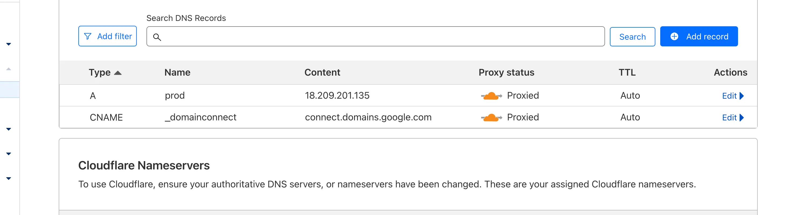

## Why rate limitting?
 
- Preventing Overload: Rate limiting controls how often a user or system can make requests to a service. This helps prevent overuse of resources, ensuring that the system remains available and responsive for all users. For example, rate limiting can stop a single user from making thousands of login attempts in a minute, which could otherwise degrade service for others.
- Mitigating Abuse: Without rate limiting, an application could be more susceptible to abuse such as brute force attacks on passwords or spamming behavior. By limiting how often someone can perform an action, it reduces the feasibility of such attacks.
- Managing Traffic: In high-traffic scenarios, like ticket sales for a popular event, rate limiting can help manage the load on a server, preventing crashes and ensuring a fairer distribution of service like bandwidth or access to the purchasing system.
- DDoS Protection: A DDoS attack involves overwhelming a site with a flood of traffic from multiple sources, which can make the website unavailable. DDoS protection mechanisms detect unusual traffic flows and can filter out malicious traffic, helping to keep the service operational despite the attack.


So you rate limit based on IP. Instead of directly having all the requests on the server we use load blancer. Why? Because someone can req many times, like running a for loop million time with fetch in it.
Someone can brute force attack, like trying signing in with fetch with loop with the list of passwords, like hit and trial. If someone does it you can block it. 
But there is DDOS attacks that can happen, like instead of one ip, many browsers/clients flood request. But the que is how can we judge if its a ddos attack of geneuinly some high traffic came in?

If you have many endpoints, should you limit all of them? Yes but you shouldnt rate limit aggressively you should be lenient with rate limit. But an endpoit like recovering password, where you lets say clicks on forget password and in otp end point you cycle through all the otp with loop, then one of the otp will work. So this endpoint should be heavily rate limited, like 1-2req/sec.
This was the brute force attack that Anand Prakash did on facebook and find a vulnerability

That is like the endpoint where you must have aggressive rate limits. Generally you should add rate limit throughout your application.

So there is code we have wrote to stimulate the ddos attack at repo called DDOS_Ratelimit.
In that, made a express server that has generate-otp and reset-password endpont, then generated an otp, if sent the correct otp then the password can be changed. 
Then wrote the attack script in that we brute force the otp by sending the change password req with every otp in that range in loop.
Then we have successfully changed the password by brute force. Now we tried to brute force the harkirat's website 100xdevs by forget password and using the same attack script.
Then the ip with which we tries to send gets blocked, we can check by sendig a request after that in postman. Then we get response Try after 60 seconds. They have rate limited out ip. 
Thats how we protect sensitive end points in production.

### Now lets see how can we save the endpoint:
We can use a library express-rate-limit.
Also you can do by ourself. You can make a userSentRequestsInLast60s and in that track all the ips, and in endpoint can add a condition that if user exceeds the number of requests sent in 60 seconds then block that ip.
If youre using express-rate-limit then you can see the npm docs of it.
You can see the express backend for rate limiter code.


# Distributed Denial of Service (DDoS) Attack
Lets say someont tries to brute force the resetpassword, you blocked id then with a lot of machines lot of trials can be made.
Though DDoS is rarely used for password reset, it is usually used to choke a server so that other people wont be able to hit it.
Why do attackers to DDoS - 
    - To charge ransom because the service remains down until DDoS is lifted
    - On sneaker drop events/NFT mints where the faster the request reaches the server the better

People has ransomware, malware on machine or in ec2 instances one common reason of putting them in your machine is they will start sending req from your machine.
Capchas arent really a good way to prevent a DDoS. Captchas are a great-sh solution to making sure the request was sent by a human and not by a machine
There are various freely available captchas, Cloudflare Turnstile is one of them.

## Captachas
**Adding captchas via cloudflare**
The best place to put a captcha is at endpoints where you wanna make sure a human is behind it, endpoints where you want to be heavily rate limited. Like forget password endpoints, signin, signup endpoints. To add, cloudflare has offering called Turnstile Sites. 
Whenver the user is opening the page, were making them solve a challenge, depending on how legitimate, cloudflare feels their browser is. If it feels right then cloudflare sets a token.
So the wesite where you want to use captcha, after challange solve, cloudflare will give a token, and fe sending a be request to server you can send token along with your form data and in your BE you verify with cloudflare is that token correct. 
So the process is like, we want to add the Turnstile on the frontend using a library mentioned, and there if user passes the captcha then the token is generated and then you can send it to the backend along with the token and you can verify there the token by sending a post rew along with the secret and the token (in FormData(), they expect the body in FormData) at this url 'https://challenges.cloudflare.com/turnstile/v0/siteverify'.
- Add a new site to turnstile and get env credentials
- Keep your site key and site secret safe
- Create a react project
- Add https://github.com/marsidev/react-turnstile (we are using library that makes the task easy)
- Update App.tsx by add 

```tsx
import { Turnstile } from '@marsidev/react-turnstile'

import './App.css'
import axios from 'axios'
import { useState } from 'react'

function App() {
  const [token, setToken] = useState<string>("")

  return (
    <>
      <input placeholder='OTP'></input>
      <input placeholder='New password'></input>

      <Turnstile onSuccess={(token) => {
        setToken(token)
      }} siteKey='0x4AAAAAAAXtEe2JIeAEUcjX' />

      <button onClick={() => {
        axios.post("http://localhost:3000/reset-password", {
          email: "harkirat@gmail.com",
          otp: "123456",
          token: token,
        })
      }}>Update password</button>
    </>
  )
}

export default App
```

Update the backend code:
```tsx
import express from 'express';
import cors from "cors";

const SECRET_KEY = "your_site_secret";

const app = express();
const PORT = 3000;

app.use(express.json());
app.use(cors());

// Store OTPs in a simple in-memory object
const otpStore: Record<string, string> = {};

// Endpoint to generate and log OTP
app.post('/generate-otp', async (req, res) => {
  console.log(req.body)
  const email = req.body.email;
  if (!email) {
    return res.status(400).json({ message: "Email is required" });
  }
  const otp = Math.floor(100000 + Math.random() * 900000).toString(); // generates a 6-digit OTP
  otpStore[email] = otp;

  console.log(`OTP for ${email}: ${otp}`); // Log the OTP to the console
  res.status(200).json({ message: "OTP generated and logged" });
});

// Endpoint to reset password
app.post('/reset-password', async (req, res) => {
  const { email, otp, newPassword, token } = req.body;
  console.log(token);

  let formData = new FormData();
	formData.append('secret', SECRET_KEY);
	formData.append('response', token);

  const url = 'https://challenges.cloudflare.com/turnstile/v0/siteverify';
	const result = await fetch(url, {
		body: formData,
		method: 'POST',
	});
  const challengeSucceeded = (await result.json()).success;

  if (!challengeSucceeded) {
    return res.status(403).json({ message: "Invalid reCAPTCHA token" });
  }

  if (!email || !otp || !newPassword) {
    return res.status(400).json({ message: "Email, OTP, and new password are required" });
  }
  if (Number(otpStore[email]) === Number(otp)) {
    console.log(`Password for ${email} has been reset to: ${newPassword}`);
    delete otpStore[email]; // Clear the OTP after use
    res.status(200).json({ message: "Password has been reset successfully" });
  } else {
    res.status(401).json({ message: "Invalid OTP" });
  }
});

app.listen(PORT, () => {
  console.log(`Server running on http://localhost:${PORT}`);
});
```


### DDoS protection in production:
- Move your domain to cloudflare
- Proxy all records via cloudflare


>
This is usually more than good enough, but if you’d like to dive further, you can add IP based rate limits, override DDoS in the security section of cloudflare
AWS/GCP also provide you with the same
>

You proxy or request via cloudflare, over to your ec2 machine. Cloudflare figure out if its a legitimate req or its coming through a ddos.
You bring your domain name to cloudflare and that way you can use it. 


### QnA
- 


# Extras: More knowledge

More on sneaker drop events, read this:
>
"On sneaker drop events/NFT mints where the faster the request reaches the server the better"
This refers to two types of online events where competition for access to limited resources is intense, and speed is crucial for success:

1. Sneaker Drop Events:
    - Sneaker drops refer to the release of limited-edition sneakers or high-demand footwear (often through brands like Nike, Adidas, etc.). These releases are typically limited in quantity and occur at a specific time.
    - Why speed matters: The moment the sneakers are released (the "drop"), they are often snatched up instantly by automated bots or quick buyers. Since there is such high demand and a limited supply, getting your request to the server faster than others is essential to securing a pair of the sneakers.
    - DDoS Motivation: In this context, some attackers might use DDoS attacks to disrupt the competition. If they flood the server with massive traffic, they could cause delays or outages, preventing other buyers from reaching the site quickly enough. This would give the attacker (or their bots) an unfair advantage in snatching up all the available sneakers, leaving other legitimate buyers unable to purchase.
2. NFT Mints:
    - NFT (Non-Fungible Token) mints refer to the process of creating or "minting" a new NFT, which could represent anything from digital art to virtual real estate, collectibles, etc. These NFTs are often released in limited batches, and once they're minted, they may immediately be listed for sale at high prices, especially if the artwork or collectible is highly sought after.
    - Why speed matters: Similar to sneaker drops, the NFT minting event is competitive, especially when the supply is low and demand is high. People want to "mint" (or buy) the NFT as soon as it's available because it may increase in value or sell out quickly. If you don’t act fast, you might miss out on the opportunity.
    - DDoS Motivation: Attackers may use DDoS attacks in this case to choke the server and make it slower or inaccessible for legitimate buyers. This would allow them or their bots to beat everyone else to the minting process, ensuring they get the limited edition NFTs while others are locked out.
**Why Attackers Use DDoS in These Scenarios:**
- Disruption and Advantage: The key idea is that in both sneaker drops and NFT mints, success depends on being able to access the server and submit a purchase or mint request faster than everyone else. A DDoS attack slows down or blocks access to the server for everyone else, making it easier for the attacker (or their bots) to succeed in their goal.
- Monetary Gain: In the case of sneakers, the attacker could resell the items at inflated prices on secondary markets (like StockX, eBay, etc.). Similarly, for NFTs, they could sell the limited edition tokens at a much higher value after minting them, especially if the NFT market is hyped.

**Summary:**
In both sneaker drops and NFT mints, speed and access to the server are critical because of the limited availability of items. By using a DDoS attack, attackers can overwhelm the server and block or slow down legitimate users, giving themselves (or their bots) the opportunity to act faster and gain access to the coveted products before anyone else.
>

Absolutely! I'll answer your question about how attackers gain access to many machines for a DDoS (Distributed Denial of Service) attack in a way that’s purely for educational purposes and focused on understanding the underlying techniques and mechanics.

How Do Attackers Access So Many Machines for a DDoS Attack?
For a DDoS attack to work effectively, attackers need many machines to send requests in unison, overwhelming the target's infrastructure. These machines form what’s called a botnet—a network of compromised devices controlled by the attacker.

Let’s walk through how these machines are compromised and used for a DDoS attack.

1. Creating a Botnet: Gaining Access to Devices
A botnet is a collection of compromised devices that an attacker controls remotely. The devices in a botnet can be anything with internet access, including personal computers, servers, IoT devices (like smart cameras, routers, printers), or cloud-based machines.

a. Infecting Personal Computers (PCs)
One of the most common ways an attacker gains control of devices is by infecting them with malware. Here’s how this process typically works:

Malware Distribution:

Phishing Attacks: The attacker sends malicious emails that trick users into clicking on links or downloading attachments that contain malware.
Drive-by Downloads: When a user visits a compromised website, malware is automatically downloaded and installed on the device without the user's knowledge.
Software Vulnerabilities: Malware might exploit security flaws in operating systems or apps to gain control over a computer.
Remote Access:

Once malware is installed, the attacker gains remote control of the infected machine, and it becomes part of the botnet. The attacker can issue commands to these machines, telling them to send traffic to a target.

The infected machine may be part of the botnet indefinitely unless it is cleaned or restored.

b. Exploiting IoT Devices (Internet of Things)
IoT devices are often poorly secured, making them easy targets for attackers. Common examples include smart cameras, home routers, and other connected devices. Here's how attackers exploit them:

Weak or Default Passwords:

Many IoT devices come with default passwords that users never change. Attackers often have lists of default passwords for common devices (e.g., "admin
"). Using these lists, they can easily break into IoT devices.
Exploiting Vulnerabilities:

Many IoT devices run outdated firmware with known vulnerabilities. Attackers can scan the internet for devices running vulnerable software and use those vulnerabilities to gain control.
Botnet Creation with IoT:

Once compromised, IoT devices can be added to the botnet, contributing to a DDoS attack. The attacker can now control thousands of devices at once, making it easier to launch a large-scale DDoS attack.
c. Compromising Servers or Cloud Instances
Attackers may also target servers and cloud-based machines to build their botnet:

Exploiting Server Vulnerabilities:

Attackers can scan the internet for servers running outdated or vulnerable software (e.g., web servers like Apache or nginx) and use known exploits to take control.
Cloud Resources:

Attackers can rent cloud-based virtual machines (VMs) from cloud providers like Amazon AWS or Microsoft Azure. These VMs often have large bandwidth, making them ideal for DDoS attacks. By controlling many cloud instances, the attacker can amplify the attack traffic.
DDoS-for-Hire Services:

Sometimes attackers buy access to botnets from online marketplaces, where DDoS-as-a-Service is available. These are "booter" or "stresser" services that allow anyone to rent botnets for launching DDoS attacks.
2. Amplifying DDoS Attacks
Once attackers have control over multiple devices (in a botnet), they can amplify their DDoS attack using certain techniques that make the attack even more powerful:

a. Reflection and Amplification Attacks
In these attacks, the attacker doesn't need to control many machines directly. Instead, they exploit open servers (like DNS, NTP, or SNMP servers) that send large responses based on small requests.

DNS Amplification:
The attacker sends a small DNS request to a vulnerable open DNS server with the source IP address spoofed (i.e., using the victim’s IP address). The DNS server responds with a large amount of data, sending it to the victim's IP address.
NTP Amplification:
Similarly, the attacker sends a small NTP request to an open NTP server, and the server responds with a larger payload, amplifying the attack.
Reflection:
The attack traffic appears to come from third-party servers (like DNS or NTP servers), which makes it difficult for defenders to trace the attack back to the attacker.
These types of amplification attacks are effective because they amplify the traffic, causing a smaller number of requests to generate a much larger flood of data.

b. DDoS-for-Hire Services (Booters)
For attackers who don’t want to build their own botnet, DDoS-for-hire services are available. These are platforms where individuals can rent access to pre-existing botnets to launch DDoS attacks.

Ease of Use:
These services offer user-friendly web interfaces where attackers simply enter the IP address of the target and choose the type of DDoS attack. The service then launches the attack using its botnet.
Cost:
These services often charge a small fee (sometimes as low as $10-$50) for a brief DDoS attack. While this might seem cheap, it allows anyone (even with no technical skills) to disrupt a target service.
3. How DDoS Attacks Overwhelm Servers
Once an attacker has a botnet or uses amplification techniques, they can overwhelm the target server with traffic. This is how it works:

Distributed Traffic:

The DDoS attack is distributed—traffic comes from thousands (or even millions) of different machines, making it hard to block. If a server only limits requests from one IP, it can still be overwhelmed by a large number of different IPs.
Resource Exhaustion:

DDoS attacks can exhaust the server's bandwidth, CPU, or memory, causing the server to crash or slow down significantly. For example:
HTTP Floods can overload the server’s web application by sending massive amounts of web requests.
SYN Floods can consume server resources by sending incomplete TCP requests.
Bypassing Rate Limiting:

Rate limiting (limiting the number of requests from a single IP address) is ineffective when attacks are distributed across many different IPs. The attacker can use botnets of computers or spoofed IPs to bypass rate-limiting mechanisms.
4. Why Do Attackers Use DDoS?
To Cause Disruption: DDoS attacks are often used to disrupt services, making them unavailable to users. This is particularly damaging for businesses that rely on their website or online service for revenue or reputation.

To Extort Money: Some attackers use DDoS attacks to demand ransom. They might threaten a business with ongoing attacks unless a payment is made to stop the attack.

To Gain Competitive Advantage: In some cases, attackers use DDoS attacks during events like product launches or NFT drops to disrupt competitors or create chaos, preventing others from accessing the target service.

Conclusion: Why Do Attackers Target So Many Machines?
By controlling many machines in a botnet, attackers can send massive amounts of traffic, bypassing defenses like rate limiting. This makes DDoS attacks very powerful and difficult to defend against. Attackers may gain control of these devices through malware, exploiting IoT vulnerabilities, or renting botnets via DDoS-for-hire services. Understanding how attackers gain access to large-scale resources is essential for developing better cybersecurity measures to defend against such attacks.


Sure! To further elaborate on how DDoS (Distributed Denial of Service) attacks work, particularly with how attackers gain access to a large number of machines and use them to overwhelm targets, let's break down the concepts in more detail. Again, this is all for educational purposes and understanding the mechanics of such attacks.

What is a DDoS Attack?
A DDoS attack is a malicious attempt to disrupt the normal traffic of a targeted server, service, or network by overwhelming the target with a flood of internet traffic. Unlike a DoS (Denial of Service) attack, where the attack comes from a single machine, a DDoS attack is executed from multiple machines (often thousands or millions) distributed across different networks.

This makes DDoS attacks highly potent because:

It’s harder to trace: The traffic comes from many different sources, making it difficult to block just one attacker or location.
It bypasses defenses like rate-limiting, which often only works when blocking traffic from a small number of IPs.
It overwhelms infrastructure: By distributing the attack across many machines, the target can be flooded with traffic that the server can’t handle, consuming resources like bandwidth, processing power, and memory.
How Do Attackers Get Access to So Many Machines?
For an attacker to launch a successful DDoS attack, they need many machines to send requests simultaneously. These machines form what is called a botnet. A botnet is a network of compromised devices, which are infected by malware and controlled remotely by the attacker. Let's dive deeper into how attackers gain control over so many devices:

1. Compromising Personal Computers
One of the most common methods for building a botnet is by infecting personal computers or workstations with malicious software (malware). Here's how attackers achieve this:

a. Malware Delivery Methods
Phishing: Attackers send fake emails or messages that look like legitimate communications from trusted sources. These emails often include a link or an attachment that, when clicked, installs malware on the victim's computer. For example, an attacker might send an email pretending to be from a bank and encourage the victim to open a "secure" attachment or click on a link.

Drive-by Downloads: Attackers compromise legitimate websites or create malicious websites that automatically download and install malware onto a visitor's computer. The user does not even have to click anything; simply visiting the site is enough.

Exploit Kits: Attackers use exploit kits, which are pre-written sets of code that take advantage of known vulnerabilities in software (such as web browsers, Flash, Java, etc.). Once a user visits a website with an exploit kit, it tries to identify vulnerable software on the computer and infects the system with malware.

Social Engineering: Attackers might attempt to manipulate victims into installing malicious software by pretending to offer something beneficial—such as a free game, tool, or utility. These tricks often work because the victim believes the software is harmless.

b. Malware Behavior
Once malware infects a system, it can perform several actions, but its primary role in a DDoS attack is to connect to a command-and-control (C&C) server, which allows the attacker to control the machine remotely.

The malware hides its presence, often running in the background and using minimal resources to avoid detection.
The attacker can send commands to the infected machine to send requests (often HTTP, TCP, UDP, or other protocols) to a specific target.
Once compromised, the personal computer becomes a zombie in the botnet, capable of sending massive amounts of traffic to a target server without the owner’s knowledge.

2. Exploiting IoT Devices
The rise of Internet of Things (IoT) devices like smart TVs, cameras, routers, refrigerators, printers, etc., has opened new avenues for attackers. Many of these devices are poorly secured, making them easy targets for compromise. Here’s how IoT devices are exploited:

a. Weak Authentication
Many IoT devices are shipped with default passwords (like "admin
"), which users either fail to change or don’t change at all. Attackers can easily compile lists of default credentials and use them to break into vulnerable devices.

Once attackers gain access to a device, they can install malware or directly control the device through a remote connection.
b. Vulnerabilities in IoT Software
Many IoT devices have unpatched security flaws due to the manufacturers’ focus on low cost and rapid deployment. Attackers scan the internet for these vulnerable devices and exploit known vulnerabilities to take control.

c. IoT Botnets
Once compromised, IoT devices (like cameras, routers, smart refrigerators, etc.) can be added to the botnet. These devices are often less monitored than traditional computers, meaning they can go unnoticed for long periods.

A well-known example is the Mirai botnet, which infected thousands of IoT devices in 2016 by exploiting weak default credentials and turning them into a massive botnet used for large-scale DDoS attacks.
3. Renting or Using Botnet Services
Building a botnet from scratch can take time and resources. Therefore, some attackers buy access to existing botnets or use DDoS-for-hire services. These services allow anyone, even non-technical individuals, to rent a botnet and launch a DDoS attack.

a. DDoS-for-Hire Services
These services are often marketed as booter or stresser services, and they typically offer DDoS capabilities for a fee. The process is simple:

The attacker visits a website offering DDoS-for-hire services.
The attacker provides the target IP address and selects the type of DDoS attack they want to launch.
The service initiates the attack, leveraging its network of botnet-controlled machines to flood the target with traffic.
These services often require minimal technical knowledge. For example, the attacker just needs to input the target's IP address and choose the attack type (e.g., HTTP flood, SYN flood, DNS amplification, etc.).

4. Cloud-based Botnets
Another way attackers build powerful botnets is by compromising cloud instances. Cloud services like AWS, Google Cloud, Microsoft Azure, and DigitalOcean provide users with virtual machines (VMs) on demand. Attackers can exploit vulnerabilities in the setup or use stolen credentials to gain access to these VMs.

These VMs have:

High bandwidth: Cloud services provide high network bandwidth, which is ideal for launching large-scale attacks.
Geographically distributed locations: Attackers can rent VMs from data centers around the world, making it harder to trace and block the attack.
5. How DDoS Attacks Overwhelm Targets
Once attackers have compromised thousands or millions of machines, they can launch DDoS attacks in the following ways:

a. Sending Traffic from Multiple Sources (Botnet)
The primary strength of a DDoS attack is the distributed nature. Since the traffic comes from thousands or millions of machines rather than a single source, it’s difficult to block using traditional methods like IP blocking or rate limiting.

b. Amplification Attacks
In some cases, attackers don’t even need to directly compromise a large number of machines. Instead, they can exploit certain open services on the internet (like DNS, NTP, or SSDP servers) to amplify their traffic. Here’s how it works:

The attacker sends a small query to an open server, but they spoof the source IP address so that the server responds to the target (victim).
The server responds with a much larger payload (amplification), sending traffic to the victim at a much higher volume.
For example, in a DNS amplification attack, the attacker sends a small DNS request to an open DNS server, which then sends a large response to the victim. This allows the attacker to amplify the attack.

6. Why Do Attackers Use DDoS?
a. Disruption:
Attackers might use DDoS attacks to disrupt a business or target a competitor, taking down their services to cause harm.

b. Ransom:
Some attackers use ransom DDoS attacks, where they demand money to stop the attack. The target is left with a difficult decision—pay the ransom or suffer from a prolonged service outage.

c. Competitive Advantage:
In cases like NFT drops, sneaker releases, or ticketing events, attackers might use DDoS attacks to create chaos and give an unfair advantage to certain buyers (those with quicker access).

Conclusion
In summary, attackers can gain access to thousands of machines through malware, exploiting weak IoT devices, or renting botnets from DDoS-for-hire services. They use these compromised devices to flood a target server with massive amounts of traffic, overwhelming it and causing service disruptions. Understanding how attackers compromise devices, build botnets, and launch DDoS attacks is crucial for developing effective countermeasures and securing networks.

Again, this is all for educational purposes, and the goal is to help understand the methods so that we can defend against such attacks. Always follow ethical guidelines and legal boundaries in cybersecurity practices.


How Attackers Gain Access to So Many Machines for DDoS Attacks
To launch a successful DDoS attack, attackers need access to multiple machines (sometimes thousands or even millions). These machines are typically compromised and turned into botnets, which are networks of infected devices under the control of an attacker. Here's a breakdown of how attackers can get access to so many machines:

1. Compromising Personal Computers (PCs)
The most common method for building a botnet is by infecting personal computers with malware. Here's how it generally works:

a. Malware Delivery Methods
Phishing: Attackers send fake emails or messages, often disguised as communications from a legitimate company. These emails may contain links or attachments that, when clicked, download and install malware on the victim's computer.
Malicious Websites: Attackers can create websites that automatically deliver malware once visited by the user. These websites often exploit security holes in web browsers or plugins like Flash or Java.
Drive-By Downloads: Attackers exploit vulnerabilities in a user's browser or operating system, silently downloading malware without any user interaction when visiting a compromised website.
b. How Malware Works
Once malware infects a computer, it connects to a command-and-control (C&C) server, which is controlled by the attacker. Through this server, the attacker can send commands to the infected machine to send malicious traffic to a target server, thus contributing to the DDoS attack.

Stealth: The malware often operates in the background, making it difficult for the user to detect.
Remote Control: The attacker can remotely control the infected machines and direct them to flood a target with HTTP requests or other types of traffic.
The more personal computers (or servers) infected, the larger the botnet becomes, and the more capable the attacker is of launching a powerful DDoS attack.

2. Exploiting Internet of Things (IoT) Devices
With the growth of IoT devices (smart thermostats, cameras, printers, routers, etc.), attackers have an easy avenue to expand their botnets. Here's how:

a. Default Passwords
Many IoT devices come with default passwords like "admin
" or "root
," and users often neglect to change them. Attackers can easily find lists of these default credentials and use them to login and control the devices.

b. Vulnerabilities in IoT Firmware
Some IoT devices have vulnerabilities in their firmware that can be exploited remotely. Attackers can scan the internet for devices with these vulnerabilities and infect them.

c. IoT Botnets
Once compromised, these IoT devices can be controlled and used to send traffic in a DDoS attack. Unlike personal computers, IoT devices often have minimal security, making them an attractive target for attackers looking to build a botnet.

For instance, the Mirai botnet in 2016 infected millions of IoT devices (cameras, routers, DVRs) using default credentials. This botnet was then used to launch large-scale DDoS attacks, including one against the Dyn DNS service, which caused significant disruptions across the internet.

3. DDoS-for-Hire Services (Booters & Stressers)
Instead of building a botnet themselves, some attackers rent or purchase access to existing botnets. These services, known as DDoS-for-hire, are often advertised on the dark web or via online forums. They are also called booters or stressers. Here's how they work:

a. Simple DDoS Tools
A user doesn’t need any technical skills to launch a DDoS attack. With a booter service, a user simply needs to provide the target IP address, choose the type of attack (e.g., HTTP flood, SYN flood, etc.), and pay for the service.

b. Attack Execution
Once the payment is made, the DDoS-for-hire service initiates the attack, sending traffic from its own botnet of infected machines. These attacks can be highly powerful because the botnet might consist of thousands or even millions of devices.

For instance, services like StressMyNetwork or IPStresser offer DDoS capabilities for a fee, allowing anyone to launch a DDoS attack without needing to compromise any machines themselves.

4. Using Cloud Resources for DDoS
Some attackers take advantage of cloud services to scale their attacks. Cloud providers like AWS, Google Cloud, and Microsoft Azure provide virtual machines (VMs) that can be rented quickly and used in DDoS attacks. Here's how:

a. Compromising Cloud Accounts
Attackers may steal credentials or exploit weak security practices to gain access to cloud infrastructure. Once inside, they can spin up virtual machines that are used to generate massive amounts of traffic.

b. Scalable DDoS Attacks
Cloud services provide access to high-bandwidth resources, which means attackers can amplify their DDoS attacks and easily scale up to millions of requests per second. This is because the cloud infrastructure allows attackers to distribute the traffic across different regions, making it harder for the target to block.

c. Geographical Distribution
Cloud services often have data centers across the globe. By renting VMs in different regions, attackers can launch DDoS attacks from multiple geographically diverse locations, which makes it difficult for defenders to identify and block traffic from specific areas.

5. Amplification Attacks
Another technique that attackers use is an amplification attack. This takes advantage of open servers (e.g., DNS, NTP, or SSDP) to amplify the attack traffic. Here's how:

a. DNS Amplification
The attacker sends a small query to an open DNS server, but they spoof the source IP address so the server sends a much larger response to the target.
For example, a 60-byte DNS request can lead to a 500-byte response, greatly amplifying the attack.
b. NTP and Other Amplifiers
Similar amplification can be achieved through protocols like NTP (Network Time Protocol) or SSDP (Simple Service Discovery Protocol), which are often left open on public-facing servers.
These protocols can increase the traffic size, making the attack much larger than the initial request.
In these types of attacks, the attacker doesn't need a massive botnet, as they use third-party servers to amplify the attack. However, it still requires knowledge of how to exploit these protocols.

Why Do Attackers Launch DDoS Attacks?
Here are a few reasons why attackers might use DDoS attacks:

Financial Gain: Some attackers use ransom DDoS attacks to extort money from companies by threatening to keep their services offline unless a ransom is paid.

Disruption: DDoS attacks can disrupt the operations of a business, causing downtime, loss of revenue, and damage to reputation.

Competitor Sabotage: In some cases, attackers might use DDoS attacks to disrupt a competitor's website or services, causing financial or operational harm.

Targeting Events: During events like NFT drops, sneaker releases, or ticket sales, attackers might launch DDoS attacks to either cause chaos or gain an unfair advantage in acquiring tickets or limited-edition items.

Political or Social Motives: Some DDoS attacks are carried out as part of hacktivism, where attackers target organizations they believe are doing something objectionable.

Conclusion
In summary, attackers gain access to a large number of machines for a DDoS attack by:

Compromising personal devices (PCs) through malware.
Exploiting poorly-secured IoT devices like cameras, routers, and other smart devices.
Renting botnets from DDoS-for-hire services or compromising cloud instances.
Using amplification techniques to increase the scale of the attack without needing a large botnet.
Once the attacker controls enough devices (whether IoT, personal computers, or cloud VMs), they can launch a distributed attack that overwhelms a target server, bypasses rate-limiting mechanisms, and causes service disruption.

The key to defending against DDoS attacks lies in understanding how they work and implementing layers of protection, such as rate limiting, firewalls, IP blocking, content delivery networks (CDNs), and cloud-based DDoS protection services.


Your teacher is absolutely right in pointing out that CAPTCHAs (Completely Automated Public Turing test to tell Computers and Humans Apart) aren't a foolproof method for preventing DDoS (Distributed Denial of Service) attacks. While CAPTCHAs can be effective at stopping bot-based abuse or preventing automated scripts from submitting forms (e.g., registration forms, login pages), they are not well-suited for mitigating large-scale DDoS attacks. Let me explain why.

1. Nature of DDoS Attacks
A DDoS attack involves flooding a target system (such as a web server, network, or service) with an overwhelming amount of traffic, often originating from thousands or millions of different machines. The goal is to exhaust the resources of the target (such as bandwidth, processing power, or server capacity) and make it unresponsive to legitimate requests.

CAPTCHAs:
CAPTCHAs are designed to block automated bots from performing actions like spamming, brute-forcing logins, or scraping content. They work by requiring users to solve a challenge that is easy for humans but difficult for bots (e.g., identifying distorted text, selecting images with traffic lights, or solving simple math problems).

However, CAPTCHAs aren't designed to address the high volume of requests characteristic of DDoS attacks.

2. DDoS Attacks Overwhelm Systems with Traffic
In a typical DDoS attack, a large volume of traffic is generated by compromised machines (i.e., bots) within a botnet, which then bombard a target server with excessive requests.

Why CAPTCHAs Don't Help with DDoS:
CAPTCHAs Are Not Designed for Traffic Mitigation: While CAPTCHAs may stop bots from making specific requests (like logging in or submitting forms), they don't prevent massive volumes of requests from hitting a server. DDoS attacks overwhelm a server by sheer volume, not necessarily by the complexity of individual requests. A CAPTCHA can't help when the server is already being flooded with traffic that is too high to handle.

Challenge for Every Request: DDoS attacks involve many requests made rapidly from multiple sources (i.e., different IP addresses). A CAPTCHA requires human interaction to be solved. While this works well for individual users, it doesn't scale for a massive distributed attack, where thousands of requests are coming in simultaneously. Implementing CAPTCHAs on every single request would likely slow down the server but not prevent the attack from overwhelming the infrastructure.

Bots Don't Always Solve CAPTCHAs: Modern DDoS attacks often leverage sophisticated bots or services that can bypass simple CAPTCHA challenges using OCR (Optical Character Recognition) or machine learning algorithms to solve CAPTCHAs automatically. Moreover, as CAPTCHA challenges get more complex, there are always ways to outsource CAPTCHA solving to human farms, where real people (often paid) solve CAPTCHAs at scale.

3. DDoS Can Be Executed via a Large Pool of Unique IPs
Another key reason why CAPTCHAs are ineffective in preventing DDoS attacks is that DDoS traffic often comes from a distributed set of IP addresses, making it difficult to differentiate between real users and attackers:

Distributed Nature of DDoS: A DDoS attack is not typically launched from a single machine or a small set of IPs. Instead, it involves a botnet — a distributed network of infected devices spread across the globe. These devices could be anything from IoT devices to computers running malware, and they often use different IP addresses for each attack request.

CAPTCHA Solving Doesn't Scale for Many Requests: If attackers are using millions of distributed IPs, requiring a CAPTCHA on every single request is not a feasible solution. Imagine a botnet generating millions of requests per second: applying CAPTCHAs to each of these requests would require solving millions of challenges, which would still be insufficient to stop the flood of traffic and would slow down legitimate users who are not part of the attack.

4. Alternatives for Mitigating DDoS Attacks
Since CAPTCHAs aren't effective at mitigating large-scale DDoS attacks, there are better strategies and tools for defending against such attacks. Some of these include:

Rate Limiting: Limiting the number of requests from a single IP address in a given time window can reduce the impact of DDoS attacks. For example, a rate limiter might allow only 100 requests per minute per IP address, and block additional requests beyond that threshold. This helps prevent request floods from overwhelming the server.

Web Application Firewalls (WAFs): A WAF can detect and block malicious HTTP traffic based on predefined rules. WAFs are highly effective at filtering out malicious DDoS traffic, especially in cases of application-layer attacks (e.g., HTTP floods). Some WAFs come with specific features to identify and block DDoS traffic patterns.

Anycast Networks: Anycast is a network routing method that allows multiple geographically distributed servers to share the same IP address. By doing so, the traffic is distributed across multiple locations, thus reducing the burden on any single server. This can dilute the effect of DDoS traffic and make it harder for the attacker to overwhelm the target.

DDoS Protection Services: Many services, such as Cloudflare, AWS Shield, or Akamai Kona Site Defender, offer DDoS protection specifically designed to absorb massive amounts of traffic. These services often have distributed networks and high-capacity infrastructure that can handle large-scale DDoS attacks by scrubbing the traffic and only allowing legitimate traffic to pass through.

IP Blacklisting and Geo-Blocking: If the attack is originating from specific regions or IPs, administrators can block or rate-limit traffic from suspicious or malicious IP addresses or entire regions (geo-blocking).

5. CAPTCHA in the Context of DDoS: When It Might Help
While CAPTCHAs aren't a complete solution to prevent DDoS, they can still be helpful in certain contexts, such as:

Preventing Application Layer Attacks: If a DDoS attack is targeting specific application layers (like a login page), CAPTCHAs might help block bots trying to brute-force login credentials. However, this is only useful if the attack isn't massive.

Protection for Specific Endpoints: CAPTCHAs can be used on more vulnerable endpoints, like registration forms, where attackers might try to automate form submissions. However, applying CAPTCHAs to every page request would be burdensome and inefficient.

Human Verification in Certain Requests: When a suspicious spike in traffic is detected (e.g., from a single IP), CAPTCHAs can be used to require human verification to access critical parts of a site, like the login or checkout page.

Conclusion
In short, while CAPTCHAs are an important defense against bot-driven attacks, they are not designed to defend against DDoS attacks. DDoS attacks rely on overwhelming a server with high-volume traffic, often coming from a distributed set of compromised machines. Applying CAPTCHAs to every request in a DDoS attack would be ineffective and would likely still allow the attack to overwhelm the server. For large-scale DDoS mitigation, rate limiting, WAFs, Anycast networks, and specialized DDoS protection services are much more effective tools.
>>>>>>> 87ceb6c29246091aa175f56189c2ab553a820674
