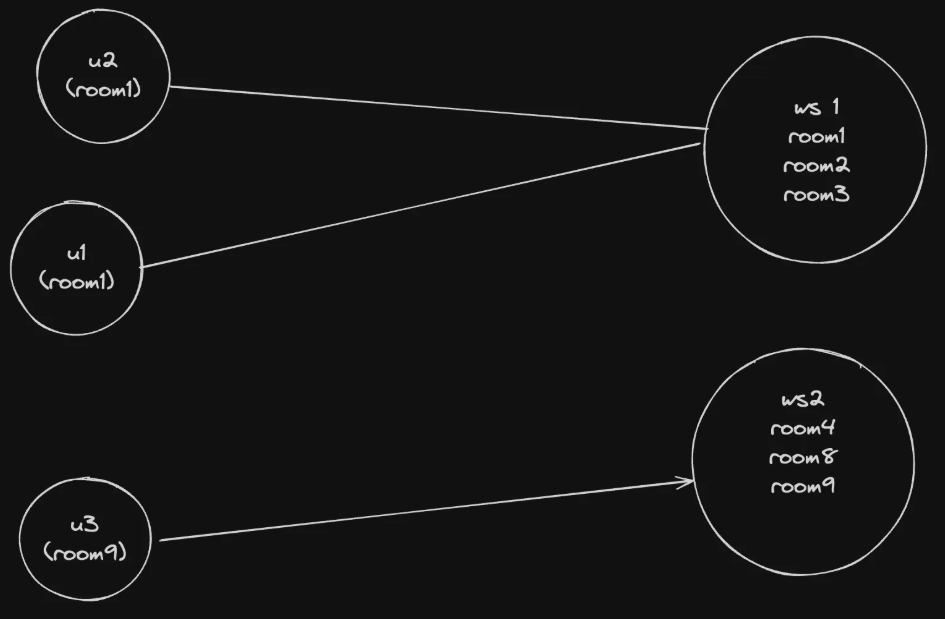
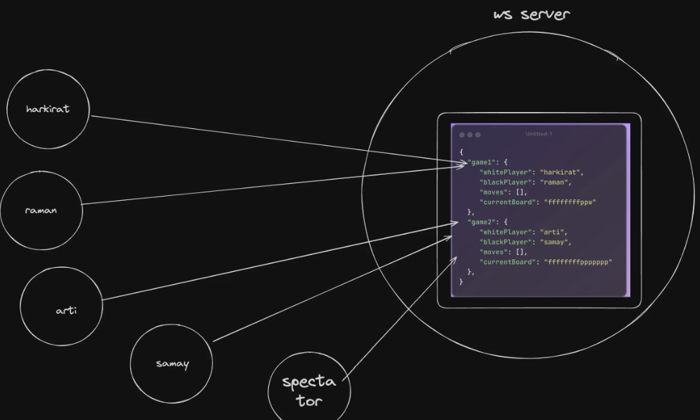
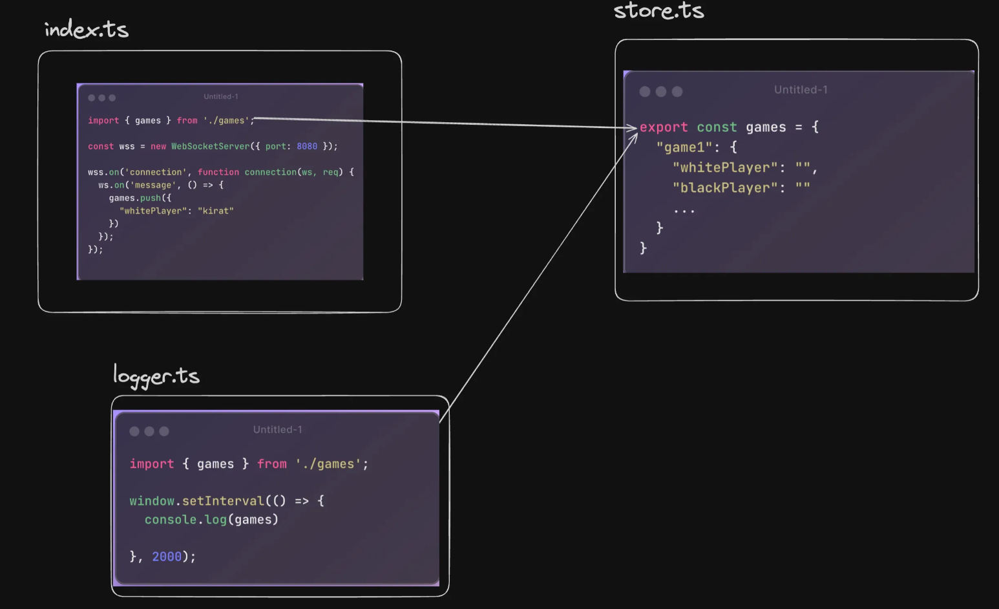
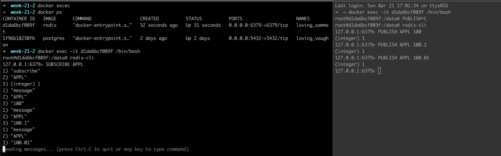

We'll see:
1. Stateful vs Stateless Backend
2. State Management in a Backend app
3. Singleton Pattern
4. Pub Subs + Singleton Pattern

## Stateful vs Stateless Backend

### Stateful Servers
Usually when you write HTTP servers, they dont hold any state. This means, they don’t have any in memory variables that they use. They usually rely on the database for state. So server is stateless and database is stateful. This is the most common architecture.

**Advantages**

1. Users can connect to a random server, there is no need of stickiness.
2. Can autoscale up and down easily and simply decide where to route traffic based on CPU usage.

Full stack app with backend and a lot of users. Lot of http servers as single isint enough as BE are auxiliary, they can die down anytime, they can scale up/down. So we persist data in a database.

So we have seen stateless backend and stateful databases until now. There is no easy way to do distributed caching, if the single server is where youre storing the data.

### Stateful servers

A lot of times, your servers needs to hold state 
- Good examples of this are:
    - Creating an in memory cache 

```ts
export class Cache {
  private inMemoryDb: Map<
    string,
    {
      value: any;
      expiry: number;
    }
  >;
  private static instance: Cache;

  private constructor() {
    this.inMemoryDb = new Map<
      string,
      {
        value: any;
        expiry: number;
      }
    >();
  }

  static getInstance() {
    if (!this.instance) {
      this.instance = new Cache();
    }

    return this.instance;
  }

  set(
    type: string,
    args: string[],
    value: any,
    expirySeconds: number = parseInt(process.env.CACHE_EXPIRE_S || '100', 10),
  ) {
    this.inMemoryDb.set(`${type} ${JSON.stringify(args)}`, {
      value,
      expiry: new Date().getTime() + expirySeconds * 1000,
    });
  }

  get(type: string, args: string[]) {
    const key = `${type} ${JSON.stringify(args)}`;
    const entry = this.inMemoryDb.get(key);
    if (!entry) {
      return null;
    }
    if (new Date().getTime() > entry.expiry) {
      this.inMemoryDb.delete(key);
      return null;
    }
    return entry.value;
  }

  evict(type: string, args: string[]) {
    const key = `${type} ${JSON.stringify(args)}`;
    this.inMemoryDb.delete(key);
    return null;
  }
}
```
- 
    - Storing the state of a Game in case of a realtime game - https://github.com/code100x/chess/blob/main/apps/ws/src/Game.ts#L41-L47 
        - like storing the list of all the moves in the server so that to check all the move with the new move to see if its valid move, need not to hit the database everytime (so for every move you hit the database and get the current state of chess board and then see all the moves to calculate if the new move is valid or not), so in realtime games it make sense to store the state of board in-memory.
        - like in counter strike game, the player moves in like 30fps, hitting db for 30 times in a sec is not good, rather we use state in-memory.
    - Storing a list of 10 most latest chats in memory for a chat application.
    - For CMS its a bunch of cache data.



> Good question to ask at this point is - How to store state in a JS project?

So thats where you have to do state management in the backend.

**Stickiness** - Making sure that the user who is intrested in a specific room, gets connected to a specific server. Like in counter strike if 50 people are playing in same room they need to be connected to same server. Also because if the user lets say disconnects and reconnects, he should be connected to the same server. So you cannot autoscale without stickiness. 

## State in JS Process
We have done state management in frontend apps using Redux, Mobx, Recoil etc... Eg: linkedin, in your browser you will have bunch of variables (like notifications array, posts array etc...) and these states are used to render the UI.

**How/where can you store state in a Javascript process**

Eg: in a chess game:



So if a chess game with two players and another two players, and a spectator, they should all be connected to a same websocket server. This is not bad but there are better ways.

You can do is make servers connect to a redis instance and store the state there (but hitting redis for every move is not that good idea), and the players can connect to any server.

This state might being used by multiple files, not just one, so that approach might not work.

Lets see other:



index.ts contain logic, store.ts contains the state of the game and there is a logger.ts file that is going to take the state and put it in the database.

Now lets say we are making chess game. We make a game[] in store.ts, then we can push the moves in the array in index.ts to maintain state. And we can make a logger file in which we can write the code in which the data is sent to database in interval. This will work, but a lot of times you need to attach functionality to state as well. 

- store.ts - Exports the game array
```ts
interface Game {
  id: string;
    whitePlayer: string;
    blackPlayer: string;
    moves: string[];
}

export const games: Game[] = [];
```

- logger.ts - uses the games array
```ts
import { games } from "./store";

export function startLogger() {
    setInterval(() => {
        console.log(games);
    }, 4000)
}
```

- index.ts - pushes to games array
```ts
import { games } from "./store";
import { startLogger } from "./logger";

startLogger();

// a websocket server will catch all the events and push to the array, we are simulating that using setInterval here
setInterval(() => {
    games.push({
        id: Math.random().toString(36),
        "whitePlayer": "harkirat",
        "blackPlayer": "jaskirat",
        moves: []
    })
}, 5000)
```

This approach is good, but the problem in this approach is, whoever is updating the state, has to do `games[0].moves.push('e4')`, they have to actually open the file and understand the structure of the state. It would be nice if it was like `GameManager.addMove(gameId, move)`.

This will work, but a lot of times you need to attach functionality to state as well. 

To improve it we create a class called GameManager and expose some functions on it that can be called by files using it. So same thing we've done, but this time we made a class in which constructor makes empty game array, we added functionalities that lets us mutate the state. We have to create only a single instance of the class as the array in that only will be storing all the moves. So we create a single instance and export it in the main file.

> 💡 There are other ways of storing state in a TS project as well, redux being a popular one. Yes, you can use redux in the backend as well

Creating a class is much benifitial as we can extend the class and use the functions there etc... 

Let’s see how can we create a class called GameManager and expose some functions on it that can be called by files using it.
 


```ts
// store.ts
interface Game {
    id: string;
    whitePlayer: string;
    blackPlayer: string;
    moves: string[];
}

export class GameManager {
    private games: Game[] = [];

    addGame(whitePlayer: string, blackPlayer: string): Game {
        const newGame: Game = {
            id: Math.random().toString(36),
            whitePlayer,
            blackPlayer,
            moves: []
        };
        this.games.push(newGame);
        return newGame;
    }

    addMove(gameId: string, move: string): boolean {
        console.log('Adding move', move, 'to game', gameId);
        const game = this.games.find(g => g.id === gameId);
        if (game) {
            game.moves.push(move);
            return true;
        }
        return false;
    }

    log() {
      console.log(this.games);
    }

    getGames(): Game[] {
        return this.games;
    }
}

export const gameManager = new GameManager(); // Create a single instance of GameManager
```

```ts
//index.ts
import { startLogger } from "./logger";
import { gameManager } from "./store"; // Import the single instance

startLogger(gameManager); // Pass the instance to logger

const game = gameManager.addGame("varun", "swechha");
console.log('New game created:', game);

setInterval(() => {
    // Simulate adding moves
    gameManager.addMove(game.id, 'e4');
}, 5000);
```

```ts
// logger.ts
import { gameManager } from "./store"; // Import the single instance

export function startLogger() {
  setInterval(() => {
    console.log(gameManager.getGames());
  }, 4000);
}
```

Lets see even better approach Singleton Pattern


## Singleton Pattern
So we have seen the class instance approach(we make a gameManager instance in the store file and nowhere else so that only one instance is maintained throughout), now if someone creates a new instance of the class, then there wont be any error shown in the code editor, so somehow we need to inforce that only one instance is created. So if something you want initialized only once then use singleton pattern. Completely prevent any developer from ever creating a new instance of the class.

**How you inforce that?**

We make the constructor private, means noone can call it from outside(you cant do `const gameManager1 = new GameManager();` from outside). 

Now if we cant do this then how can we make one instance. We can expose a function like `getSingleton` which makes that one instance we needed and return it. We can do it with static variables. Static variables are associated with the class itself, not with individual objects, which makes them useful for implementing singletons — like keeping a single game array shared across all uses.

So we can implement a singleton using a static variable. This way, the instance (and any shared attributes like the game array) belongs to the class, not to any individual object, ensuring there's only one shared instance.

- Associated with an object means: `const gameManager1 = new GameManager(); const gameManager2 = new GameManager();`
- Associated with class means: `GameManager.someStaticVariable`

So we do in class

```ts
private static instance: GameManager; // Create a static instance of the class

static getInstance() {
  if(GameManager.instance) {
    return GameManager.instance;
  }
  GameManager.instance = new GameManager();
  return GameManager.instance;
}
```
and then we can export the instance like `export const gameManager = GameManager.getInstance();` at last.

> So noone can create a new instance of the class as constructor is private, and the only way to get the instance is through `getInstance` function which makes sure that only one instance is created.

> So the static variable or attribute is associated to class, which means its global for all the variables. It can be called directly on the class. Its same for all the instances. So to solve that problem we create a new game instance in a static function and return it so that even if the instance is created multiple times it returns the same instance.

```ts
    interface Game {
        id: string;
        whitePlayer: string;
        blackPlayer: string;
        moves: string[];
    }

    export class GameManager {
        private static instance: GameManager; // Create a static instance of the class
        private games: Game[] = [];

        private constructor() {
            // Private constructor ensures that a new instance cannot be created from outside
        }

        public static getInstance(): GameManager {
            if (!GameManager.instance) {
                GameManager.instance = new GameManager();
            }
            return GameManager.instance;
        }
        // ... other methods
    }

    // Usage GameManager.getInstance().addGame()
```

### Finally the code will look like this:
 
- GameManager.ts
```ts
interface Game {
    id: string;
    whitePlayer: string;
    blackPlayer: string;
    moves: string[];
}

export class GameManager {
    private static instance: GameManager; // Create a static instance of the class
    private games: Game[] = [];

    private constructor() {
        // Private constructor ensures that a new instance cannot be created from outside
    }

    public static getInstance(): GameManager {
        if (!GameManager.instance) {
            GameManager.instance = new GameManager();
        }
        return GameManager.instance;
    }

    public addGame(game: Game) {
        this.games.push(game);
    }

    public getGames() {
        return this.games;
    }

    public addMove(gameId: string, move: string) {
        const game = this.games.find(game => game.id === gameId);
        if (game) {
            game.moves.push(move);
        }
    }

    public logState() {
        console.log(this.games);
    }
}
```

- logger.ts file
```ts
import { GameManager } from "./GameManager";

export function startLogger() {
    setInterval(() => {
        GameManager.getInstance().logState();
    }, 4000)
}
```

- index.ts file
```ts
import { GameManager } from "./GameManager";
import { startLogger } from "./logger";

startLogger();

setInterval(() => {
    GameManager.getInstance().addGame({
        id: Math.random().toString(),
        "whitePlayer": "harkirat",
        "blackPlayer": "jaskirat",
        moves: []
    })
}, 5000)
```

Try creating a new instance of the GameManager class. Notice it wont let you.


## Pub Sub + Singleton
**What is Pub Sub?**
Pub Sub stands for Publish Subscribe. It lets backend services communicate with each other without being directly connected. eg: in chess game if both p1 and p2 playing are in the same server, and one person is spectating which is connected to different server, then the server in which p1 and p2 are playing can publish the moves to a pub sub service, and the server in which spectator is connected can subscribe to that pub sub service to get the moves. Like in room 1 there is a move happen and server tells pub sub and then pub sub be like who all subscribed to room 1, and it will forward the move to that server. 

What if You want to create a system where users can subscribe to the feed of stocks (prices), like whats the price of Apple today?

This application will be used by >1Mn users

How would you build it?


So the user tells that i am interested in Google stock, so the server will randomly connect the user to a websocket(these servers dont have state) and some other external service is going to tell you that the price of google stock is this and the pub sub will broadcast it to right servers. So if user1 is interested in google stock then the server will tell the pub sub that user1 is interested in google stock, and whenever the pub sub gets an update about google stock it will broadcast it to all the servers that have users interested in google stock. If user2 leaves then it needs to tell the pubsub that user2 is no longer interested so dont forward it any more google stock.

- Create a PubSubManager class (singleton)
- It keeps track of what all stocks are users on this server interested in
- It tells the pub sub whenever a new stock is added or a stock is removed from the list of interested stocks on that server
- It relays the events to the right sockets whenever an event is received


## Pub Sub + Singleton (Implementation)
You need to start a pub sub service, eg: redis, nats, rabbitmq etc... We will use redis here.
- Starting the pub sub
- Start a pub sub (redis is a decent one)
```bash
docker run -d -p 6379:6379 redis
```
- Try a simple publish subscribe in two terminals
```bash
docker exec -it d1da6bcf089f /bin/bash
redis-cli
```
- Now you can write command to PUBLISH and SUBSCRIBE
```bash
SUBSCRIBE APPL
```
- In another terminal
```bash
docker exec -it d1da6bcf089f /bin/bash
redis-cli
PUBLISH APPL "Apple stock is at $150"
```
- You will see the message in the first terminal




### Creating the PubSubManager
- Init a simple node.js project
```bash
npm init -y
npx tsc --init
npm install redis
```
- Create the `PubSubManager.ts` file
```ts
// Import the necessary module from the 'redis' package
import { createClient, RedisClientType } from 'redis';

export class PubSubManager {
    private static instance: PubSubManager;
    private redisClient: RedisClientType;
    private subscriptions: Map<string, string[]>;

    // Private constructor to prevent direct construction calls with the `new` operator
    private constructor() {
        // Create a Redis client and connect to the Redis server
        this.redisClient = createClient();
        this.redisClient.connect();
        this.subscriptions = new Map();
    }

    // The static method that controls the access to the singleton instance
    public static getInstance(): PubSubManager {
        if (!PubSubManager.instance) {
            PubSubManager.instance = new PubSubManager();
        }
        return PubSubManager.instance;
    }

    public userSubscribe(userId: string, stock: string) {
        if (!this.subscriptions.has(stock)) {
            this.subscriptions.set(stock, []);
        }
        this.subscriptions.get(stock)?.push(userId);
        
        if (this.subscriptions.get(stock)?.length === 1) {
            this.redisClient.subscribe(stock, (message) => {
                this.handleMessage(stock, message);
            });
            console.log(`Subscribed to Redis channel: ${stock}`);
        }
    }


    public userUnSubscribe(userId: string, stock: string) {
        this.subscriptions.set(stock, this.subscriptions.get(stock)?.filter((sub) => sub !== userId) || []);

        if (this.subscriptions.get(stock)?.length === 0) {
            this.redisClient.unsubscribe(stock);
            console.log(`UnSubscribed to Redis channel: ${stock}`);
        }
    }

    // Define the method that will be called when a message is published to the subscribed channel
    private handleMessage(stock: string, message: string) {
        console.log(`Message received on channel ${stock}: ${message}`);
        this.subscriptions.get(stock)?.forEach((sub) => {
            console.log(`Sending message to user: ${sub}`);
        });
    }

    // Cleanup on instance destruction
    public async disconnect() {
        await this.redisClient.quit();
    }
}
```

- Create a simple index.ts file to simulate users
```ts
import { PubSubManager } from "./PubSubManager";

setInterval(() => {
    PubSubManager.getInstance().userSubscribe(Math.random().toString(), "APPL");
}, 5000)
```


# QnA
### Q: Stratergy pattern?
Lets say you have website and you are accepting payments via razorpay, but it goes down one day, you wanna switch to stripe, here you can use stratergy pattern. 
You have class Payment and in that function switchStratergy, so you can have some part of codebase that keeps polling for the status of razorpay, when it goes down all it has to do is call switchStratergy(stripe) and all the api calls will start to go to stripe. So in a single class function call you can switch provider.

### Q: Difference between webrtc and websocket?
Websocket is a protocol that allows two way communication between client and server. WebRTC is a protocol that allows peer to peer communication between two clients. WebRTC is used for video and audio calls, while websocket is used for chat applications. If you need reliability, means you want every message to be delivered eg chess, then use websocket. If you dont worry about every event reaching the other place, eg counter strike, moving in 30fps and few events are lost its fine as long as the last event reaches, then use webrtc.

> ### **check this out https://github.com/skushagra9/RedisWS-Hub (Real-time comms with Redis pub/sub & WebSocket! Connect & stay updated in a flash!)**

