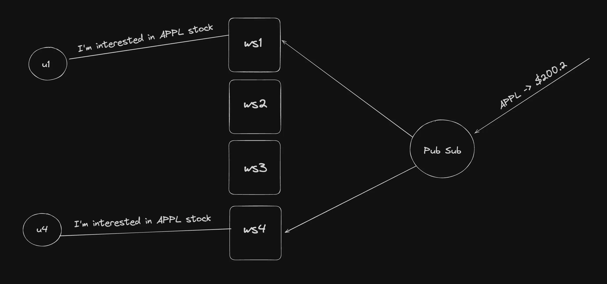

We'll see:
1. Stateful vs Stateless Backend
2. State Management in a Backend app
3. Singleton Pattern
4. Pub Subs + Singleton Pattern


## Stateful vs Stateless Backend

### Stateful Servers
Full stack app with backend and a lot of users. Lot of http servers as single isint enough as BE are auxiliary, they can die down anytime, they can scale up/down. So we persist data in a database.
So we have seen stateless backend and stateful databases until now. There is no easy way to do distributed caching, if the single server is where youre storing the data.

### Stateful servers

A lot of times, you make servers hold state 
Good examples of this are:
    - Creating an in memory cache - https://github.com/code100x/cms/blob/e905c71eacf9d99f68db802b24b7b3a924ae27f1/src/db/Cache.ts#L3
    - Storing the state of a Game in case of a realtime game - https://github.com/code100x/chess/blob/main/apps/ws/src/Game.ts#L41-L47 
        - like storing the list of all the moves in the server so that to check all the move with the new move to see if its valid move, need not to hit the database everytime. 
        - like in counter strike game, the player moves in like 30fps, hitting db for 30 times in a sec is not good, rather we use state.
    - Storing a list of 10 most latest chats in memory for a chat application
    - For CMS its a bunch of cache data.

So thats where you have to do state management in the backend.
**Stickiness** - Making sure that the user who is intrested in a specific room, gets connected to a specific server. Like in counter strike if 50 people are playing in same room they need to be connected to same server. 

## State in JS Process
How/where can you store state in a Javascript process
So if a chess game with two players and another two players, and a spectator, they should all be connected to a same websocket server. This is not bad but there are better ways.
This state might being used by multiple files, not just one, so the following approach might not work

Lets see other:
index.ts contain logic, store.ts contains the state of the game and there is a logger.ts file that is going to take the state and put it in the database.
Now lets say we are making chess game. We make a game [] in store.ts, then we can push the moves in the array in index.ts to maintain state. And we can make a logger file in which we can write the code in which the data is sent to database in interval. This will work, but a lot of times you need to attach functionality to state as well. 
To improve it we create a class called GameManager and expose some functions on it that can be called by files using it. So same thing we've done, but this time we made a class in which constructor makes empty game array, we added functionalities that lets us mutate the state. We have to create only a single instance of the class as the array in that only will be storing all the moves. So we create a single instance and export it in the main file.
Creating a class is much benifitial as we can extend the class and use the functions there etc... 
"There are other ways of storing state in a TS project as well, redux being a popular one. Yes, you can use redux in the backend as well"
Lets see even better approach Singleton Pattern


## Singleton Pattern
So we have seen the class instance approach, now if someone creates a new instance of the class and there wont be any error shown in the code editor, so if something you want initialized only once then use singleton patter. Completely prevent any developer from ever creating a new instance of the class.
How you inforce that? 
We make the constructor private. Static variables means, whenever someone creates a new instance of the class, then the attributes in the class like the game array is associated to the objects, not the class, pretty obvious.
So the static variable or attribute is associated to class, which means its global for all the variables. It can be called directly on the class. Its same for all the instances. So to solve that problem we create a new game instance in a static function and return it so that even if the instance is created multiple times it returns the same instance.

```ts
    interface Game {
        id: string;
        whitePlayer: string;
        blackPlayer: string;
        moves: string[];
    }

    export class GameManager {
        private static instance: GameManager; // Create a static instance of the class
        private games: Game[] = [];

        private constructor() {
            // Private constructor ensures that a new instance cannot be created from outside
        }

        public static getInstance(): GameManager {
            if (!GameManager.instance) {
                GameManager.instance = new GameManager();
            }
            return GameManager.instance;
        }
        // ... other methods
    }

    // Usage GameManager.getInstance().addGame()
```

### Pub Sub + Singleton
What if You want to create a system where users can subscribe to the feed of stocks (prices), like whats the price of Apple today?
This application will be used by >1Mn users
How would you build it?


