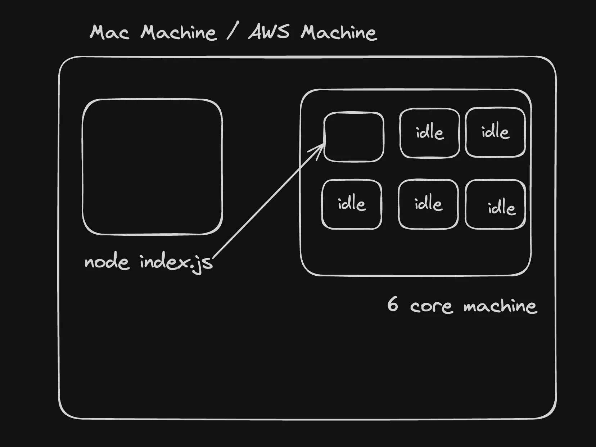
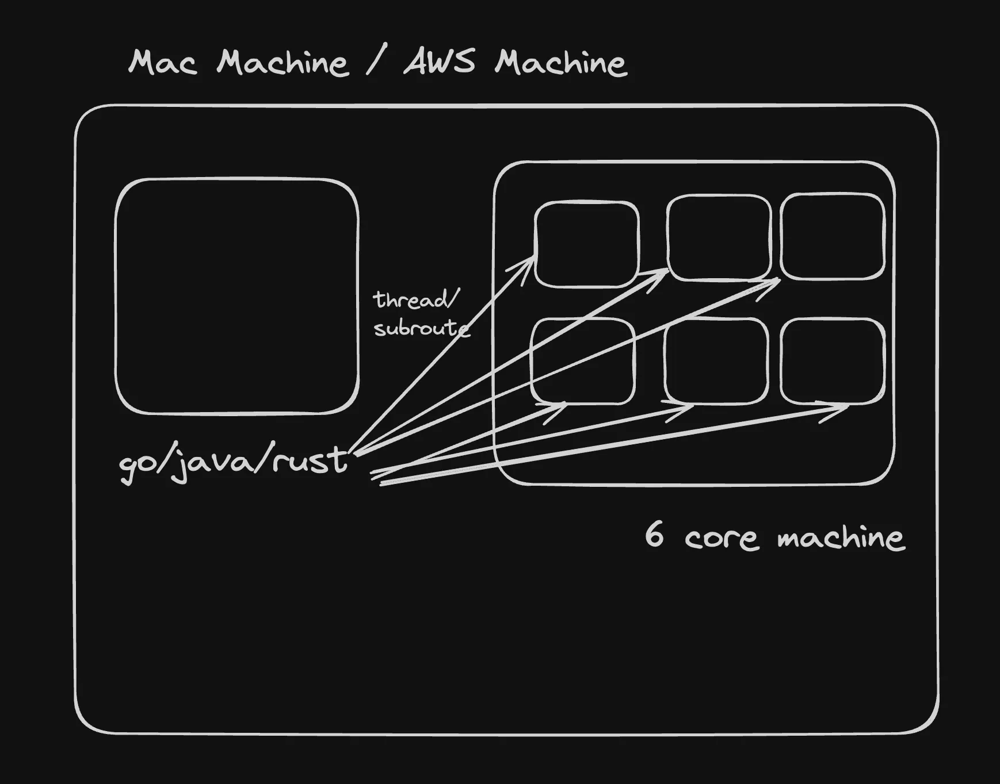

We'll see:
Server:
1. Cluster module and horizontal scaling
2. Capacity Estimation, ASGs and vertical scaling
3. Load balancers


Vertically scaling means increasing the size of the machine itself to support more load. Eg: If it had 1 cpu 8gb ram, now it has 20 cpu 32gb ram. You hoping by this your nodejs process will be able to handle more requests. If its memory intensive task then increasing memory may make sense. But specifically for processing, this runs on cpu. JS is single threaded, means it can only utilize one cpu. Now its of no use if youre increasing cpu in machine as node process cant take benifi of all those cpus. It will still run on single cpu only.
Unless its going to use a lot of memory and cpu like in build time etc, in t2.micro 1 vcpu running a node process is ok and in 32 vcpu its ok too, its not like youre getting 32 times benifits by paying 32 times more, you wont get 32 times performance. 

Means nodejs is not the effective way to scale it as vertical scale. 


**Implementing Vertical scaling in Node.js project**: You can start multiple node projects then? If there are 8 cores, then just start 8 projects?
But this will create port conflicts. If not Its just ugly to do this, keep track of the processes that are up and down.
We can use **Cluster Module**, cluster thats nodejs internal library provided. 

```js
    import express from "express";
    import cluster from "cluster";
    import os from "os";

    const totalCPUs = os.cpus().length;

    const port = 3000;

    if (cluster.isPrimary) {
        console.log(`Number of CPUs is ${totalCPUs}`);
        console.log(`Primary ${process.pid} is running`);

        // Fork workers.
        for (let i = 0; i < totalCPUs; i++) {
            cluster.fork();
        }

        cluster.on("exit", (worker, code, signal) => {
            console.log(`worker ${worker.process.pid} died`);
            console.log("Let's fork another worker!");
            cluster.fork();
        });
    } else {
        const app = express();
        console.log(`Worker ${process.pid} started`);

        app.get("/", (req, res) => {
            res.send("Hello World!");
        });

        app.get("/api/:n", function (req, res) {
            let n = parseInt(req.params.n);
            let count = 0;

            if (n > 5000000000) n = 5000000000;

            for (let i = 0; i <= n; i++) {
                count += i;
            }

            res.send(`Final count is ${count} ${process.pid}`);
        });

        app.listen(port, () => {
            console.log(`App listening on port ${port}`);
        });
    }
```
If lets say 10 cpus then they are separate processes, only its just cleaner to write, and running at same port. 