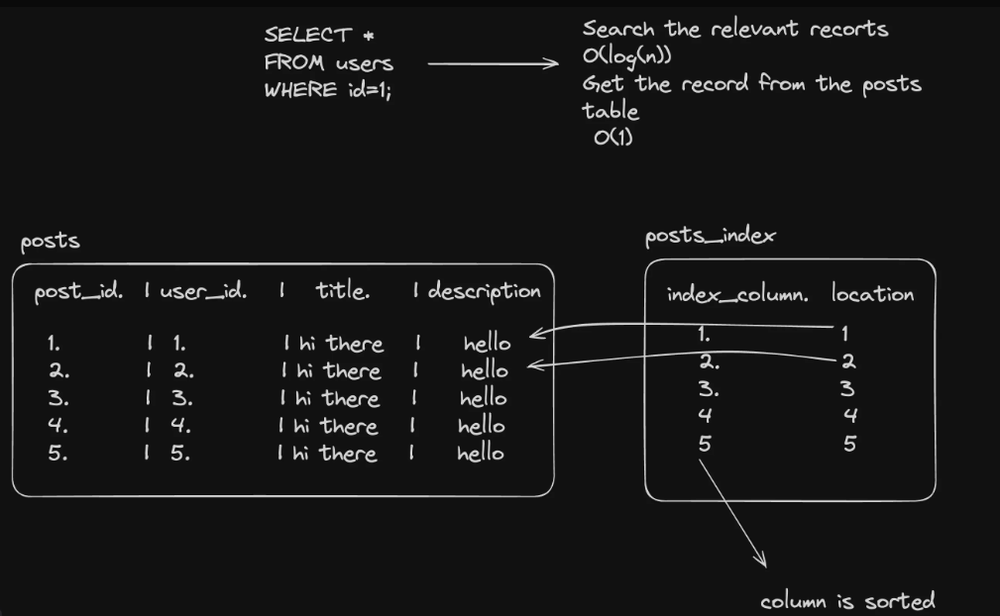

# Indexing in Postgres
We’ve created postgres tables many times now. Let’s see how/if indexing helps us speed up queries.

So when you do `SELECT * FROM posts WHERE user_id=1;` and the table contains millions of records, how does postgres find the records that match this query?

So it has to scan the entire table linearly to find the records that match this query. Postgres does a bunch of optimizations to make this faster, like it maybe spawns multiple threads to scan the table in parallel, but it still has to scan the entire table. So indexing is the thing you can do on top of it to make it faster.
 
- Create a postgres DB locally (dont use neon, we have a lot of data to store, will be very slow)
```bash
docker run  -p 5432:5432 -e POSTGRES_PASSWORD=mysecretpassword -d postgres
```

- Connect to it and create some dummy data in it
```bash
docker exec -it container_id /bin/bash
psql -U postgres
```

- Create the schema for a simple medium like app
```sql
CREATE TABLE users (
    user_id SERIAL PRIMARY KEY,
    email VARCHAR(255) UNIQUE NOT NULL,
    password VARCHAR(255) NOT NULL,
    name VARCHAR(255)
);
CREATE TABLE posts (
    post_id SERIAL PRIMARY KEY,
    user_id INTEGER NOT NULL,
    title VARCHAR(255) NOT NULL,
    description TEXT,
    image VARCHAR(255),
    FOREIGN KEY (user_id) REFERENCES users(user_id)
);
```

- Insert some dummy data in
```sql
DO $$
DECLARE
    returned_user_id INT;
BEGIN
    -- Insert 5 users
    FOR i IN 1..5 LOOP
        INSERT INTO users (email, password, name) VALUES
        ('user'||i||'@example.com', 'pass'||i, 'User '||i)
        RETURNING user_id INTO returned_user_id;

        FOR j IN 1..500000 LOOP
            INSERT INTO posts (user_id, title, description)
            VALUES (returned_user_id, 'Title '||j, 'Description for post '||j);
        END LOOP;
    END LOOP;
END $$;
```

- Try running a query to get all the posts of a user and log the time it took
```sql
EXPLAIN ANALYSE SELECT * FROM posts WHERE user_id=1 LIMIT 5;
```
> Focus on the execution time

- Add an index to user_id
```sql
CREATE INDEX idx_user_id ON posts (user_id);
```
> Notice the execution time now. 

**What do you think happened that caused the query time to go down by so much?**

## How indexing works (briefly)
When you create an index on a field, a new data structure (usually B-tree) is created that stores the mapping from the index column to the location of the record in the original table. 

Search on the index is usually `log(n)`

### Without indexes


### With indexes



In diagram we have made the index as a simple hash map, but in reality its a B-tree. (you can feel that the insertion will take O(n) time as all the rows will need to move because of the insertion, but in reality its O(log n) because of the B-tree structure)

> Most applications are read heavy, which is why you optimize for reads and not writes. Even if the writes are more expensive its fine as long as the reads are significantly faster.

The data pointer (in case of postgres) is the page and offset at which this record can be found.

Think of the index as the appendix of a book and the location as the page + offset of where this data can be found


## Complex indexes
You can have index on more than one column for more complex queries

**For example:**

Give me all the posts of a user with given id with title “Class 1”. If you try to run this query now then it will take time although we have an index on user_id. Means the index which we have wont work on this, as the index is only on user_id and not on title.

- The index needs to have two keys now
```sql
CREATE INDEX idx_posts_user_id_title ON posts (description, title);
```

- Try searching before the index is added and after it is added
```sql
SELECT * FROM posts WHERE title='title' AND description='my title';
```


### Indexes in Prisma
Ref - https://www.prisma.io/docs/orm/prisma-schema/data-model/indexes

You can add an index to a model in prisma by doing the following - 
```prisma
model User {
  id        String   @id @default(uuid())
  username  String   @unique
  email     String   @unique
  posts     Post[]
  createdAt DateTime @default(now())
  updatedAt DateTime @updatedAt
}

model Post {
  id          String   @id @default(uuid())
  title       String
  content     String?
  published   Boolean  @default(false)
  createdAt   DateTime @default(now())
  updatedAt   DateTime @updatedAt
  userId      String
  user        User     @relation(fields: [userId], references: [id])

  @@index([userId])         // means we want to create an index on userId
}
```

- Let’s look at daily code and see where all can we introduce an index

https://github.com/code100x/daily-code/blob/main/packages/db/prisma/schema.prisma#L129