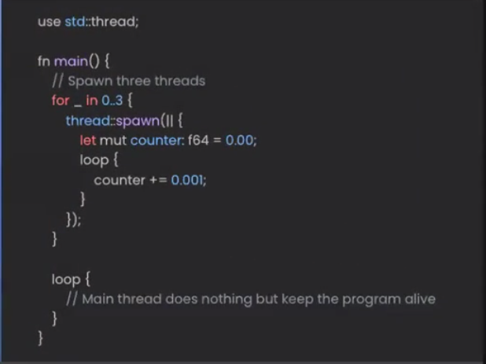
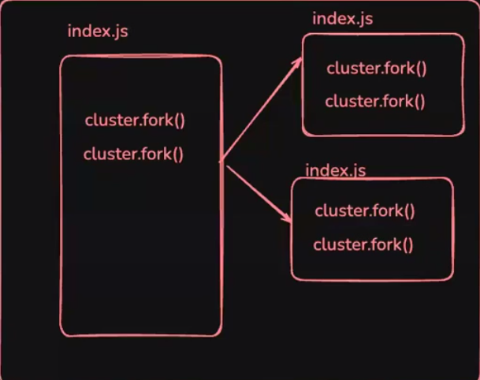
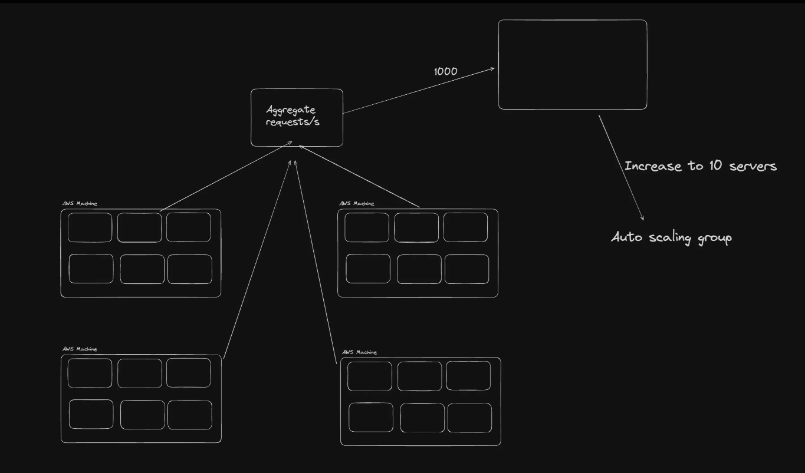
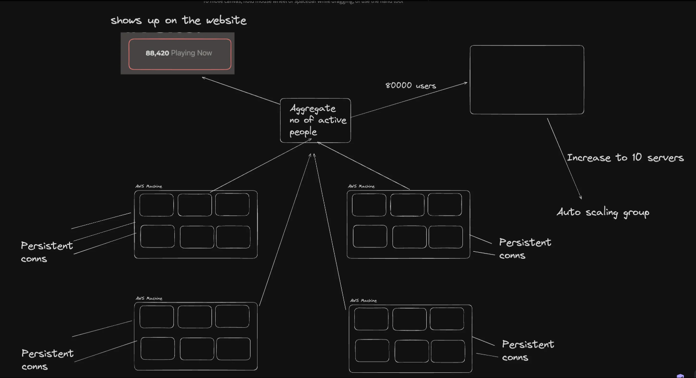
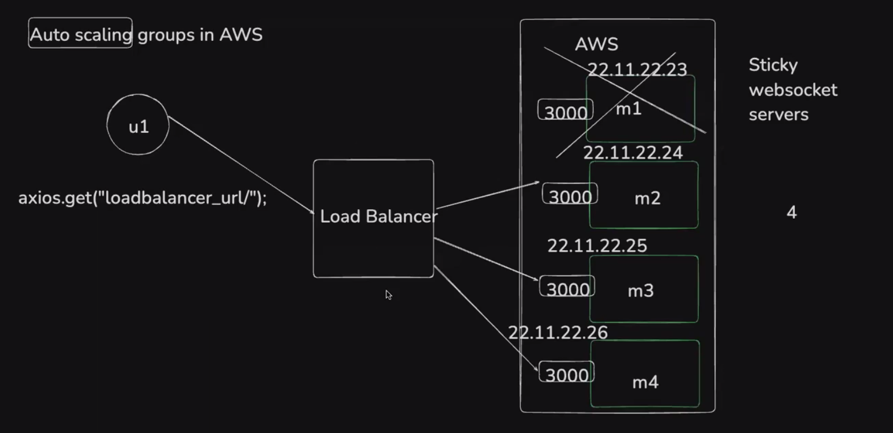
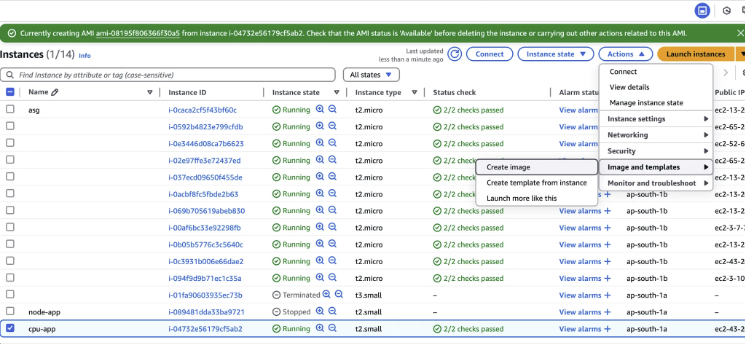
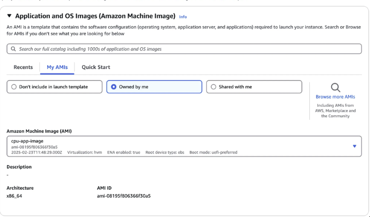
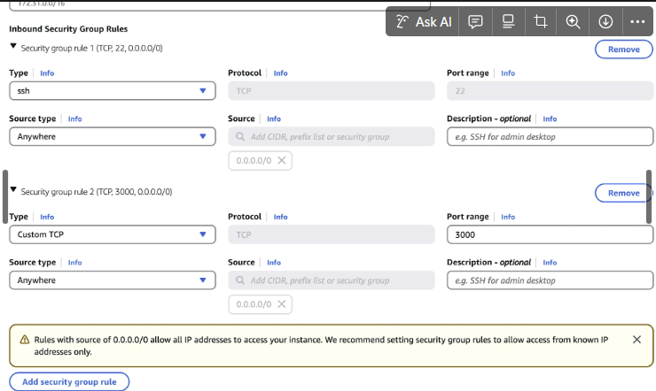
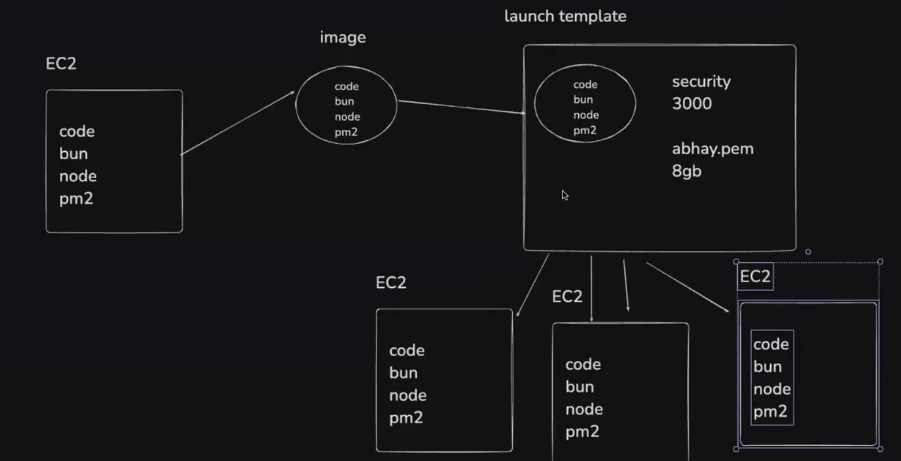

As your application grows, you have to scale your application, you have to spend more money on cloud, and there are 2 ways to scale your application:
1. Horizontal Scaling
2. Vertical Scaling


Since nodejs is single threaded, it can only use one core of your cpu. So if you have a 8 core cpu, nodejs will use only one core and the other 7 cores will be idle. It is different from Rust, Go lang, Java, Python. They are multi threaded and can use all the cores of your cpu. Rust has threads concept, so as java, go lang gas goroutines, python has multiprocessing module. JS is very unoptimal language in terms of cpu usage.

**Vertical Scaling**: Means increasing the size of your machine to support more load. 


Now we need to know how does the app change, how does the deployment change, how does the devops pipeline if a lot of users are hitting your app. Vertical scaling means just select the bigger machine, more cpu, more ram, more disk space. This is great but not great for JS, in JS it doesnt matter how big of a CPU you have, it will use only one core.
So in out PC we have many cores lets say 8 and we have vscode, chrome, gta, postman, spotify, discord, etc running. More than 8 apps are running but we have 8 cpus, its because of a concept called context switching. OS switches between the apps very fast, so it looks like all the apps are running at the same time. But in reality only one app is running at a time. So if you have 8 cores and 16 apps running, 8 apps will run at a time and other 8 will wait for their turn. This is called context switching.


**It is said that single threaded apps are bad at scaling.**

Eg: create index.js file
```
let x = 1;
while(true){
    x++;
}
```
This program will use almost 100% of one core of your cpu. Although we can run this program like 4 times in different terminal `node index.js` then we have 4 processes that taking almost 4 cores fully. So anyways one process running in one core only. So if you vertically scale your machine, it will not help.

Eg: in rust there is concept of threads, you can spawn multiple threads in the same process. 



So different thread can run in different core of your cpu. So we can say it makes sense to vertically scale rust program.

Now lets understand how we can vertically scale nodejs app. That means how can we make sure that our all cores are been used.
You can start 8 instance of same process in all of them. Now lets say you make a basic express app and you try to run them in 4 different terminal then you will get error port conflict.
In rust you can spawn multiple threads in the same process so no the process runs on a single port.
So in JS how can you acquire a single port yet load balance to various nodejs processes. 
So we can do that by using `cluster` module of nodejs. It will create multiple instances of your app and each instance will run on different core of your cpu. It lets you fork processes. Fork means to create multiple child process of the same parent process. Each child process will run on different core of your cpu. All the child processes will listen on the same port. So when a request comes to that port, it will be load balanced to one of the child process.

When we call cluster.fork(), it will create a new nodejs process. Its like opening a new terminal and running `node index.js` command.

The problem is if the same file is running then it will create infinite number of processes, as it will again call cluster.fork() in the child process.



So we have to check if the process is primary or child process. If its primary then only we will call cluster.fork(). We can check that by using `cluster.isPrimary` property, in parent process it will be true and in child process it will be false.

```ts
import express from "express";
import cluster from "cluster";
import os from "os";

const CPU_COUNT = os.cpus().length;

const port = 3000;

if (cluster.isPrimary) {
  console.log(`Number of CPUs is ${CPU_COUNT}`);
  console.log(`Primary ${process.pid} is running`);

  // Fork workers.
  for (let i = 0; i < CPU_COUNT; i++) {
    cluster.fork();
  }

  cluster.on("exit", (worker, code, signal) => {
    console.log(`worker ${worker.process.pid} died`);
    console.log("Let's fork another worker!");
    cluster.fork();
  });
} else {
  const app = express();
  console.log(`Worker ${process.pid} started`);

  app.get("/", (req, res) => {
    res.send("Hello World!");
  });

  app.get("/api/:n", function (req, res) {
    let n = parseInt(req.params.n);
    let count = 0;

    if (n > 5000000000) n = 5000000000;

    for (let i = 0; i <= n; i++) {
      count += i;
    }

    res.send(`Final count is ${count} ${process.pid}`);
  });

  app.listen(port, () => {
    console.log(`App listening on port ${port}`);
  });
}
```

> If we use the same browser tab to hit the api endpoint multiple times, we will see that the process id is same. Because the browser keeps the connection alive and reuses the same connection. So if we want to see different process id, we have to use different browsers or use postman. There is some level of process caching happens on browser.

So we can make a bin.js file and move the cluster code there and in index.js we will have only express app code. So that we can keep our code clean.

```ts
// bin.js
import cluster from "cluster";
import os from "os";
import app from "./index.js";

const CPU_COUNT = os.cpus().length;
const port = 3000;

if (cluster.isPrimary) {
  console.log(`Number of CPUs is ${CPU_COUNT}`);
  console.log(`Primary ${process.pid} is running`);

  // Fork workers.
  for (let i = 0; i < CPU_COUNT; i++) {
    cluster.fork();
  }

  cluster.on("exit", (worker, code, signal) => {
    console.log(`worker ${worker.process.pid} died`);
    console.log("Let's fork another worker!");
    cluster.fork();
  });
} else {
  app.listen(port, () => {
    console.log(`App listening on port ${port}`);
  });
}
```

```ts
// index.js
import express from "express";

export const app = express();
console.log(`Worker ${process.pid} started`);

app.get("/", (req, res) => {
  res.send("Hello World!");
});

app.get("/api/:n", function (req, res) {
  let n = parseInt(req.params.n);
  let count = 0;

  if (n > 5000000000) n = 5000000000;

  for (let i = 0; i <= n; i++) {
    count += i;
  }

  res.send(`Final count is ${count} ${process.pid}`);
});
```

Lets do a task:
- Find sum from 0 to 1000000000
- use cluster module to scale the app
- print the final sum
- make sure its parallalized it utilizes all the cores of your cpu

```ts
//index.js
import cluster from "cluster";
import os from "os";

const CPU_COUNT = os.cpus().length;
const target = 10000000000;
const chunkSize = Math.floor(target / CPU_COUNT);

if(cluster.isPrimary) {
    let startTime = Date.now();
    let totalSum = 0;
    let completedWorkers = 0;

    for(let i=0; i<CPU_COUNT; i++) {
        const worker = cluster.fork();
        const start = i * chunkSize;
        const end = (i === CPU_COUNT - 1) ? target : (i + 1) * chunkSize - 1;

        setTimeout(() => {
            worker.send({start, end});
        }, 100);

        worker.on('message', (msg) => {
            totalSum += msg.partialSum;
            completedWorkers++;

            if(completedWorkers === CPU_COUNT) {
                let endTime = Date.now();
                console.log(`Total Sum: ${totalSum}`);
                console.log(`Time taken: ${(endTime - startTime)/1000} seconds`);
                process.exit(0);
            }
        });
    }
} else {
    const startTime = Date.now();
    const {start, end} = msg;
    let partialSum = 0;

    for(let i=start; i<=end; i++) {
        partialSum += i;
    }

    process.send({partialSum});
}
```

```ts
// index2.js

const target = 10000000000;
let startTime = Date.now();
let answer = 0;

for(let i=0; i<=target; i++) {
    answer += i;
}

const endTime = Date.now();
console.log(`Final Answer is ${answer}`);
console.log(`Time taken: ${(endTime - startTime)/1000} seconds`);
```


So these are the two files, one is using cluster module and other is not using cluster module. Run both the files and see the time taken by both the files. You will see that the file using cluster module will take less time as it is using all the cores of your cpu.

**Capacity estimation:**
- This is a common system design interview where they’ll ask you 
    - how would you scale your server
    - how do you handle spikes
    - How can you support a certain SLA given some traffic
 
- Answer usually requires a bunch of 
    - paper math
    - Estimating requests/s
    - Assuming / monitoring how many requests a single machine can handle
    - Autoscaling machines based on the load that is estimated from time to time

Example #1 - PayTM app



Example #2 - Chess app


Lets say you have fal.ai where you write prompt and it generates image and video for you, or lets say you upload a video on youtube here also a single request takes an mp4 as an input and generates multiple resolutions of that video, here request per second calculation is not enough. Here single request takes a lot of time to process. But single stateless applications like a todo app, which all its doing is recieving a request from user and hitting the database, they need simple request per second calculation, simple SLA calculation, simple stratergy to scale up and scale down. If not checking the aggrigate request per second, you can also check the average CPU usage of your machine, if its more than 70% then scale up, if its less than 20% then scale down.

This was simple http server scaling example capacity estimation. But in real world there are many more things to consider like database, caching, cdn, etc. But this is the basic idea of how to scale your application.

You can say that cpu is not the best metric to scale your application, you might have memory intensive application, you might have a network intensive application. So you have to monitor all the metrics and scale your application accordingly. Request per second give you more control over scaling your application. You can also use a combination of cpu, memory, network, request per second to scale your application.

- **GenAI application/Video upload pipeline:** So if you are not doing a heavy operation on backend, its simply talking to a database then you scale based on cpu, memory, request per second. But if you are doing a heavy operation on backend like genAI application, video upload pipeline are expensive operations, you cant simply scale based on cpu, memory, request per second. For these long running processes, you cant just scaleup and scaledown because a server might be in the middle of processing a request and if you scale down that server then that request will be lost. So  to scale backend that has long running processes, you dont directly process the request, you kindof hit the database and create sort of a task in the database with like before_queue state, or processing state then that is pushed in a queue and then you have workers that pick things from that queue. So now the time it takes depends on the queue, you have to use a message queue like rabbitmq, kafka, etc. So when a request comes to the server, it will put that request in the message queue and return a response to the user that your request is being processed. Then a worker will pick that request from the message queue and process it. So here you can scale your workers based on the length of the message queue. If the length of the message queue is more than a certain threshold then scale up your workers, if its less than a certain threshold then scale down your workers fleet. This way you can handle spikes in traffic without losing any requests.
So this workers fleet's scaling algorithm you have to design. And lets say the image generation is been processing and the frontend is polling the backend to check the status of the image generation, lets say its in process now. So once the image is generated, you can upload it to a cdn and return the cdn url to the user.
This is scaling application which have one very expensive task that you cant directly run on the http layer, so you use this architecture of message queue and workers to handle that expensive task.
Http layer should be stateless, it should not have any state, it should not have any long running processes other than talking to database, cache, etc. All the long running processes should be handled by workers. eg: Youtube video uploading, fal.ai image generation, codeforces, ideogram, etc. So this was scaling slightly expensive backend operations in a more asynchronous fashion.


## AutoScaling Groups in AWS
When one VM is not enough, you cant keep vertically scaling your machine, then you require horizontal scaling. 

Now if you think from first principal then you start lets say 4 machines and they have different IP and when you are writing your frontend code, you be hitting the IP of which machine? You cant keep changing your frontend bundle with this new url.
So we will be creating a bunch of machines and we dont really need to expose the ip to the end user. The end user will hit the load balancer and load balancer will be aware that these are the 4 machines that it need to balance the load accross.

For this you need not to use the ASG of AWS you can start machines and create a load balance by yourself and use the load balancer url in your frontend code. But ASG makes it easy for you to manage the machines, it will automatically replace the unhealthy machines, it will automatically scale up and scale down the machines based on the load. So you dont have to worry about managing the machines. So using the ASG this 4 machines cluster can auto scale.

To be able to create a ASG you need to learn about EC2, Image(amis), launch template, load balancer, target group, health check, scaling policy, Autoscaling Groups.

As your app grows, you need to `autoscale` your app if traffic incrases/decreases. 

This would require

1. Increasing/Decreasing compute 
2. Putting your compute behind a load balancer

An **Auto Scaling Group** (ASG) in AWS (Amazon Web Services) is a service that automatically adjusts the number of EC2 (Elastic Compute Cloud) instances in a specified group to meet the demand for your application. It helps ensure that you have the right amount of compute capacity at any given time by automatically scaling up (adding more instances) or scaling down (removing instances) based on demand. This helps optimize costs and ensures that your application is always running efficiently.

### Features

1. **Automatic Scaling:**
    - Based on predefined metrics like CPU utilization, memory usage, or custom metrics, ASGs scale your EC2 instances up or down to maintain optimal performance and availability.
2. **Health Checks:**
    - ASGs perform regular health checks on the EC2 instances in the group. If an instance becomes unhealthy, it is automatically replaced with a new one.
3. **Scaling Policies:**
    - You can configure scaling policies to define how the scaling should happen. This could be based on a schedule, like increasing the number of instances during peak traffic hours, or dynamically adjusting based on real-time metrics.
4. **Launch Configurations/Launch Templates:**
    - These specify the configuration of instances launched within the group, such as the AMI (Amazon Machine Image), instance type, security group, key pair, and other parameters.
5. **Desired, Minimum, and Maximum Instance Counts:**
    - You define the minimum and maximum number of instances the group can scale between. The **desired capacity** is the target number of instances you want the ASG to maintain at any time.
6. **Elastic Load Balancer Integration:**
    - ASGs can be integrated with Elastic Load Balancing (ELB), so new instances launched by the Auto Scaling Group are automatically registered with the load balancer, ensuring traffic is distributed across healthy instances. AWS manages the load balancer for you. You dont have to scale the load balancer, it will automatically handle the traffic to the instances in the ASG. You might think that this is single point of failure, that you have thousands of instances in cluster but only one load balancer, its completely managed by AWS, it will automatically scale the load balancer based on the traffic. This is a slightly expensive service, but you can always be sure that your load balancer will not be a bottleneck or down.




### **Why use Auto Scaling Groups?**

- **Cost Efficiency:** ASGs help reduce costs by ensuring you're only running as many instances as needed to handle the load.
- **High Availability:** Automatically replacing unhealthy instances keeps your application running smoothly.
- **Flexibility:** ASGs support both manual and dynamic scaling policies to cater to a wide range of use cases. 

The very first instance we have to make by ourself manually, then we can create an launch template and then they can create automatically, we will have to create an Image/blueprint of that instance, so that whenever ASG needs to create a new instance it can use that image. So we have to create an image of the instance manually, then we can create an launch template using that image, then we can create an ASG using that launch template. So whenever ASG needs to create a new instance it will use that launch template.


### **Create an instance which runs your app**
- Start an AWS EC2 instance
- SSH into the machine
- Install docker in the machine - https://www.digitalocean.com/community/tutorials/how-to-install-and-use-docker-on-ubuntu-20-04
- or Install node.js on the machine - https://www.digitalocean.com/community/tutorials/how-to-install-node-js-on-ubuntu-22-04, also install bun `npm install -g bun`
- Clone the repo - https://github.com/100xdevs-cohort-3/ASG
- bun install
- bun bin.ts
- Install pm2


### **Creating an ami/image**

An AMI (Amazon Machine Image) in AWS (Amazon Web Services) is a pre-configured template used to create a virtual server, known as an EC2 (Elastic Compute Cloud) instance. It contains the operating system, application software, and settings required to launch and run the server.




### **Create a launch template**

In AWS, a Launch Template is a resource that defines the configuration settings used to launch EC2 instances. It acts as a blueprint that specifies the instance configuration, such as instance type, Amazon Machine Image (AMI), security groups, key pairs, storage, and other parameters, making it easier to launch instances with predefined configurations.


### **Image**




### **Security group**




### User data

**User Data** in AWS Launch Templates refers to a script or configuration file that you can provide when launching an EC2 instance. This script runs automatically during the instance's initialization process, allowing you to perform tasks like configuring the instance, installing software, or setting up services without needing to log in to the instance manually. If you wish to change the user data of an existing launch template, you will have to create a new version of that launch template with the updated user data. you can simply go to the template, click on actions, then click on modify template. Then you can see there are 2 versions of the launch template, then you go to the ASG and update the launch template version to the latest version. Then the old machines will still run the old version of the launch template so before updating the launch template version you can set the desired capacity of ASG to 0, then update the launch template version, then set the desired capacity to 2. So that the new machines will be created using the latest version of the launch template.

```bash
#!/bin/bash 
export PATH=$PATH:/home/ubuntu/.nvm/versions/node/v22.14.0/bin/
npm install -g pm2
cd /home/ubuntu/ASG
pm2 start --interpreter /home/ubuntu/.nvm/versions/node/v22.14.0/bin/bun bin.ts
```

Debugging - https://stackoverflow.com/questions/15904095/how-to-check-whether-my-user-data-passing-to-ec2-instance-is-working

**Summarize Until Now:** 
- We started a fresh EC2, its a base sort of machine for us and when we are ssh into the machine we installed things a cloned 
- Then we clicked on actions, image and templates, create image. Image is nothing but a snapshot of that machine(which has everything, eg bun, nodejs, ubuntu, source code, pm2 etc), so whenever we want to create a new machine we can use that image.
- Then we created a launch template, launch template is nothing but a blueprint of how to create a machine. We have to provide the image id, instance type, security group, key pair, user data, etc. Then you can launch multiple instances from that launch template, because this launch template has everything that needs to start an instance.
- Now we can manually start an instance from that launch template, or we can create an ASG using that launch template, so that ASG can automatically start and stop instances based on the load.
- Ideally this is enough, if we have an internet facing application(like we want some compute for machine learning model training or something like this), we dont need target group and load balancer, we need then for an internet facing application. So before we create load balancer we need a target group.




### **Create a target group**

In AWS, a **Target Group** is a logical grouping of resources (such as EC2 instances, IP addresses, or Lambda functions) that are used as the targets for routing traffic from an **Elastic Load Balancer (ELB)**. The load balancer distributes incoming network traffic to the registered targets within the target group based on specified routing rules.
In AWS a load balancer connects to a target group, and it just knows that it has to route the request to the target groups, and the target group routes traffic to the instances. Target group is sort of a blue print of where the traffic can go, a group of machines that can be a target. Before we create a ASG we need to create a load balancer and before we create a load balancer we need to create a target group. 
You can add and remove machines from the target group, and the load balancer will automatically adjust the traffic distribution accordingly. Load balancer routes the traffic to the target group, and target group routes the traffic to the instances in that target group. 

**Health Check Endpoint:** This is important, whenever you create any application in the real world create a health check endpoint, like a get request to /healthcheck which returns 200 ok. So that the load balancer can hit that endpoint to check if the instance is healthy or not. If the instance is not healthy then it will not route traffic to that instance. So create a health check endpoint in your application.

- So we create a target group, select instance, protocol as http, port as 3000, health check path as lets say /healthcheck, then create the target group.
- Then it asks to select the instances but we dont do this, because we will be creating an ASG which will automatically add the instances to the target group.
- Next we create a load balancer. In the process of creating a ASG you get a step to create a load balancer. You can create a load balancer from EC2 dashboard also.


### **Create an autoscaling group**
1. Give it a name
2. Select the launch template
3. Select availability zones, you select 2 or more availability zones, so that if one availability zone goes down, your application is still up and running.
4. Attach a new load balancer, select the target group, select the vpc, security group, etc. Select port 80 as any request coming to port 80 of load balancer will be routed to the target group. The load balancer will understand from the target group that it has to route the traffic to port 3000 of what instances(as in our machines the app is exposed on port 3000).
5. Group size - minimum 1, desired 2, maximum 4. So it will always have at least 1 instance running, it will start with 2 instances and it can go upto 4 instances.
5. So our ASG is created. Try visiting the website through the load balancer URL (might have to change the security group of the LB to make the port 80 accessible from internet)
6. Add a new listener (https) and create a new certificate to make website accessable on https

So first we create EC2 then Image then Launch Template. Then we create Target Group(3000, didnt attach any instance), then create ASG and a Load Balancer and exposed port 80 of LB and we selected the group size. 

So when we go to the ASG and Instance Management and there we can see it has started 2 instances, so 3 instance total, 1 we created manually for creating the image. If we stop one of those 2 manually, then ASG will automatically start a new instance to maintain the desired capacity of 2.

So this was manual scaling, we set the desired capacity to 2, so it will always have 2 instances running. Despite of giving the min and max scaling limits.

### **Create autoscaling policy**


Now in ASG we can create automatic scaling policy(dynamic scaling policy). There you can select a simple metric like average cpu utilization, if its more than 70% for 5 minutes then scale up by 1 instance, if its less than 20% for 5 minutes then scale down by 1 instance. Or you can select advanced scaling policy.

So when we add a dynamic scaling policy then the desired capacity can be changed by you or by the ASG itself.

Now to connect this to the CI CD pipeline, in the lauch template just add cd ASG, git pull, bun install and pm2 start --interpreter /home/ubuntu/.nvm/versions/node/v22.14.0/bin/node bin.ts in the user data. So whenever a new instance is created it will automatically pull the latest code from the repo and start the app. This way only the new machines will have the latest code. You can add hacks like scale down to 0 then scale up when commit happens to the github. Or like every night at some 3 am make the desired capacity 0 and make the desired capacity lets say 5, that way all the servers drains at night. That way you have new deployments at night.