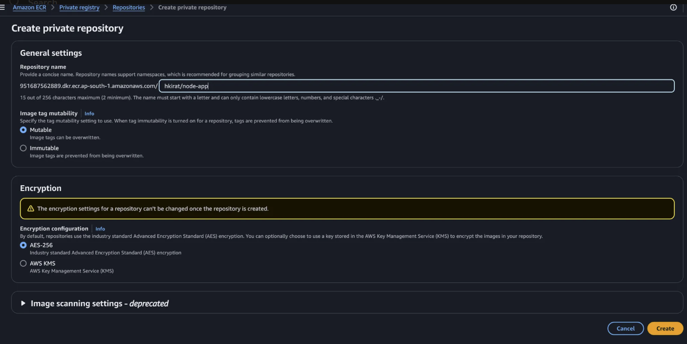
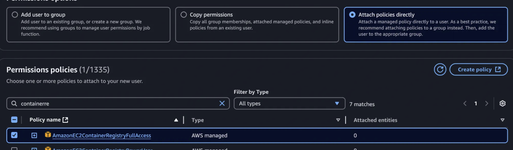
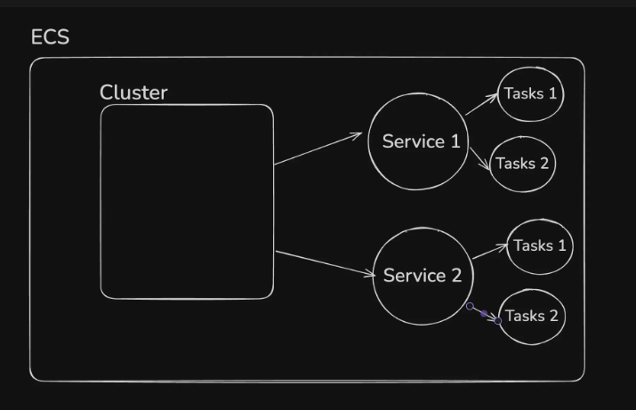
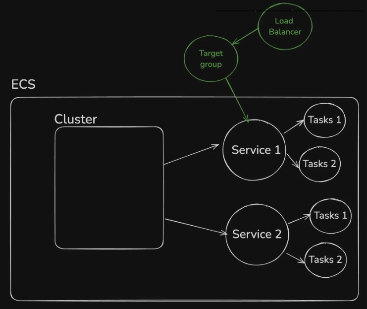
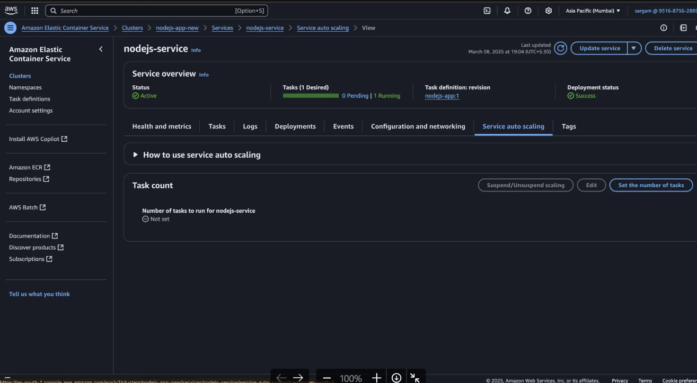

**ECS(Elastic Container Service):** is like Amazon's answer to Docker Swarm and Kubernetes. If you want similar benifits to the app, then you can use ECS, it is a container orchestration service.
Downside is its a AWS specific service, so you cant use it on other cloud providers, thats not true for Docker Swarm and Kubernetes.

Today, we’ll learn how to deploy containerized applications to a serverless environment on AWS using ECS.

We’ll also learn about ECR(Elastic Container Registry), AWS’s container registry (similar to dockerhub).

**Pre-requisites**
- Docker
- AWS account
- Node.js

**Good video to watch**

How ERC and ECS work under the hood - https://aws.amazon.com/awstv/watch/8123a115bf0/

## What is ECR
ECR stands for **Elastic Container Registry**. It is a fully managed Docker container registry service provided by Amazon Web Services (AWS). ECR allows you to store, manage, and deploy Docker container images, making it easier for developers to work with containerized applications.

Key features of ECR include:

1. **Private repositories**: You can create private repositories to store your container images securely.
2. **Integration with ECS and EKS**: ECR is fully integrated with Amazon Elastic Container Service (ECS) and Amazon Elastic Kubernetes Service (EKS), making it seamless to deploy containers from ECR to these services.
3. **Scalability**: As a managed service, ECR scales automatically to accommodate the growth of your container image repository.


## What is ECS
**ECS** stands for **Elastic Container Service**. It is a fully managed container orchestration service provided by Amazon Web Services (AWS) that allows you to easily run, manage, and scale Docker containers on AWS infrastructure. Can you do it without ECS? Yes, use ASG and LB, but ECS makes it easier. But if you dont want to deal with machines you have a container and you want someone to manage it for you, then ECS and Kubernetes are the best options.

Key features and concepts of ECS include:

1. **Container Orchestration**: ECS automates the deployment, scaling, and management of containerized applications. It allows you to run Docker containers without managing the underlying servers or infrastructure manually.
2. **Cluster Management**: ECS organizes resources into clusters, which are groups of EC2 instances (virtual servers) or AWS Fargate instances that run your containers. ECS automatically handles scheduling and managing the resources within these clusters.
3. **Task Definitions**: In ECS, you define your containerized applications in "task definitions." A task definition is a blueprint that describes which Docker containers to run, their settings (e.g., CPU, memory), and how they interact with other services.
4. **Service Management**: ECS allows you to define services that ensure your containers run continuously, are scaled according to demand, and are replaced automatically if they fail.
5. **Integration with Other AWS Services**: ECS integrates with various AWS services like Elastic Load Balancer (ELB), CloudWatch for monitoring, IAM for security, and ECR for container image storage, enabling a seamless environment for deploying containerized applications.
6. **Fargate**: Its an independent service, its a serverless container environment, you bring up the container, you give it to fargate it scales it automatically. ECS can run containers on EC2 instances, but it also supports **AWS Fargate**, a serverless compute engine that removes the need to manage the underlying infrastructure. With Fargate, you only specify the CPU and memory requirements, and AWS handles the rest.
7. **Scaling**: ECS can scale applications automatically based on demand, ensuring that your containers are appropriately distributed across resources.


# ECR Workflow
## Containerize a Node.js app
- Initialize an empty bun app

```rust
bun init
```

- Add express to it

```rust
bun add express @types/express
```

- Write a basic node.js app

```jsx
import express from "express";

const app = express();

app.get("/cpu", (req, res) => {
	for (let i = 0; i < 100000000; i++) {
		Math.random();
	}
	res.send("Hello world");
});

app.listen(3000)
```

- Create the dockerfile

```jsx
FROM oven/bun:alpine

WORKDIR /app

COPY . .

RUN bun install

CMD ["bun", "run", "index.ts"]
```

- Build the dockerfile

```jsx
docker build -t node-app .
// mac M1 people should add --platform=linux/amd64
```

- Try running it locally

```jsx
docker run -p 3000:3000 node-app
```


## Creating ECR Repository, Pushing to ECR
- Open ECR
- Create a new repo with your registry name (eg: varuntd/node-app)
- You can select Immutabe or Mutable, Immutable means you cant overwrite an image with the same tag eg: varuntd/node-app is same as varuntd/node-app:latest, by default the tag is latest but we can change to something else. Immutable means you cant push the same tag again, Mutable means you can overwrite it.



Now how to push the image to ECR? We need to login with the aws credentials from the terminal. You can see option "View push commands" once you create the repo, on aws console.

- You need to install the aws cli if you dont have it already on your machine.
- Then you need to login to aws from the terminal, so you need aws credentials for that. And you should never use root credentials for this, always create a new user with limited permissions.
- So go to IAM, create a new user with ECR permissions FullAccess and go to the Security credentials tab and create new access keys for cli access.
- Create new AWS credentials that have access to ECR (in the IAM console)



- Create security credentials for the user
- Install the aws cli - https://docs.aws.amazon.com/cli/latest/userguide/getting-started-install.html
- Store the aws credentials locally

```jsx
aws configure
```

- Get the registry password, we are getting the password and piping it to docker login.

```jsx
aws ecr get-login-password --region ap-south-1 | docker login --username AWS --password-stdin 951687562889.dkr.ecr.ap-south-1.amazonaws.com
```

So what we have done until now is, we have installed aws cli, then we got the aws credentials from the IAM user we created, then we asked aws to give us our registry password and piped it to docker login command. And now docker is connedted to our ECR registry. Now we can push images to ECR.

- Now if we have already built the image, we can change the name of the image to match the ECR repo name like this (or we can build it with ecr repo name directly):

```jsx
docker tag node-app:latest 951687562889.dkr.ecr.ap-south-1.amazonaws.com/varuntd/node-app:latest
```

- Push the image

```jsx
docker push 951687562889.dkr.ecr.ap-south-1.amazonaws.com/varuntd/node-app:latest
```

- Assignment - Add a CI/CD pipeline that pushes every commit to ECR


# ECS (Elastic Container Service) architecture
AWS ECS is a fully managed container orchestration service that allows you to easily run, scale, and manage Docker containers on AWS. It abstracts much of the complexity of managing containers and lets you focus on deploying applications rather than managing infrastructure.

- Now our image has reached ECR, now where do we run it? We can run it on EC2, we can take it to kubernetes cluster, we can take it to ECS.
- There are 3 main components of ECS - Cluster, Task, Service
- If you want to deploy your nodejs app first you need to create a cluster, its not a physical machine, its a logical grouping of resources, and you can attach multiple services to a cluster(eg: todo backend service and todo frontend service).
- Then you tell service that you are going to start a task, a task is a running instance of a containerized application in ECS. Eg: you tell service to always make sure 2 tasks are running, you give it a blueprint of the task, which is called task definition. And service make sure to scale the tasks up and down based on demand, like an autoscaling group.



### **Cluster**

A **Cluster** is a logical grouping of resources used by ECS to manage and run containerized applications. A cluster is essentially a pool of computing resources (e.g., EC2 instances or Fargate) where your tasks (containers) run.

- **EC2 Cluster**: When you use EC2 launch type, the cluster contains EC2 instances that are registered to ECS.
- **Fargate Cluster**: When you use Fargate, the cluster is virtualized, and ECS manages the infrastructure for you (you don't manage the underlying EC2 instances). Its not same as AWS Lambda, because in lambda you just give the code and it runs on functions, here you give the container and it runs containers.


### **Task**

A **Task** is a running instance of a containerized application in ECS. It's the basic unit of work in ECS. A task is defined by a **Task Definition**, which specifies the Docker image to use, resource requirements (like CPU and memory), networking configurations, environment variables, and more.

- **Task Definition (similar to launch templates)**: The blueprint for your task, describing which containers to run, their configuration, and the resources they need.
- **Running Task**: Once ECS launches a task from a task definition, it becomes a running task, executing your containerized application.

### **Service**

A **Service** is a higher-level abstraction on top of tasks in ECS. A service allows you to maintain and scale a specified number of task instances running and ensures that the desired number of tasks are continuously running.

- **Scaling**: Services allow automatic scaling of tasks up or down based on demand (e.g., adding more task instances when traffic increases).
- **Load Balancing**: ECS services can also be associated with a **load balancer** (like an ELB) to distribute incoming traffic across running tasks.



- Why we need to create target group then whet will service do? Target group is needed for load balancer to know where to send the traffic, load balancers dont know about services or tasks, they only know about target groups. So we create a target group and attach it to the service, so that the load balancer can send traffic to the tasks running in the service.

> So cluster's job is to manage resources and start services and service's job is to manage tasks. We create a task definition and then we create a service thats attached to the cluster. We will also need a load balancer attached to the target group which is attached to the service to expose it to the world.


## Creating a Cluster
- Go to AWS ECS console, create a new cluster
- Give your cluster a name
- You can select EC2 or fargate or both as the infrastructure providers(you can also decide like 30% traffic to EC2 and 70% fargate)

## Create a task defination
1. Give it a name
2. Select fargate as the provider
3. Select the infrastructure (we have nodejs app and we aint wrote any multithreaded code so 1 vCPU or more doesnt matter)
4. Add the container that you pushed (image url of the image we pushed to the ECR), also make sure to add port mappings
5. Anything else we can leave as default

>Next up is creating a service inside the cluster and attaching the task definition to it and giving it a desired count of tasks to run.

## Create a service in your cluster
- Select the cluster you created
- Click on create service
- Select Capacity provider strategy as Fargate
- **Environment:** Set capacity base to 0, weight to 1
- **Deployment configuration** 
	- Select application type as service (you can actually only start a task without a service, but then you will have to manually manage the tasks. If you want to run a thing only once, not a long running process, then you can start a task without a service)
	- Select the service from the last section
	- Set desired capacity to lets say 3 
- Since our application is an internet facing application, we need to attach a load balancer to it
- Select Load balancer type as Application Load Balancer
- Whenever we create a load balancer, we also need to create a target group, so select "Create a new target group"
- Create a target group, select the 3000 port container.
- Also open the load balancer on port 80 to the world by updating its security group once it is created
- So you can go to the load balancer's url and test your app

> Now our cluster will have one service which will be attached to a load balancer through a target group, and this service will start 3 tasks of the task definition we created.

## Autoscaling policies




