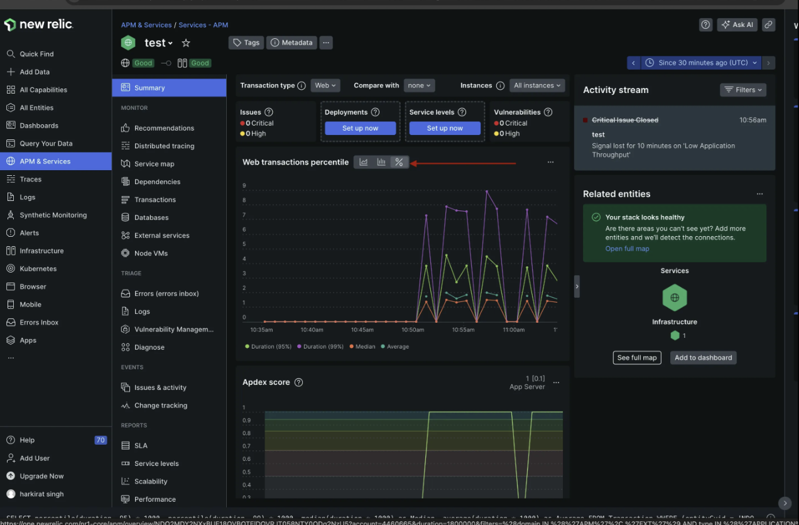

We'll see paid services to do monitoring.

## Logging, monitoring, alerts and status pages

**Logging**

Logging refers to the practice of recording events, messages, or data points generated by software applications and systems. (Remote logging more technically) These logs can include various types of information, such as:
- **Error Messages**: Details about errors and exceptions that occur.
- **Access Logs**: Records of who accessed what resources and when.
- **Audit Logs**: Records for compliance and security purposes.

**Monitoring**

Monitoring involves the continuous observation of a system to ensure it is operating correctly and efficiently. It includes tracking various metrics and performance indicators, such as:
- **CPU Usage**: Monitoring how much processing power is being used.
- **Memory Usage**: Tracking the amount of memory being utilized.
- **Disk I/O**: Observing read/write operations on storage devices.
- **Space**: Total amount of space available on the machine
- **Network Traffic**: Measuring data transfer rates and network activity.
- **Application Performance**: Monitoring response times, throughput, and error rates.

**Alerts**

When there are logging/monitoring systems in place, you can put up alerts to be called/messaged/slacked/paged when 
- A system goes down
- CPU usage goes above a certain point
- Error count goes up
- An alert is like an email, phone call, or text message that would trigger when certain conditions are met.
- There are on-call systems to manage who gets alerted when in big companies. (eg: there are 5 backend developers, only one of them is on-call for a week. If an alert goes off, that person gets alerted. If they don’t respond in 10 minutes, the next person gets alerted. Like if something crashes then the on-call person recives a call).
- PagerDuty, BetterUptime, OpsGenie these companies provide alerting and on-call management services.

**Monitoring dashboards**


Status pages
https://status.100xdevs.com/
https://status.backpack.exchange/


## Services
There are a few ways to monitor systems. 
**Paid**
- AWS CloudWatch: Monitoring and observability service for AWS resources.
- Datadog - Logging and monitoring (popular paid one, and are expensive)
- Newrelic - Logging and monitoring (slightly cheaper than datadog)

**In house/self hosted**
Prometheus + Grafana + Loki
 
We’ll be going through
- Newrelic
- Prom + Grafana


# Newrelic
We’ll be setting up 3 things in newrelic
- Logging
- Monitoring
- Alerting

**Steps**
- Login to newrelic
- Select your stack
- Select machine (OS) to install it on 
- The first thing it says is to instrument your hosts 
    - eventually youll have bunch of machines, all of them needs to send data to newrelic time to time, and for that you have to run an agent on each machine
    - agent's job is to send data like cpu usage, memory usage to newrelic
    - Youll have nodejs process thats running on the machine, where you want to track the incoming req, outgoing res, response time, status codes, error rates etc, the agent's job is to take the metric from nodejs process and send it to newrelic
    - From time to time this agent will send data to newrelic
    - You can run this agent on your local machine, but you are not monitoring your local machine, so you should run it on a server (eg: ec2 instance)
- So we need a new instance to run the agent
- And also open all the ports that newrelic needs to connect to on the AWS EC2 security group
- Create a new key (a password basically to connect the agent to newrelic)
- Run the command on your machine to install and connect the agent to newrelic
- if its giving some error that the linux that version is not supported, try to debug it
- if not then you can install docker in that machine, and go to newrelic dashboard and select docker and get the command to run the docker container
- then click on continue and then test the connection in the newrelic dashboard

Now you have the agent running on your machine, and its sending data to newrelic. Lets click on **All Entities**.

Entity is the newrelic's jargon that means what are the things you are monitoring.

You can see the machine that you are monitoring. Charts and graphs that are constantly tracking the usage of cpu, memory, disk io, network traffic etc. You can add alerts and notification channels.

- you can play around and make a nodejs app and start a infinite loop to see how cpu usage goes up
- Now when you see the cpu usage `htop` then you can see that one cpu is spiking to 100% and in newrelic you can see the cpu usage graph spiking to 100%
- Now lets say it was a real application and indeed you have a lot of traffic and cpu usage is going up, and you are sleeping. You aint sshing and constantly looking the matrix, which is where monitoring comes in and you can see things in newrelic dashboard. And that data will be stored in newrelic for a certain amount of time (eg: 30 days) and you can go back and see what happened 2 days ago. you have zero visibility in your infrastructure if you dont have monitoring.

- You can make your custom dashboards for your application
- You get an empty dashboard, and you can add widgets to it
- One way is to NRQL (newrelic query language) queries to get the data you want
- eg: `SELECT average(cpuPercent) FROM SystemSample TIMESERIES` - this will give you the average cpu usage over time (you can see the queries of the already existing widgets on All Entities page)
- You can also use the visual builder to build your queries

## Alerting
- You can set up alerts to get notified when something goes wrong
- You can see the Create alert condition of entity/widget

- Whenever you create an alert, you also have to create a alert policy(like a backend team policy, eg: whenever there is an alert everyone in the backend team should be notified, or the on-call person should be notified)
- you cant just create an alert, you have to create an alert policy first, a policy is what defines that where the alert should go
- alert policy can have multiple alert conditions
- Then we have to create a worflow to notify people when an alert goes off
- You can create notification channels (eg: email, pagerduty(its another application that handles on-call calanders, calling an engineer), slack, webhook, etc)


- So the flow was like this
    - Create a notification channel (eg: email)
    - Create an alert policy (eg: backend team)
    - Add the notification channel to the alert policy, those are the destinations where the alert will go
    - Create an alert condition (eg: cpu usage > 80%) and add it to the alert policy


## NRQL
NRQL (New Relic Query Language) is a SQL-like query language used to query data within New Relic, a monitoring and observability platform. NRQL allows users to perform complex data analysis and create custom dashboards and alerts by querying their application and infrastructure performance data stored in New Relic.

### CPU Usage
- **Fetch all CPU usage**
```sql
SELECT average(cpuPercent) AS `CPU used %` FROM SystemSample WHERE (entityGuid = 'xyz') TIMESERIES AUTO
```


- **Filter by High CPU Usage**
```sql
SELECT average(cpuPercent) AS `CPU used %`
FROM SystemSample
WHERE (entityGuid = 'NDQ2MDY2NXxJTkZSQXxOQXwzOTczMjM4ODc0NzI4NDk0NzYz') AND cpuPercent > 2
TIMESERIES AUTO
```

- **Multiple graphs in the same timeline**
    - You can use it by comma separating the queries
```sql
SELECT average(transmitBytesPerSecond) AS `Transmit bytes per second`, average(receiveBytesPerSecond) AS `Receive bytes per second` FROM NetworkSample WHERE (entityGuid = 'NDQ2MDY2NXxJTkZSQXxOQXwtMzE2MTI3OTkyNzM3NDEzMTE1Mw') TIMESERIES AUTO`
```


- **Facets**
```sql
SELECT average(cpuPercent) AS `CPU used %`
FROM SystemSample
WHERE entityGuid IN ('xyz', 'abc')
FACET entityGuid
TIMESERIES AUTO
```


## APM (Application Performance Monitoring)

Newrelic also lets you see all the logs and stats from your process, not just the host machine

**Default logs**

By default, you will see it is tailing global nginx logs, but not the application logs `/var/log/nginx/access.log` and `/var/log/nginx/error.log`


**Setting up APM for a Node.js process**
- We also want to know about APM and Services, there is a process that is running we want to monitor
- We want to know what that process is doing, how many requests are coming in, what is the response time, error rates, throughput etc
- Go to APM and Services, Click on add an app or service
- select nodejs
- we are running node directly on machine, so select host
- create a new key
- It will give you a command to run in your nodejs process
- Create a node app before running the command

```javascript
require("newrelic");        // make sure this is the first line

const express = require("express");

const app = express();

app.get("/", (req, res) => {
	console.log("route hit");
	res.json({message: "hi there"})
})

app.listen(3000, () => {
	console.log("listening on port 3000");
});
```

- Now run the command that newrelic gave you in the terminal where your nodejs app is running
- Now go to newrelic APM and services, you should see your nodejs app by clicking Test Connection

- Open another terminal and loadtest the app
```bash
npm i -g loadtest
loadtest -c 10 --rps 200 http://localhost:3000/
```

- Check the APM dashboard


- Now all of the logs we see on the terminal will also be sent to newrelic

## Adding logs
- The thing about newrelic is that it doesnt works with the default logger (console.log, console.error) newrelic doesnt capture those logs, you have to use a custom logger like winston, pino etc
- These libraries are not just for newrelic, they are good logging libraries in general (eg: if you want to stash your logs in like postgres then you can use winston with something called transports to send your logs to postgres, to a file, to the console etc)

Ref - https://docs.newrelic.com/docs/logs/logs-context/configure-logs-context-nodejs/

- Try enabling the NEW_RELIC_APPLICATION_LOGGING_FORWARDING_ENABLED flag
```bash
"scripts": {
    "start": "NEW_RELIC_APPLICATION_LOGGING_FORWARDING_ENABLED=true NEW_RELIC_APP_NAME=test NEW_RELIC_LICENSE_KEY=your_key node -r newrelic index.js"
},
```

- Add winston as the logger
```bash
npm i winston
```

- update the code
```javascript
require("newrelic");
const winston = require('winston');
const logger = winston.createLogger({
  level: 'info',
  format: winston.format.json(),
  defaultMeta: { service: 'user-service' },
  transports: [
    new winston.transports.File({ filename: 'error.log', level: 'error' }),
    new winston.transports.File({ filename: 'combined.log' }),
    new winston.transports.Console(),  // also log to console, like this we can add postgres transport
  ],
});

if (process.env.NODE_ENV !== 'production') {
  logger.add(new winston.transports.Console({
    format: winston.format.simple(),
  }));
}

const express = require("express");
const app = express();

app.get("/", (req, res) => {
	logger.info("route hit");
	if (Math.random() < 0.5) {
		logger.error("there was an err");
	}
	res.json({message: "hi there"})
});

app.listen(3000, () => {
	console.log("listening on port 3000");
});
```


## Winston logger
### Transports
Winston lets you stash logs in various places (files, console, postgres tables etc)

```javascript
const logger = winston.createLogger({
  transports: [
    new winston.transports.Console(),
    new winston.transports.File({ filename: 'combined.log' })
  ]
});
```
> Good list of transports - https://github.com/winstonjs/winston/blob/master/docs/transports.md#postgresql-transport

### Formats
```javascript
import winston from 'winston';
const logger = winston.createLogger({
    level: 'info',
    format: winston.format.combine(
        winston.format.timestamp(),
        winston.format.prettyPrint()
    ),
    transports: [
        new winston.transports.File({ filename: 'error.log', level: 'error' }),
        new winston.transports.File({ filename: 'combined.log' }),
    ]
})


logger.error('Hello, world!');
logger.info('Hello, world!');
logger.warn('Hello, world!');
```

## Metrics on logs
You can add metrics on top of log counts (esp for errors) to catch if a certain error is being thrown too often/there is a spike
```sql
SELECT count(`message`) FROM Log WHERE (`entity.guid` = 'NDQ2MDY2NXxBUE18QVBQTElDQVRJT058NTY0ODg2NzU5' OR `entity.guids` LIKE '%NDQ2MDY2NXxBUE18QVBQTElDQVRJT058NTY0ODg2NzU5%' OR `service_name` = 'test' OR `serviceName` = 'test' OR `service.name` = 'test' OR `entity.name` = 'test') AND (level='error') TIMESERIES AUTO
```


You can also add individual set of metrics on individual errors
```sql
AND message LIKE '%there was an error%' 
```


## p95, p99
- One question asked to harkirat in an interview: You are monitoring an application and in nigeria there are 2 users that are getting very bad load time of lets say 1000 seconds, but everyone else million user overall is getting 100ms, Is there a problem, if among million users only 2 users are getting bad experience, is there a problem?
- Its not a problem as its like 0.0002% of the traffic, so its not a problem. But when you see the average metrics, the average will be high because of those 2 users (like in college placements example, where 2 people got 1cr placement and rest got 10lpa, because of which the average was high, but median was 10lpa), so in case of spikes, or anomolities percentile based metrics are better than average based metrics or median are better than average based metrics.

When you are measuring things like response times , cpu usage  etc, which of the following should you use?

- Mean
- Median
- Something else?

**Example:**
Let’s say in a 20 second interval there were 20 requests that came and the response times were - 

[1, 2, 3, 4, 4, 4, 5, 6, 7, 9, 10, 11, 11, 11, 12, 13, 13, 13, 50, 100]

Average - 14.45

Median - 9.5

### Better metrics
As you can see, the average is skewed a little to the right because of two anomolies (50, 100)

- p95, p99 means what are the like response times for 95% and 99% of the best users (1 percent are really living in bad networks in africa we dont care about their response times)
- So this means we have to focus on the best 95% of the users, and ignore the worst 5% of the users and do the calculations on the best 95% of the users

This means the website is performing good for 90% of the users, but 10% of the users are having slower response times.
- P90 here is 13, since 90% of the users are equal to or below 13ms

Can you guess what P95 would be?
- P95 is 50, since 95% of the users are equal to or below 50ms

### Percentile based metrics in newrelic
If you open the APM dashboard, you’ll see the response time percentiles tab



Try exploring the query - 
```sql
SELECT percentile(duration, 95) * 1000, 
percentile(duration, 99) * 1000,
median(duration * 1000) as Median,
average(duration * 1000) as Average
FROM Transaction
WHERE (entityGuid = 'NDQ2MDY2NXxBUE18QVBQTElDQVRJT058NTY0ODg2NzU5')
AND (transactionType = 'Web')
LIMIT MAX SINCE 1800 seconds AGO EXTRAPOLATE TIMESERIES 
```

## Infrastructure tab


## Status pages/Notifiers
Pagerduty and Better stack are two popular services used by teams for on call management, raising a call to the manager incase the on call is asleep 

https://betterstack.com/uptime - Go over there, signup and put your url to monitor it, they will start to hit your website and based on your website status (up or down) they will create a status page like we have seen at start

### Problem?
All services we’ve used (newrelic, uptime, datadog) can get very expensive very quickly.

You also become highly dependant on them as time goes by so very hard to get the costs down.

### Solution
Use open source tools that let you do the same thing and self host.

Most common stack for monitoring, observability and logging - Grafanna, Prometheus and Loki

- https://github.com/grafana/grafana
- https://prometheus.io/
- https://github.com/grafana/loki


