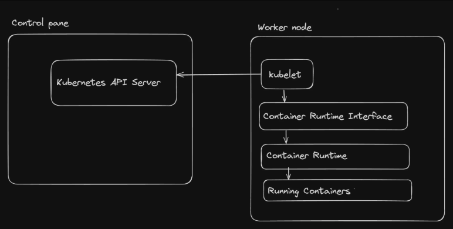
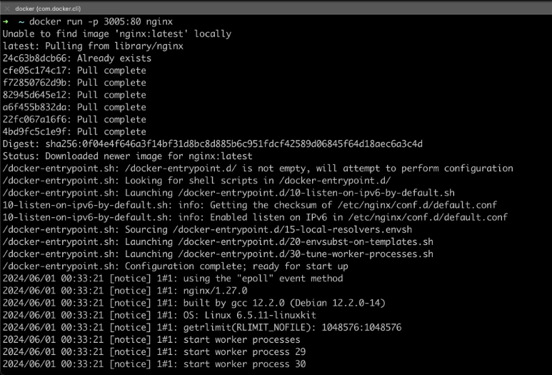
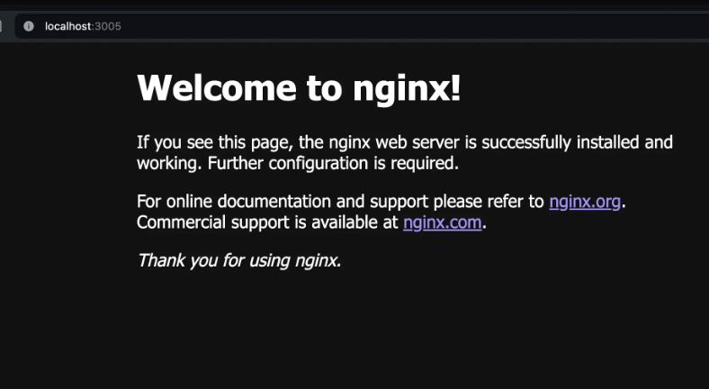

# What is Kubernetes?

*Docker is a pre-requisite before you proceed to understand kubernetes*

- Deploying to a VM
- Deploying to K8s

If you know: </br>
1. pm2 (its a process manager, in case your nodejs process goes down it brings it back up)
2. Nginx/Reverse Proxies (Its used for lot of things we use it as reverse proxies, to deploy multile applications to same server)
3. Certbot (for SSL)

these 3 things then you cna deploy to VM

K8? WHY??

1. Self Healing (whenever it goes down it will automatically goes up)
2. Shared Resources (if you have 5 projects, they can all share a bunch of computes, if your load increase you can just increase your overall compute, the overall machines you have)


Kubernetes (popularly known as k8s) is a container orchestration engine, which as the name suggests lets you create, delete, and update containers.

This is useful when
- You have your docker images in the docker registry and want to deploy it in a cloud native (means all cloud supports any kubernetes apis, means you can easily move from cloud providers, eg: GCP, Vultr, AWS, Azure) fashion
- You want to not worry about patching, crashes. You want the system to auto heal (something ECS and ASG also does)
- You want to autoscale with some simple constructs
- You want to observe your complete system in a simple dashboard


When you are starting VM you are starting one machine. When you are starting autoscaling groups, then you are starting lets say 5 machines or 10 machines. When you use ECS, you don't even know what machines are running. You just tell AWS to start containers in a serverless fashion and it does it for you without you knowing what's happening behind the scenes. Most of the time when you use ECS you use fargate which means let AWS decide where to run your containers.

But when you use kubernetes, you actually start bunch of machines. All those machines are running the kubernets code. They all have each other's information, address. They can all discover each other, all these machines are called the kubernetes cluster. In case of OPENAI it has maybe 1000s machines in case of small startup maybe it has 10s of machines. And when you deploy your application they might deploy like this:


High level architecture of kubernetes

So you done have to ssh into the machines install nodejs clone and run it, you just tell kubernetes to run your docker image. How can we ssh into the machines? You don't. If kubernetes decides to move the container to another machine then ip change. So its not like this, kubernetes has its own internal networking. There are APIs to talk to kubernetes. You can use kubectl (command line tool) or you can use the dashboard (UI) to talk to kubernetes. Kubernetes also called as k8s.

## Before Kubernetes


## After kubernetes


- The architecture says you start a kubernetes cluster (very easy to start in GCP, AWS, Azure, Digital Ocean, Vultr) by giving it number of machines.
- In diagram look machine 1, 2, 3 is called worker nodes and machine 4 is called master node. K8 can have multiple master nodes for high availability. Or one node that is master and worker both.
- Master node is the brain of the kubernetes cluster. Developer talks to master node. Master node tells worker nodes what to do. In diagram developer said master to start 3 replica of the backend and 1 replica of the frontend. Master schedules the containers in the worker nodes. Masters job is to take declarative commands or the desired state commands from the developer and schedule the jobs.

## Jargons
Ref - https://kubernetes.io/docs/concepts/overview/components/

### Nodes
In kubernetes, you can create and connect various machines together, all of which are running kubernetes. Every machine here is known as a node

There are two types of nodes:
## Master Node (Control pane)

The node that takes care of deploying the containers/healing them/listening to the developer to understand what to deploy. Master node is  running a bunch of kubernetes processes, by default processes. Master node has many parts For eg:


### API Server : 
- **Handling RESTful API Requests**: The API server processes and responds to RESTful API requests from various clients, including the kubectl command-line tool, other Kubernetes components, and external applications. These requests involve creating, reading, updating, and deleting Kubernetes resources such as pods, services, and deployments.
- **Authentication and Authorization**: The API server authenticates and authorizes all API requests. It ensures that only authenticated and authorized users or components can perform actions on the cluster. This involves validating user credentials and checking access control policies.
- **Metrics and Health Checks**: The API server exposes metrics and health check endpoints that can be used for monitoring and diagnosing the health and performance of the control plane.
- **Communication Hub**: The API server acts as the central communication hub for the Kubernetes control plane. Other components, such as the scheduler, controller manager, and kubelet, interact with the API server to retrieve or update the state of the cluster.
### etcd 
Consistent and highly-available key value store used as Kubernetes' backing store for all cluster data. 

Ref - https://etcd.io/docs/v3.5/quickstart/

### kube-scehduler
Control plane component that watches for newly created Pods with no assigned node, and selects a node for them to run on. Its responsible for pod placement and deciding which pod goes on which node.
### kube-controller-manager: 
- Ref - https://kubernetes.io/docs/concepts/architecture/controller/
- The kube-controller-manager is a component of the Kubernetes control plane that runs a set of controllers. Each controller is responsible for managing a specific aspect of the cluster's state.
- There are many different types of controllers. Some examples of them are:
    - **Node controller**: Responsible for noticing and responding when nodes go down.
    - **Deployment controller**:  Watches for newly created or updated deployments and manages the creation and updating of ReplicaSets based on the deployment specifications. It ensures that the desired state of the deployment is maintained by creating or scaling ReplicaSets as needed.
    - **ReplicaSet Controller**: Watches for newly created or updated ReplicaSets and ensures that the desired number of pod replicas are running at any given time. It creates or deletes pods as necessary to maintain the specified number of replicas in the ReplicaSet's configuration.

> This API server is what a developer talks to. Lets say developer says through an api that please start 3 replicas of backend, when you say that, this gets stored in etcd (a key value store, like redis) then comes the kube-scheduler, it looks at the etcd and sees that there is a request to start 3 replicas of backend, it will decide where to start it. Its has all the matrix of the worker nodes and decides where to start it. Then kube-controller-manager (youve heard of control loop, which is like an infinite loop, eg, a thermostat, it keeps checking the temperature and if its more than 25 degrees it will turn on the ac, if its less than 25 degrees it will turn off the ac), so kubernetes has the bunch of controllers running which constantly checks the desired state (eg: 3 replicas of backend) and the current state (eg: 2 replicas of backend), if there is a mismatch it will try to fix it. So if one backend goes down, it will start another backend. This is how self healing happens. Kube controller starts a bunch of controllers, one of them is node controller, it keeps checking the health of the worker nodes, and responding when a node goes down. Like this there are many controllers running in the background, you can make your own controllers as well.

> So is master node sending the req to worker nodes? No, master node is not sending any requests to worker nodes, worker nodes are constantly polling/talking to master node, asking what to do. So its a pull based model. 

So there should be one process running in the worker nodes which is constantly talking to master node, asking what to do. This process is called kubelet.

## Worker Nodes
- The nodes that actually run your Backend/frontend


### kubelet 
- An agent that runs on each node in the cluster. It makes sure that containers are running in a Pod.
- The kubelet is taking to the master node's API server and understanding what jobs it need to run. It gets the desired state from the master node and makes sure that the desired state is running on the node. If its not running it will try to fix it.

**How the kubelet Control Loop Works**
- **Watch for PodSpecs**: The kubelet watches the API server for PodSpecs that are scheduled to run on its node. This includes both new pods that need to be started and existing pods that may need to be updated or terminated.
- **Reconcile Desired State**: The kubelet compares the current state of the node (which pods are running, their statuses, etc.) with the desired state as defined by the PodSpecs.
- **Take Action**: Based on this comparison, the kubelet takes actions to reconcile the actual state with the desired state:
- **Start Pods**: If there are new PodSpecs, the kubelet will pull the necessary container images, create the containers, and start the pods.
- **Monitor Health**: The kubelet performs health checks (liveness and readiness probes) on running containers. If a container fails a health check, the kubelet may restart it according to the pod's restart policy.
- **Update Pods**: If there are changes to the PodSpecs (e.g., configuration changes), the kubelet will update the running pods accordingly.
- **Stop Pods**: If a pod is no longer needed or should be terminated, the kubelet will stop and remove the containers.
- **Report Status**: The kubelet periodically reports the status of the pods and the node back to the API server. This includes resource usage (CPU, memory, etc.) and the status of each container.

### kube-proxy
- The kube-proxy is a network proxy that runs on each node in a Kubernetes cluster. It is responsible for you being able to talk to a pod. As the container starts the proxy will give it an internal, external IP address and a port. Thats how node will be able to talk to each other. It maintains network rules on nodes. It allows network communication to your pods from inside or outside the cluster.


### Container runtime
- In a Kubernetes worker node, the container runtime is the software responsible for running containers. Its very similar to docker engine.

It interacts with the kubelet, which is the agent running on each node, to manage the lifecycle of containers as specified by Kubernetes pod specifications. The container runtime ensures that the necessary containers are started, stopped, and managed correctly on the worker node.

**Common Container Runtimes for Kubernetes**
- containerd
- CRI-O
- Docker

**Kubernetes Container Runtime Interface (CRI):**
The Container Runtime Interface (CRI) is a plugin interface that allows the kubelet to use a variety of container runtimes without needing to know the specifics of each runtime. This abstraction layer enables Kubernetes to support multiple container runtimes, providing flexibility and choice to users.



**Cluster:**
A bunch of worker nodes + master nodes make up your kubernetes cluster . You can always add more / remove nodes from a cluster.

**Images:**
A Docker image is a lightweight, standalone, and executable software package that includes everything needed to run a piece of software, including the code, runtime, libraries, environment variables, and configuration files. Images are built from a set of instructions defined in a file called a Dockerfile.

Eg - https://hub.docker.com/_/mongo

**Containers:**
A container is an image in execution. For example if you run
```bash
docker run -p 5432:5432 -e POSTGRES_PASSWORD=mysecretpassword  -d postgres
```

### Pods
A pod is the smallest and simplest unit in the Kubernetes object model that you can create or deploy. Whenever you want to start a container in kubernetes, you actually start a pod. A pod can have one or more containers(eg, just frontend, or just backend or the both container). Most of the time a pod has one container. But sometimes you want to run multiple containers in a pod, for example you want to run a logging agent alongside your main application container to collect and ship logs. In this case, both containers can share the same network namespace and storage volumes, making it easier for them to communicate and share data. 


## Creating a k8s cluster

- Locally (Make sure you have docker)
1. minukube
2. kind - https://kind.sigs.k8s.io/docs/user/quick-start/

- On cloud
    - GKE
    - AWS K8s
    - vultr

## Using kind

Install kind - https://kind.sigs.k8s.io/docs/user/quick-start/#installation

**Single node setup**
- Create a 1 node cluster
```bash
kind create cluster --name local
```
This will create a cluster with single node which is both control pane(master node) and worker node. But its not ideal to have control pane and worker node in same node.

- Check the docker containers you have running
```bash
docker ps
```

- You will notice a single container running (control-pane)
- Delete the cluster
```bash
ki nd delete cluster -n local
```

- Multi node setup
- Create a clusters.yml file
```yml
kind: Cluster
apiVersion: kind.x-k8s.io/v1alpha4
nodes:
- role: control-plane
- role: worker
- role: worker
```

- Create the node setup
```bash
kind create cluster --config clusters.yml --name local
```

- Check docker containers
```bash
docker ps
```


> Now you have a node cluster running locally

## Using minikube
 
- Install minikube - https://minikube.sigs.k8s.io/docs/start/?arch=%2Fmacos%2Fx86-64%2Fstable%2Fbinary+download
- Start a k8s cluster locally

`minikube start`

- Run docker ps to see the single node setup
 
> 💡A single node setup works but is not ideal. You don’t want your control pane to run containers/act as a worker.


## Kubernetes API
The master node (control pane) exposes an API that a developer can use to start pods. You can see that exposed api using docker ps command. Ther its "127.0.0.1:63074". Now you need to hit that api in https. Its an https server, very similar to one we have created using express js. Now you can talk to this https server and start pods and do other operations.

- **Try the API**
    - Run docker ps to find where the control pane is running

    

    - Try hitting various endpoints on the API server - `https://127.0.0.1:50949/api/v1/namespaces/default/pods`

    

This is a secure endpoint, so you cant directly hit it on browser. You need to pass some authorization headers. </br>
Kubernetes API server does authentication checks and prevents you from getting in. </br>
>All of your authorization credentials are stored by kind in ~/.kube/config 


Now we have all our credentials in ~/.kube/config file. </br> Now to talk to the kubernetes cluster you will use kubectl command line tool.

## kubectl
kubectl is a command-line tool for interacting with Kubernetes clusters. It provides a way to communicate with the Kubernetes API server and manage Kubernetes resources.

- Install kubectl

`https://kubernetes.io/docs/tasks/tools/#kubectl`
 
- Ensure kubectl works fine</br>
`kubectl get nodes` </br>
`kubectl get pods`

 
If you want to see the exact HTTP request that goes out to the API server, you can add verbocity flag --v=8 (means i want to see the logs on a very detailed level) </br>
`kubectl get nodes --v=8`

- Creating a Pod
    - *There were 5 jargons we learnt about*
        - Cluster
        - Nodes
        - Images
        - Containers
        - Pods
 
We have created a `` of 3 nodes</br>
How can we deploy a single container from an image  inside a pod ?</br>

- Finding a good image
- Let’s try to start this image locally - `https://hub.docker.com/_/nginx`
    - Starting using docker </br>
    `docker run -p 3005:80 nginx`

- Starting a pod using k8s
- Start a pod
```bash
kubectl run nginx --image=nginx --port=80
```

> and what port does it expose? 80? No, it literally does nothing, its just for documentation purpose. Exposing an app is whole another concept. This is just to start a pod. You cant access is anywhere.

- you can check the pod is running by running
```bash
kubectl get pods
```
- you can see the logs of the pod by running
```bash
kubectl logs nginx
```
- you can also see the logs using flag -f (follow)
```bash
kubectl logs nginx -f
```
- you can also describe the pod to see more details
```bash
kubectl describe pod nginx
```



Try visiting localhost:3005




- Check the status of the pod
```bash
kubectl get pods
```

- Check the logs 
```bash 
kubectl logs nginx
```


- Describe the pod to see more details


- What our system looks like right now


>Good questions to ask is, How can I stop a pod? `kubectl delete pod nginx`.

>How can I visit the pod? Which port is it available on? 

>How many pods can I start? As many as you want, but your node has limited resources. It doesnt make sense to start 20 if you have 5 nodes, as a lot of them will have shared resources.


- Stop the pod by running
```bash
kubectl delete pod nginx
```

- Check the current state of pods
```bash
kubectl get pods
```

> Until now what we have done is imperatively started a pod. But in real world you will never do this. You will always use declarative way of starting a pod. You will write a manifest file and apply it.

## Kubernetes manifest
A manifest defines the desired state for Kubernetes resources, such as Pods, Deployments, Services, etc., in a declarative manner.
 
- Original command
```bash
kubectl run nginx --image=nginx --port=80
```

```yml
Manifest
apiVersion: v1
kind: Pod
metadata:
  name: nginx
spec:
  containers:
  - name: nginx
    image: nginx
    ports:
    - containerPort: 80
```

- Breaking down the manifest
- metadata is very important
- spec containers is an array, you can start multiple containers in a pod


- so now rather than doing that command thing we have done, we can just apply the manifest
```bash
kubectl apply -f manifest.yml
```

- Delete the pod
```bash
kubectl delete pod nginx
```


---
</br></br>


## Deployment
A Deployment in Kubernetes is a higher-level abstraction that manages a set of Pods(this is done by replicasets) and provides declarative updates to them. It offers features like scaling, rolling updates, and rollback capabilities, making it easier to manage the lifecycle of applications.

- Lifecycle of an application: Almost everyday developers are commiting code to the application so it needs to redeploy the application.
- Rolling updates: When you update the application, you want to make sure that there is no downtime. You want to update the application in a rolling fashion. Slowly take down the old version and bring up the new version of the code to the pods.

> Deployments doesnt really start pods, it starts replicasets which starts pods. So the diagram is little wrong.


- **Pod:** A Pod is the smallest and simplest Kubernetes object. It represents a single instance of a running process in your cluster, typically containing one or more containers.
- **Deployment:** A Deployment is a higher-level controller that manages a set of replicasets(when you create a deployment it creates a bunch of replicasets which creates a bunch of pods). It ensures the desired number of Pods are running and provides declarative updates to the Pods it manages.

> the deployment is applied with a version1 lets say. Now you made v2 and you had updated the docker container with the version2 and want to update the deployment. Then what happens is it makes a new replicaset with version2 and slowly takes down the old replicaset with version1. This is called rolling update. If something goes wrong you can always rollback to version1.
 
**Key Differences Between Deployment and Pod:**

1. **Abstraction Level:**
    - **Pod:** A Pod is the smallest and simplest Kubernetes object. It represents a single instance of a running process in your cluster, typically containing one or more containers.
    - **Deployment:** A Deployment is a higher-level controller that manages a set of identical Pods. It ensures the desired number of Pods are running and provides declarative updates to the Pods it manages.
2. **Management:**
    - **Pod:** They are ephemeral, meaning they can be created and destroyed frequently.
    - **Deployment:** Deployments manage Pods by ensuring the specified number of replicas are running at any given time. If a Pod fails, the Deployment controller replaces it automatically.
3. **Updates:**
    - **Pod:** Directly updating a Pod requires manual intervention and can lead to downtime.
    - **Deployment:** Supports rolling updates, allowing you to update the Pod template (e.g., new container image) and roll out changes gradually. If something goes wrong, you can roll back to a previous version.
4. **Scaling:**
    - **Pod:** Scaling Pods manually involves creating or deleting individual Pods.
    - **Deployment:** Allows easy scaling by specifying the desired number of replicas. The Deployment controller adjusts the number of Pods automatically.
5. **Self-Healing:**
    - **Pod:** If a Pod crashes, it needs to be restarted manually unless managed by a higher-level controller like a Deployment.
    - **Deployment:** Automatically replaces failed Pods, ensuring the desired state is maintained.

--- 
</br>

## Replicaset

A ReplicaSet in Kubernetes is a controller that ensures a specified number of pod replicas are running at any given time. It is used to maintain a stable set of replica Pods running in the cluster, even if some Pods fail or are deleted. (you can make two pods of a container with the manifest file manually, but if one pod goes down, the other pod will be there but the total number of pods will be 1, not 2, so it wont autoheal. So replicaset ensures that the desired number of pods are always running)

When you create a deployment, you mention the amount of replicas you want for this specific pod to run. The deployment then creates a new ReplicaSet that is responsible for creating X number of pods.


-  Series of events
    - User creates a deployment which creates a replicaset which creates pods
    - If pods go down, replicaset controller ensures to bring them back up


### Series of events
When you run the following command, a bunch of things happen
```bash
kubectl create deployment nginx-deployment --image=nginx --port=80 --replicas=3
```

**Step-by-Step Breakdown:**

1. **Command Execution:**
    - You execute the command on a machine with kubectl installed and configured to interact with your Kubernetes cluster.
2. **API Request:**
    - kubectl sends a request to the Kubernetes API server to create a Deployment resource with the specified parameters.
3. **API Server Processing:**
    - The API server receives the request, validates it, and then processes it. If the request is valid, the API server updates the desired state of the cluster stored in etcd.  - The desired state now includes the new Deployment resource.
4. **Storage in etcd:**
    - The Deployment definition is stored in etcd, the distributed key-value store used by Kubernetes to store all its configuration data and cluster state. etcd is the source of truth for the cluster's desired state.
5. **Deployment Controller Monitoring:**
    - The Deployment controller, which is part of the kube-controller-manager, continuously watches the API server for changes to Deployments. It detects the new Deployment you created.
6. **ReplicaSet Creation:**
    - The Deployment controller creates a ReplicaSet based on the Deployment's specification.     - The ReplicaSet is responsible for maintaining a stable set of replica Pods running at any given time.
7. **Pod Creation:**
    - The ReplicaSet controller (another part of the kube-controller-manager) ensures that the desired number of Pods (in this case, 3) are created and running. It sends requests to the API server to create these Pods.
8. **Scheduler Assignment:**
    - The Kubernetes scheduler watches for new Pods that are in the "Pending" state. It assigns these Pods to suitable nodes in the cluster based on available resources and scheduling policies.
9. **Node and Kubelet:**
    - The kubelet on the selected nodes receives the Pod specifications from the API server. It then pulls the necessary container images (nginx in this case) and starts the containers.
 
### Hierarchical Relationship
1. **Deployment:**
    - High-Level Manager: A Deployment is a higher-level controller that manages the entire lifecycle of an application, including updates, scaling, and rollbacks.
    - Creates and Manages ReplicaSets: When you create or update a Deployment, it creates or updates ReplicaSets to reflect the desired state of your application.
    - Handles Rolling Updates and Rollbacks: Deployments handle the complexity of updating applications by managing the creation of new ReplicaSets and scaling down old ones.
2. ReplicaSet:
    - Mid-Level Manager: A ReplicaSet ensures that a specified number of identical Pods are running at any given time.
    - Maintains Desired State of Pods: It creates and deletes Pods as needed to maintain the desired number of replicas.
    - Label Selector: Uses label selectors to identify and manage Pods.
3. Pods:
    - Lowest-Level Unit: A Pod is the smallest and simplest Kubernetes object. It represents a single instance of a running process in your cluster and typically contains one or more containers.
 
> 💡A good question to ask at this point is why do you need a deployment when a replicaset is good enough to bring up and heal pods?

## Create a replicaset
Let’s not worry about deployments, lets just create a replicaset that starts 3 pods

- Create rs.yml
```yml
apiVersion: apps/v1
kind: ReplicaSet
metadata:
  name: nginx-replicaset
spec:
  replicas: 3
  selector:
    matchLabels:
      app: nginx
  template:
    metadata:
      labels:
        app: nginx
    spec:
      containers:
      - name: nginx
        image: nginx:latest
        ports:
        - containerPort: 80
```

- template section means whatever pod is created it should have these specs/label (eg: app set to nginx as the label), you have to make sure that a u
- specification of the container is same as pod specification, the pod that is going to be created will have this container spec
- selector means which pods should this replicaset manage, it will manage all the pods with label app=nginx (this is how replicaset knows out of all the pods which pods belong to it)

- Apply the manifest
```bash
kubectl apply -f rs.yml
```

- Get the rs details
```bash
kubectl get rs

NAME               DESIRED   CURRENT   READY   AGE
nginx-replicaset   3         3         3       23s
```

- Check the pods
```bash
kubectl get pods

NAME                     READY   STATUS    RESTARTS   AGE
nginx-replicaset-7zp2v   1/1     Running   0          35s
nginx-replicaset-q264f   1/1     Running   0          35s
nginx-replicaset-vj42z   1/1     Running   0          35s
```

- Try deleting a pod and check if it self heals
```bash
kubectl delete pod nginx-replicaset-7zp2v
kubectl get pods
```

- Try adding a pod with the app=nginx
```bash
kubectl run nginx-pod --image=nginx --labels="app=nginx"
```

- Ensure it gets terminated immedietely because the rs already has 3 pods
- Delete the replicaset
```bash
kubectl delete rs nginx-deployment-576c6b7b6
```

> 💡 Note the naming convention of the pods. The pods are named after the replicaset followed by a unique id (for eg nginx-replicaset-vj42z)


## Create a deployment
Lets create a deployment that starts 3 pods
 
- Create deployment.yml
```yml
apiVersion: apps/v1
kind: Deployment
metadata:
  name: nginx-deployment
spec:
  replicas: 3
  selector:
    matchLabels:
      app: nginx
  template:
    metadata:
      labels:
        app: nginx
    spec:
      containers:
      - name: nginx
        image: nginx:latest
        ports:
        - containerPort: 80
```
 
- Apply the deployment
```bash
kubectl apply -f deployment.yml
```

- Get the deployment
```bash
kubectl get deployment


NAME               READY   UP-TO-DATE   AVAILABLE   AGE
nginx-deployment   3/3     3            3           18s
```

- Get the rs
```bash
kubectl get rs

NAME                         DESIRED   CURRENT   READY   AGE
nginx-deployment-576c6b7b6   3         3         3       34s
```

- Get the pod
```bash
kubectl get pod

NAME                               READY   STATUS    RESTARTS   AGE
nginx-deployment-576c6b7b6-b6kgk   1/1     Running   0          46s
nginx-deployment-576c6b7b6-m8ttl   1/1     Running   0          46s
nginx-deployment-576c6b7b6-n9cx4   1/1     Running   0          46s
```

- Try deleting a pod
```bash
kubectl delete pod nginx-deployment-576c6b7b6-b6kgk
```

- Ensure the pods are still up
```bash
kubectl get pods
```

### Why do you need deployment?
If all that a deployment does is create a replicaset , why cant we just create rs ?
 
**Experiment**

- Update the image to be nginx2  (an image that doesnt exist)
```yml
apiVersion: apps/v1
kind: Deployment
metadata:
  name: nginx-deployment
spec:
  replicas: 3
  selector:
    matchLabels:
      app: nginx
  template:
    metadata:
      labels:
        app: nginx
    spec:
      containers:
      - name: nginx
        image: nginx2:latest
        ports:
        - containerPort: 80
```

- Apply the new deployment
```bash
kubectl apply -f deployment.yml
```

- Check the new rs now
```bash
kubectl get rs

NAME                          DESIRED   CURRENT   READY   AGE
nginx-deployment-576c6b7b6    3         3         3       14m
nginx-deployment-5fbd4799cb   1         1         0       10m
```

- Check the pods
```bash
kubectl get pods

NAME                                READY   STATUS             RESTARTS   AGE
nginx-deployment-576c6b7b6-9nlnq    1/1     Running            0          15m
nginx-deployment-576c6b7b6-m8ttl    1/1     Running            0          16m
nginx-deployment-576c6b7b6-n9cx4    1/1     Running            0          16m
nginx-deployment-5fbd4799cb-fmt4f   0/1     ImagePullBackOff   0          12m
```

#### Role of deployment
Deployment ensures that there is a smooth deployment, and if the new image fails for some reason, the old replicaset is maintained.

Even though the rs is what does pod management , deployment is what does rs management
 
#### Rollbacks
- Check the history of deployment
```bash
kubectl rollout history deployment/nginx-deployment
```

#### Undo the last deployment
```bash
kubectl rollout undo deployment/nginx-deployment
```

### Create a new deployment
- Replace the image to be postgres
```yml
apiVersion: apps/v1
kind: Deployment
metadata:
  name: nginx-deployment
spec:
  replicas: 3
  selector:
    matchLabels:
      app: nginx
  template:
    metadata:
      labels:
        app: nginx
    spec:
      containers:
      - name: nginx
        image: postgres:latest
        ports:
        - containerPort: 80
```

- Check the new set or rs


- Check the pods


- Check pods after some time, the ContainerCreating will become CrashLoopBackOff

- Check the logs
```bash
kubectl logs -f nginx-deployment-7cdb767447-4d5dr
```
Error: 
```bash
Database is uninitialized and superuser password is not specified.
You must specify POSTGRES_PASSWORD to a non-empty value for the
superuser. For example, "-e POSTGRES_PASSWORD=password" on "docker run".

You may also use "POSTGRES_HOST_AUTH_METHOD=trust" to allow all
connections without a password. This is *not* recommended.
```

> See PostgreSQL documentation about "trust": https://www.postgresql.org/docs/current/auth-trust.html

- Update the manifest to pass POSTGRES_PASSWORD
```yml
apiVersion: apps/v1
kind: Deployment
metadata:
  name: nginx-deployment
spec:
  replicas: 3
  selector:
    matchLabels:
      app: nginx
  template:
    metadata:
      labels:
        app: nginx
    spec:
      containers:
      - name: nginx
        image: postgres:latest
        ports:
        - containerPort: 80
        env:
        - name: POSTGRES_PASSWORD
          value: "yourpassword"
```

- Check pods now
```bash
kubectl get pods
```


- Try after some time


Postgres is running correctly

- Check the rs


---
</br>

## How to expose the app?
- We have seen how to start a cluster and in that how to start nodes, and start pods using deployments in the nodes. The problem is you cant access the app using localhost:port. They are not exposed over the internet or even inside the intranet. 2 containers in the same pod can talk to each other, but containers in different pods cant talk to each other. Lets say one worker node has nodejs process running and another worker node has mongo process running, the nodejs process cant talk to mongo process. So we will se how to do internal and external networking in kubernetes.

Right now if you run a simple nginx manifest and apply it, where do you access it locally? You cant. Because its not exposed. You can go and see the IP of the pod by running `kubectl get pods -owide` but that IP is internal to the cluster. You cant access it from outside. You can access it by creating another kuberentes resource called service.

Let’s delete all resources and restart a deployment for nginx with 3 replicas
```yml
apiVersion: apps/v1
kind: Deployment
metadata:
  name: nginx-deployment
spec:
  replicas: 3
  selector:
    matchLabels:
      app: nginx
  template:
    metadata:
      labels:
        app: nginx
    spec:
      containers:
      - name: nginx
        image: nginx:latest
        ports:
        - containerPort: 80
```


- Apply the configuration
```bash
kubectl apply -f deployment.yml
```

- Get all pods
```bash
kubectl get pods -owide

NAME                               READY   STATUS    RESTARTS   AGE     IP            NODE            NOMINATED NODE   READINESS GATES
nginx-deployment-576c6b7b6-7jrn5   1/1     Running   0          2m19s   10.244.2.19   local-worker2   <none>           <none>
nginx-deployment-576c6b7b6-88fkh   1/1     Running   0          2m22s   10.244.1.13   local-worker    <none>           <none>
nginx-deployment-576c6b7b6-zf8ff   1/1     Running   0          2m25s   10.244.2.18   local-worker2   <none>           <none>
```

The IPs that you see are private IPs. You wont be able to access the app on it.

---
</br>

## Services
In Kubernetes, a "Service" is an abstraction that defines a logical set of Pods and a policy by which to access them. Kubernetes Services provide a way to expose applications running on a set of Pods as network services. Services are of three types, NodePort(for external access), ClusterIP(for internal access) and LoadBalancer(for external access using cloud provider load balancer, slightly more production ready).

### Types of services
- ClusterIP
- NodePort
- Loadbalancer

Here are the key points about Services in Kubernetes:

**Key concepts**
1. Pod Selector: When you start a service, you need to create a selector that what pods this service should expose. So lets say there are three pods in which nginx server is running, you want to expose all those three pods using a single service. So these 3 pods the service needs to load balance between. Services use labels to select the Pods they target. A label selector identifies a set of Pods based on their labels.
2. Service Types:
    - **ClusterIP**: Exposes the Service on an internal IP in the cluster. This is the default ServiceType. The Service is only accessible within the cluster.
    - **NodePort**: There will be a IP of each node. So the nodeport service says that if you have exposed the nginx app using nodeport service, you can access it using any one of three node's IP, so whenever the req comes it will be forwarded to one of the pods. Downside is world knows your exact node url. Nodeport Exposes the Service on each Node’s IP at a static port (the NodePort). A ClusterIP Service, to which the NodePort Service routes, is automatically created. You can contact the NodePort Service, from outside the cluster, by requesting \<NodeIP>:\<NodePort>. The pods will be identified using the labels by service, that it needs to forward the request to these pods.
    - **LoadBalancer**: Exposes the Service externally using a cloud provider’s load balancer. NodePort and ClusterIP Services, to which the external load balancer routes, are automatically created.
3. Endpoints: These are automatically created and updated by Kubernetes when the Pods selected by a Service's selector change.

- Create service.yml
```yml
apiVersion: v1
kind: Service
metadata:
  name: nginx-service
spec:
  selector:
    app: nginx
  ports:
    - protocol: TCP
      port: 80
      targetPort: 80   # what port of the pod the app is running on (nginx is running on 80 by default)
      nodePort: 30007  # This port can be any valid port within the NodePort range(30000-32767). The node's what port the app is exposed on
  type: NodePort    # service is of type nodeport 
```

> Local setup we have seen using kind, lets see how to do it on cloud. We will use digital ocean for this.

### Setup Kubernetes on digital ocean
- Go to Create a kubernetes cluster in digital ocean
- Select version, region, size pod and service network
- Select cluster capacity
- Create the cluster
- Then click manual and download the config file (if then copy the config file to the ~/.kube/config)
- Then we are connected to the cloud kubernetes cluster through our local kubectl
- then try to apply the same nginx deployment manifest
- Then you can see that the nginx pods are running
- Now try to apply the nginx service (see below)
- Then you can see on what pod the nginx app is running `kubectl describe nodes`
- And you can see the external ip of the node
- and going to that exposed port of the node you can see the nginx welcome page

> So only using manifest file and services file we applied on the kubernetes cluster on cloud and our application is ready.

So if you want to expose a pod of yours to the world, you create a service with selector app:nginx and whichever pod has that label, the request will be forwarded to that pod, or load balanced between those pods. And nodePort:30007 and you can go to whatever node ip and port 30007 and it will forward the request to one of the pods.

You apply manifest file to start a pod, and then you apply service file, when this service got applied then port 30007 on every machine in the cluster is forwarding the request to the nginx pods.

### That extra port step in local setup

> you used kind to start a local k8s cluster on your machine. You have 3 nodes running. All have services exposed on 30007 port. kind is kubernetes in docker. And lets say we have to run mongo container on docker then we have had added a port mapping. Similarly we need to add a port mapping from our machine to these docker container nodes. All this would have been very easy if we had used cloud provider like digital ocean, aws, gcp.


So locally we have to do extra step, we need to change the kind config little bit. Start 2 workers with extra port mapping like following.


- Restart the cluster with a few extra ports exposed (create kind.yml)
```yml
kind: Cluster
apiVersion: kind.x-k8s.io/v1alpha4
nodes:
- role: control-plane
  extraPortMappings:
  - containerPort: 30007
    hostPort: 30007
- role: worker
- role: worker
```

- kind create cluster --config kind.yml
- Re apply the deployment and the service
- Visit localhost:30007 and you can see the nginx welcome page

---
</br>

## Loadbalancer service
In Kubernetes, a LoadBalancer service type is a way to expose a service to external clients. When you create a Service of type LoadBalancer, Kubernetes will automatically provision an external load balancer from your cloud provider (e.g., AWS, Google Cloud, Azure) to route traffic to your Kubernetes service.

So it does same thing as nodeport so why we need loadbalancer service? Because in nodeport service the world knows your exact node url. The port range in nodeport is not 80 or 443, and you cant make this secure(there is no ssl termination happens in nodeport, basically you cant run on https). In loadbalancer service the cloud provider gives you a single url and it forwards the request to one of the nodes in your cluster which has the nodeport service running. So its more production ready.

- In digital ocean there is an option to create a load balancer (not necessarily for kubernetes), but can be used for connecting to the kubernetes cluster. So we wont be exposing the nodes ip address, the IP to hit the app will be of the external load balancer, which will forward the request.


> One very comman thing is when you delete the cluster, the load balancer is not deleted automatically. You have to go and delete it manually. Forgetting to delete the load balancer is a common mistake that can lead to unexpected costs.
 
### Creating a kubernetes cluster in vultr


- Create deployment.yml
```yml
apiVersion: apps/v1
kind: Deployment
metadata:
  name: nginx-deployment
spec:
  replicas: 3
  selector:
    matchLabels:
      app: nginx
  template:
    metadata:
      labels:
        app: nginx
    spec:
      containers:
      - name: nginx
        image: nginx:latest
        ports:
        - containerPort: 80
```

- Apply deployment
```bash
kubectl apply -f deployment.yml
```

- Create service-lb.yml
```yml
apiVersion: v1
kind: Service
metadata:
  name: nginx-service
spec:
  selector:
    app: nginx
  ports:
    - protocol: TCP
      port: 80            # port of the load balancer
      targetPort: 80      # targer port of the pod
  type: LoadBalancer
```

- Apply the service
```bash
kubectl apply -f service-lb.yml
```

## ClusterIP service
It is used for internal networking. Pods cant talk to each other. Even though they are in the same worker they cant talk to each other. So if you have a nodejs app running in one pod and mongo running in another pod, the nodejs app cant talk to mongo pod. So you create a service of type clusterip which exposes the mongo pod internally. And the nodejs app can access the mongo pod using the service name. So services are used for internal networking as well.

> You will not need it until you are self hosting database, or redis, or kafka.

## Series of events
### Step 1 - Create your cluster
- Create kind.yml
```yml
kind: Cluster
apiVersion: kind.x-k8s.io/v1alpha4
nodes:
- role: control-plane
  extraPortMappings:
  - containerPort: 30007
    hostPort: 30007
- role: worker
  extraPortMappings:
  - containerPort: 30007
    hostPort: 30008
- role: worker
```

- Create cluster
```bash
kind create cluster --config kind.yml --name local
```


### Step 2 - Deploy your pod
- Create deployment.yml
```yml
apiVersion: apps/v1
kind: Deployment
metadata:
  name: nginx-deployment
spec:
  replicas: 3
  selector:
    matchLabels:
      app: nginx
  template:
    metadata:
      labels:
        app: nginx
    spec:
      containers:
      - name: nginx
        image: nginx:latest
        ports:
        - containerPort: 80
```

- Apply the deployment
```bash
kubectl apply -f deployment.yml
```


### Step 3 - Expose your app over a NodePort
- Create service.yml
```yml
apiVersion: v1
kind: Service
metadata:
  name: nginx-service
spec:
  selector:
    app: nginx
  ports:
    - protocol: TCP
      port: 80
      targetPort: 80
      nodePort: 30007  # This port can be any valid port within the NodePort range
  type: NodePort
```
```bash
kubectl apply -f service.yml
```


### Step 4 - Expose it over a LoadBalancer
- Create a load balancer service (service-lb.yml)
```yml
apiVersion: v1
kind: Service
metadata:
  name: nginx-service
spec:
  selector:
    app: nginx
  ports:
    - protocol: TCP
      port: 80
      targetPort: 80
  type: LoadBalancer
```

- Apply the configuration
```bash
kubectl apply service-lb.yml
```


- Check the cloud dashboard


</br>

