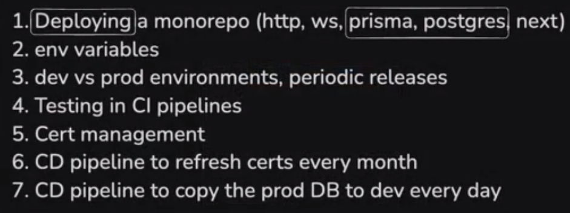

# Monorepo Deployment

lets say we have a very simple monorepo project made using turborepo. It has a next app, a primsa(postgres) database, a express http backend and a websocket server.

## Summary of making monorepo project
- `npx create-turbo@latest`, choose `npm`
- then you will have a monorepo project with package.json in it. If you want you can the name of the project to `repo` or something.
- have one next app, delete one, as we'll be using one next app for frontend. Then lets say we use prisma and postgres for database
- lets initialize a prisma database 
  - make a db folder in the /packages
  - in packages/db run `npx prisma init -y` open package.json and make name as "@repo/db"
  - now we need typescript, so there is a packages/typescript-config we have to add this as dependency to this db
    ```json
    {
      "name": "@repo/db",
      "version": "1.0.0",
      "main": "index.js",
      "devDependencies": {
        "@repo/typescript-config": "*",   //if you are using npm, otherwise use "workspace:*" if you are using pnpm
      },
    }
    ```
  - then do `npx tsc --init`, and remove all from tsconfig.json and extent the tsconfig.json from packages/typescript-config/base.json
    ```json
    {
      "extends": "@repo/typescript-config/base.json",
      "compilerOptions": {
        "outDir": "./dist",
        "rootDir": "./src"
      },
    }
    ```
  - then we install prisma and `npx prisma init` as we know how to setup prisma
  - then get a connection string from neon or aiven etc or docker and add that string in the .env file in packages/db
  - then make models and do migrate and generate client as we know how to do that
  - Now you have to export the prisma client(its just a variable that lets you interact with the database), so that you can use it everywhere in the monorepo
    - for that you can make a file in packages/db/src/index.ts and export the prisma client from there
    - ```typescript
      import { PrismaClient } from '@prisma/client';

      const prisma = new PrismaClient();  // or export const prisma = new PrismaClient();

      export { prisma };
      ```
    - Now add a export section in the package.json of packages/db
      ```json
      {
        "exports": {
          "./client": "./src/index.ts",
        },
      }
      ```
      - now everything in the `src/index.ts` will be exported like /subroute (here client)
      - Now add this package as a dependency to the next app and remember to add in repo where you are using prisma client, like this in the package.json of that app
      ```json
      {
        "dependencies": {
          "@repo/db": "*",  // if you are using npm, otherwise use "workspace:*" if you are using pnpm
        },
      }
      ```
      - and you have to do global npm install to use the prisma client in the next app
      - Now you can go to the nextjs app and import the prisma client like this
      ```typescript
      import { prisma } from '@repo/db/client';

      // Now you can use the prisma client
      ```
      - You can refer a repo production grade www.github.com/dubinc/dub
- These are the steps we generally do to introduce prisma, and same we will do for http and websocket server.
- So init express project in apps/http-server and apps/ws-server and also extend the tsconfig.json from @repo/typescript-config/base.json and also add the @repo/typescript-config as a dependencies in package.json and @repo/db too if youre using the database in those apps.
- Add build scripts in the package.json of http and ws server
- Add logic in your next app, http app and websocket app accordingly. And lets say you have application ready. 


## After application is ready
In company you wont have just main branch. You'll have min 3 branches, dev, staging, and production.
If youre autodeploying from your github to your server, then pushing to the main branch will automatically deploy to your server which will be problomatic if some junior pushes to the main branch. 

So you have dev branch where anyone can push, and it autodeploy to the dev server/dev cluster. Then you have a production branch.

So we will create two servers, the main will deploy to staging server and production branch will be deployed to the production server.

So make 2 branches `git checkout -b production` and do `git push origin HEAD` (HEAD means the current branch), so main branch will be staging and production branch will be production.


## Deployment Steps

These are the steps to deploy manually. **You should never deploy manually, its just we are practicing, you should not even ssh into your machine ever.**

**eventually when we reach ASGs or we reach kubernetes, youll see we will not have to do that, and generally ssh access should be closed, no developer should ever ssh into a machine, even if something is wrong you should have a remote login and you should see the log somewhere else, so never ssh into machine, today we are doing it**


So lets start,</br>
1. We'll need 2 servers, create on AWS, with a key pair. The machine will have a public key and we will have a private key, so we can ssh into the machine using that private key. Eventually we will make CI/CD pipeline to deploy the code, so github will also need private key to access the server.
2. SSH into the server and add node, nginx to both the servers, install npm if using
3. Clone the monorepo to both the servers
4. Start 3 processes (next, ws, http)
    - you have to get 2 database connection strings, one for dev and one for prod. And you edit .env using vim editor and put env in that.
    - then you run commands like prisma migrate and generate and necessary commands
    - then you build all the apps.
    - then if you do npm run start, then if if you close terminal then the processes will stop. So we need something that will keep the processes running even if you close the terminal. So we need a process manager like pm2 or forever.
        - so we use pm2, which is a process manager for node.js applications. It allows you to keep your applications running in the background, manage them easily, and monitor their performance.
        - So you install pm2 globally using `npm install -g pm2`
        - then you can start your app using `pm2 start npm --name "app name" -- start` where "app name" is the name of your application.
        - You can also use `pm2 start <path-to-your-app>` if you want to start a specific app directly.
    - then you start websocket and http process using pm2.
        - instead of "npm run start" you do `pm2 start npm --name "app name" -- start`
5. Point our domain names to the respective servers by changing config file of nginx
`fe.veruntd.com`  
`httpser.varuntd.com`  
`wsser.varuntd.com`  
and  
`staging.fe.veruntd.com`  
`staging.httpser.varuntd.com`  
`staging.wsser.varuntd.com`  
  - This also should be done via code, it will come in infrastructure as code, but for now we will do it manually.
6. Do nginx config to point the domain names to the respective processes. `sudo vi /etc/nginx/nginx.conf`, in that put this:
```nginx
server {
    listen 80;
    server_name fe.varuntd.com;

    location / {
        proxy_pass http://localhost:3000;  # Next.js app
        proxy_http_version 1.1;
        proxy_set_header Upgrade $http_upgrade;
        proxy_set_header Connection 'upgrade';
        proxy_set_header Host $host;
        proxy_cache_bypass $http_upgrade;
    }
}
server {
    listen 80;
    server_name httpser.varuntd.com;

    location / {
        proxy_pass http://localhost:3001;  # HTTP server
        proxy_http_version 1.1;
        proxy_set_header Upgrade $http_upgrade;
        proxy_set_header Connection 'upgrade';
        proxy_set_header Host $host;
        proxy_cache_bypass $http_upgrade;
    }
}
server {
    listen 80;
    server_name wsser.varuntd.com;

    location / {
        proxy_pass http://localhost:3002;  # WebSocket server
        proxy_http_version 1.1;
        proxy_set_header Upgrade $http_upgrade;
        proxy_set_header Connection 'upgrade';
        proxy_set_header Host $host;
        proxy_cache_bypass $http_upgrade;
    }
}
```  
  - you can put this in the top level folder of the monorepo too like nginx-conf/nginx-prod.conf
7. Refresh nginx config `sudo nginx -s reload`
   - This will apply the new configuration and restart Nginx with the updated settings.
   - You can check if nginx is running using `sudo systemctl status nginx`
   - If you want to see the logs of nginx, you can use `sudo tail -f /var/log/nginx/error.log` or `sudo tail -f /var/log/nginx/access.log`
8. Test everything is working
9. So our manual deployment of the monorepo is done.

- Now you need to add checks to github, means the production(main branch if the main branch is production) branch should be protected, so that no one can push to it directly, and you can only merge to it from the staging branch. You can go to settings of the repo and then branches and then add a branch rulesets for production branch, and select the options you want. 


## Lets write CI/CD pipeline for this monorepo


---

### Why You Should Avoid SSH into Servers

* Every SSH connection is a potential **security risk**.
* If devs SSH in, they can:

  * Accidentally or maliciously delete files
  * Modify production state without tracking
  * Access secrets, tokens, database passwords

**Best practice:** Only allow automated agents (CI/CD, orchestration tools) to access servers.

In systems like **Auto Scaling Groups (ASGs)** or **Kubernetes**, we **don’t fix broken machines** — we **replace them**.

* If a server goes bad, it’s destroyed and a new one is created from a clean template (AMIs or containers).
* This is called **immutable infrastructure** — you never "patch" a running machine manually.
* SSHing into a container or pod breaks this model.

> No "pets", only "cattle" — if a machine breaks, you don't nurse it back to health, you replace it.

In production:

* Logs go to a **central location**: Grafana, Prometheus, ELK (Elasticsearch), Datadog, etc.
* You never tail logs from inside the server.
* Monitoring dashboards and alerts tell you what’s broken.

> Proper systems give you full visibility without SSH.

**Declarative Infrastructure (Kubernetes, Terraform)**

* You declare your app's desired state: “3 pods running version 1.2.0”
* If something drifts from that state, Kubernetes or infra tools will **automatically fix it**
* Manually changing things (via SSH) will break this self-healing loop

 **Collaboration and Accountability**

* If you SSH into a server and make changes, it:

  * Doesn’t leave logs or history
  * Can’t be reviewed or audited by your team
* CI/CD pipelines, GitOps, or Infrastructure-as-Code ensure changes are **visible**, **reviewable**, and **reproducible**

---

> "Today we are doing it manually to understand **what happens behind the scenes**."

You’re learning the fundamentals:

* Setting up environments
* Deploying code
* Debugging services
* Configuring Nginx, systemd, etc.

Once you know how to do all this manually, you can later automate and scale it with:

* GitHub Actions
* Docker
* Kubernetes
* ASGs / Load balancers
* GitOps tools like ArgoCD or Flux

