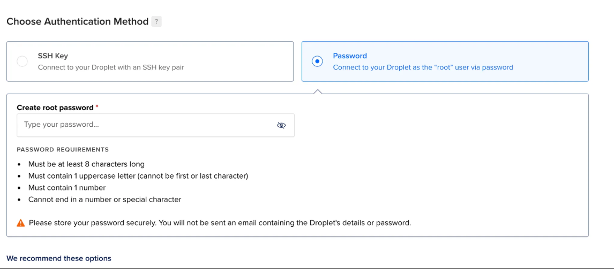

## Local Host vs Domains vs IP Addresses
- "Local host" refers to the computer you are currently working on. Its essentially the loopback address that points to the machine itself, allowing it to communicate with itself over a network. In technical terms the ip address for local host is 127.0.0.1 for IPv4 and ::1 for IPv6. There is a command ping that lets you ping a speicific domain name.
- A "domain" is a human-readable address that maps to an IP address, making it easier to access websites or services.
- An "IP address" is a numerical label assigned to each device connected to a computer network that uses the Internet Protocol for communication. It serves two main functions: identifying the host or network interface and providing the location of the device in the network.

## Local network, routing(mild hosting)
If you have multiple devices on a local network, i.e. same wifi, you can access one machine from another using their private IP address. This is a mild version of deploying your app on your local network.

## Steps to follow

1. Start a node.js process locally on port 3000

```javascript
const express = require('express');
const app = express();
const port = 3000;

app.get('/', (req, res) => {
  res.send('Hello, World!');
});

app.listen(port, () => {
  console.log(`Server is running on http://localhost:${port}`);
});
```
1. Find the IP of your machine on the local network

```bash
ifconfig or ipconfig
```

**Loopback address**


**Ethernet 0 network**

If I go to 192.168.1.3:3000 on my phone, I should be able to visit the website

Also you can use `npx serve` to serve static files on a specific port to local network,

```bash
npx serve -l 3000
```

## Hosts file
You can override what your domain name resolves to by overriding the hosts file.

```bash
vi /etc/hosts
127.0.0.1	propayn.varuntd.com
```
Can you think of how you can phis your friend into giving their credentials by using this approach? You can make facebook look alike and hosts to the local network with domain name facebook.com resolves to your fake facebook app and then ask them to login, but in reality you are capturing their credentials.

- search and try to understand whats dns propagation

## How to deploy (actual hosting)
1. Renting servers on a cloud
   - Examples of cloud providers: AWS, Azure, GCP, Digital Ocean, Linode, Civo, Vultr, etc.
   - You can rent a virtual machine (VM) or a container to run your applications.
   - You can also rent a managed service like AWS Lambda for serverless computing.
2. Renting compute yourself in datacenters (in the end aws has also rented data centers in india, from tata, tata is the one who bought the servers, tata is the one who does maintainance and is renting it to aws, so you can also rent from tata directly, but we don't need to rent from tata directly, we can rent from aws which is a cloud provider)
3. Self hosting (buying a CPU rack in your house, dukaan guy does this)
4. Serverless providers 
   - Examples: Cloudflare, Vercel, Netlify, Firebase, AWS Lambda, etc.
   - These platforms allow you to deploy applications without managing the underlying infrastructure.
   - They often provide features like automatic scaling, CDN, and easy integration with version control systems.
5. Cloud native options (k8s)


## What is a VM
VMs run on a physical server (called the **host**) but are abstracted through a layer of virtualization software called a **hypervisor** (e.g., VMware, KVM). This hypervisor divides the host machine’s resources (CPU, memory, storage) into separate virtual machines.

Each VM acts like a completely independent machine, even though they share the underlying hardware. You can run different operating systems and applications in different VMs on the same physical server.

We have similar compute at home, we have a computer at home, we can run a server on it, we can run a node.js process on it, we can run a database on it, we can run a web server on it but locally only. You cant create an internet facing application unless you have a public IP. Basically this is where cloud providers come in handy, they provide you with a public IP address and handle the networking for you. There are ways for people to access your local machine over the internet by punching holes to through the internet (read about the stun protocol, or read about hole punching, or read about NAT traversal, or read about cloudflare tunneling traffic to your machine), but it requires port forwarding and dynamic DNS services, which can be complex and insecure.

VMs are highly flexible and easy to scale. You can quickly spin up, modify, or delete VMs, and you can consolidate multiple workloads on a single server.

The virtualization layer introduces a slight overhead in terms of performance because the hypervisor needs to manage resources and ensure each VM operates independently. However, with modern hypervisors and powerful hardware, this overhead is minimal.


## Bare metal servers
Bare metal servers are physical machines dedicated to a single tenant. Unlike VMs, which share resources on a host machine, bare metal servers provide complete control over the hardware.

### Advantages of Bare Metal Servers
In a bare-metal setup, an operating system (OS) runs directly on the physical hardware without a hypervisor in between. There’s no virtualization layer.

Since there's no hypervisor, bare-metal systems tend to offer better performance, as the OS can directly access all the server’s resources without sharing them with other instances. This is especially important for high-performance applications like large databases, gaming servers, or mining crypto

With bare-metal, you’re typically limited to the resources (CPU, memory, storage) of the actual physical server. You can't dynamically allocate resources like you can in a VM. Also its not easy to get. People need to do year long contracts to get bare metal servers, so they are not as flexible as VMs. So if youre not having that much traffic, youre paying for resources you are not using. But you want performance, but if you want performance, you buy machines and put it at your home. But what if you want a bare metal server in japan near japanese exchange. So thats the logic!!

**Advantages:**
1. **Performance**: Since you have exclusive access to the hardware, bare metal servers can deliver better performance for resource-intensive applications.
2. **Customization**: You can configure the server to meet your specific needs, including the choice of operating system, hardware components, and network settings.
3. **Isolation**: Bare metal servers offer strong isolation from other tenants, which can enhance security and compliance.

### Use Cases
- High-performance computing (HPC) like mining, scientific simulations, and financial modeling
- Big data processing
- Gaming servers
- Applications with strict compliance requirements


# SSH protocol, password based auth

When you go to aws or digital ocean, and you rent they will cut a machine and allocate some spaces and give you a public IP address. Other than all the hardware you get public IP address as well. Now how can you talk to that machine, this is where SSH protocol comes in. We've seen http protocol, websocket protocol, etc. SSH is another protocol. 

The **SSH protocol** (Secure Shell) is a cryptographic network protocol (it has encryption to make sure someone dont intercept the connection to sniff or change packet) that allows secure communication between two systems, typically for remote administration(connect to server and change things). It’s most commonly used to log into remote servers and execute commands, but it also facilitates secure file transfers and other operations. Logging in means you get terminal accress to the remote machine, so you can run commands, install software, and manage the system as if you were physically present at the machine. You do all things with terminal, you dont need a display or GUI.

### Key Features of SSH:

1. **Encryption**: SSH encrypts the data that’s sent between the client and the server, so even if someone intercepts the connection, they can’t read the data. This makes it much more secure than older protocols like Telnet or FTP, which transmit data in plaintext.
2. **Authentication**: SSH can use two methods of authentication:
    - **Password-based**: You enter a password to authenticate yourself to the remote system.
    - **Public Key-based**: A more secure method, where the client uses a private key to authenticate, and the server checks it against the corresponding public key. This eliminates the need for passwords and provides an extra layer of security.
3. **Integrity**: SSH ensures the integrity of data, meaning that data cannot be tampered with while it’s in transit. If someone tries to alter the data being sent, the connection will be immediately disrupted.

## Password based

While setting up a server, select password based authentication

**Example from `digitalocean`**



```bash
ssh ubuntu@SERVER_IP
or
ssh root@SERVER_IP
```


## Lets get a machine
- You login to a cloud provider like Digital Ocean, AWS, etc.
- You create a new droplet or instance, which is essentially a virtual machine.
- You select the operating system, size, and region for your instance.
- You can choose to use password-based authentication or SSH key-based authentication.
- Once the instance is created, you will receive a public IP address (which is an internet facing IP) to connect to it.

And you can connect to it using SSH command **ssh root@<your_public_ip>**

## Keypair based authentication
Now lets see keypair based authentication, which is more secure than password based authentication. The problem with password based authentication is if someone wants to access server in team then we need to share the password with them, if someone does something wrong then we dont know who did it, and if someone leaves the team then we need to change the password and share it again with everyone. So the right way to connect to a server is to use SSH keypair based authentication, usually the machine shouldnt have a password.

Also whenever you have to hack your friends laptop, have access to their laptop almost forever, as long as you know their ip address which is not to hard to find, and not get caught, you should use SSH keypair based authentication. Most importantly is how can you protect yourself. What are the files you should constantly been monitoring, to make sure no one has access of your machine.

So this SSH key is a common way to identify yourself to a remote server.
You can generate a public private keypair on your machine, put the public key in your friends laptop as an authorized key, and then you can access their laptop anytime without them knowing. But this is illegal and unethical, so dont do it.

So you broadcast your public key to everyone, and whenever you want to send message you signs that message with your private key and send it. Then they can verify using your public key. Your public key is a way to check that yes this message is signed with this private key. The private key and public key are related somehow, such that if you sign the message using the private key then it can be decoded using the public key. Its vice versa is also true, if you encrypt a message using the public key then it can be decrypted using the private key. This is another usecase, some algo does it, some algo doesnt.

We generate a new public private keypair from our laptop and we tell aws that this is my public key, whenever I try to connect to the server, allow anyone that has the corrosponding private key to connect to the server. Same we do with github, like we give our public key to github, and whenever we want to push code or clone private repo we use our private key to authenticate ourselves. 

So on aws we can put multiple public keys and team can connect to their public key. So that we can revoke access to a specific user by removing their public key from the server without affecting others.

## SSH key
SSH keys are a pair of cryptographic keys used for secure authentication in the SSH protocol. They consist of a public key and a private key. The public key is placed on the server, while the private key is kept secure on the client machine. When you attempt to connect to the server, the server uses the public key to create a challenge that can only be answered by the private key. This method is more secure than password-based authentication, as it is resistant to brute-force attacks and does not transmit sensitive information over the network.

Try learning few things like hashing, encryption, public key cryptography, RSA, ed25519, and ECDSA.

### SSH protocol, ssh keypair based
Generate a new public private keypair

```bash
ssh-keygen
```
It asks for a file name, you can just press enter to use the default location `~/.ssh/id_rsa`. It will also ask for a passphrase, which is optional but recommended for added security. This passphrase will be required whenever you use the private key, adding an extra layer of password protection. Its recommended as if someone gets access to your private key, they would also need the passphrase to use it.

Explore your public and private key
```bash
cat ~/.ssh/id_rsa.pub
cat ~/.ssh/id_rsa
```

- Try adding it to Github so you can push to github without password
    
    
    
- Try adding it to digitalocean and ssh using it.
    
    
    

```bash
ssh ubuntu@IP
or
git clone git@github.com:100xdevs-cohort-3/week-24-deposit-with-infra.git (try a private repo)
```


Check `authorized_keys`

```bash
cat ~/.ssh/authorized_keys
```

### How to hack your friends laptop?

Put your public key in your friends laptop as an authorized key.

## Algorithms for public key cryptography

The `ssh-keygen` tool can generate SSH key pairs using several different cryptographic algorithms, depending on what you choose during the key creation process. By default, it typically uses **RSA**, but you can specify other algorithms as well. Here are the most commonly used algorithms:

### **1. RSA (Rivest–Shamir–Adleman)**

- **Default Algorithm** (for most systems): The `ssh-keygen` tool uses RSA by default when creating keys.
- RSA is a widely-used public-key algorithm that provides strong security.

### **2. Ed25519**

- **A newer and more secure option**: Ed25519 is a modern elliptic curve algorithm that is designed to provide both high security and efficiency.
- It’s **faster**, more **secure** for the same key size, and less prone to certain vulnerabilities compared to RSA.

```bash
ssh-keygen -t ed25519
```

### **3. ECDSA (Elliptic Curve Digital Signature Algorithm)**

- **Another elliptic curve algorithm**, which is considered a more secure and efficient alternative to RSA for most use cases.